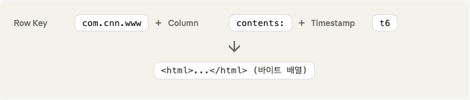
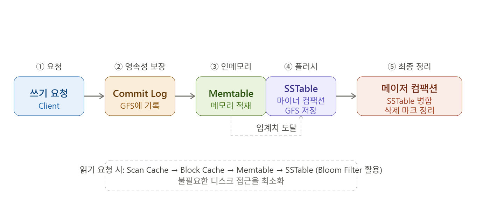
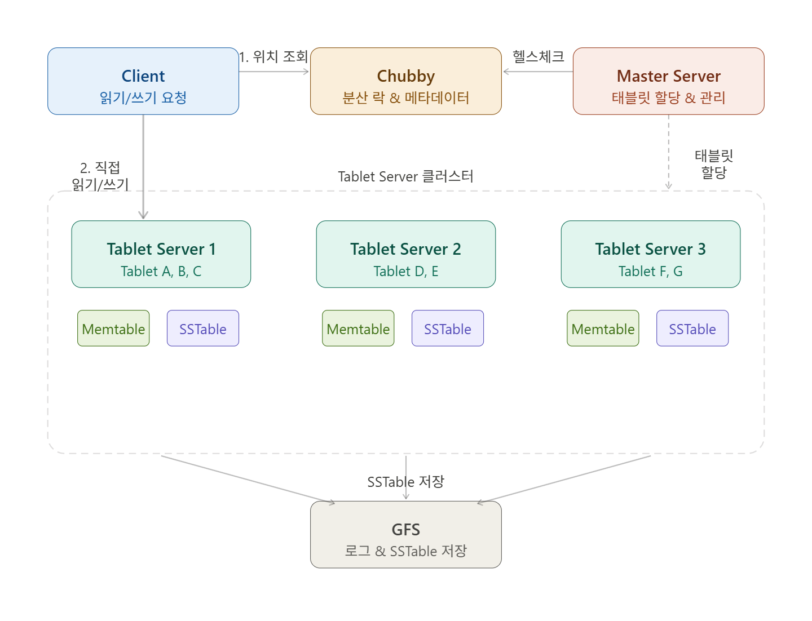
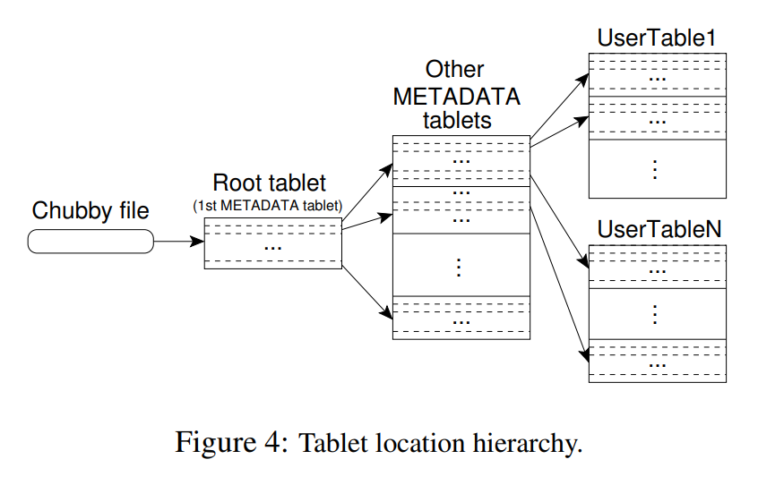

### Intro
`Google`은 웹 크롤링 데이터, 사용자 로그, 지도 데이터 등 수십 페타바이트 규모의 구조화된 데이터를 다뤄야 했다.
기존의 `RDBMS`는 이러한 규모에서의 수평 확장이 어렵고, 단순한 `Key-Value` 스토리지는 구조화된 데이터를 표현하기에 부족했다.
`Google`은 이 문제를 해결하기 위해 `GFS(Google File System)` 위에서 동작하는 분산 구조화 스토리지 시스템인 `BigTable`을 설계했다.
#
`BigTable`은 `RDBMS`처럼 엄격한 스키마를 강요하지 않으면서도 `Row`, `Column Family`, `Timestamp`를 활용한 유연한 데이터 모델을 제공한다.
어떤 형식으로 데이터를 저장할지, 어떤 데이터를 물리적으로 가깝게 배치할지를 개발자가 직접 설계할 수 있도록 했다.
이후 `BigTable`은 오픈소스로 재구현되어 `HBase`라는 이름으로 `Hadoop` 생태계에서 널리 사용되고 있다.

### 데이터 구조

`BigTable`의 데이터는 `(Row Key, Column Key, Timestamp)`의 3차원 좌표로 식별된다.
`Row Key`와 `Column Key`는 모두 임의의 바이트 문자열(`Uninterpreted String`)이며, 데이터의 의미는 애플리케이션이 해석한다.
`Timestamp`를 통해 하나의 셀에 여러 버전의 데이터를 보관할 수 있으며, 오래된 버전은 자동으로 삭제되도록 설정할 수 있다.
#
`Column Key`는 `family:qualifier` 형태로 구성된다.
`family` 부분이 `Column Family`이고, `qualifier`는 해당 패밀리 내의 세부 열 이름이다.
예를 들어 웹 페이지를 저장한다면 `content:html`, `anchor:cnnsi.com`과 같은 방식으로 열을 구성할 수 있다.

### Tablet
`Tablet`은 `Row Key` 범위를 기준으로 테이블을 수평으로 분할한 단위이다.
테이블은 처음에 하나의 `Tablet`으로 시작하지만, 데이터가 쌓여 설정된 임계치를 초과하면 두 개의 `Tablet`으로 자동 분할된다.
`Row Key` 범위가 연속적으로 정렬되어 있기 때문에 특정 행 범위에 대한 순차 읽기가 효율적이다.
#
`Tablet`은 `Tablet Server`에 의해 관리되며, 클러스터 내의 서버 간에 이동될 수 있다.
하나의 `Tablet Server`는 수십에서 수천 개의 `Tablet`을 담당할 수 있다.
`Master Server`는 어떤 `Tablet`을 어떤 `Tablet Server`에 할당할지를 결정하고 조율한다.

### Column Family
`Column Family`는 열 데이터를 묶는 논리적이면서 동시에 물리적인 단위이다.
같은 `Column Family`에 속한 데이터는 하나의 `SSTable` 파일에 함께 압축되어 저장된다.
따라서 자주 함께 조회되는 열들은 동일한 `Column Family`로 묶는 것이 I/O 효율에 유리하다.
#
`Column Family`는 스키마의 일부로서 테이블 생성 시 또는 스키마 변경 시 정의해야 한다.
반면 `Column Family` 내의 `qualifier`는 런타임에 자유롭게 추가할 수 있어 유연성을 제공한다.
이 구조 덕분에 `BigTable`은 넓은 테이블(Sparse Wide Table)을 효과적으로 표현할 수 있다.

### Compaction

`BigTable`은 데이터 쓰기가 발생하면 즉시 디스크에 기록하는 대신, 먼저 `Commit Log`에 기록한 뒤 메모리 내의 `Memtable`에 적재한다.
`Memtable`이 일정 크기에 도달하면, 그 내용을 `GFS`에 새로운 `SSTable` 파일로 저장하는 작업을 **마이너 컴팩션(Minor Compaction)**이라고 한다.
마이너 컴팩션은 `Tablet Server`의 메모리 사용량을 줄이고, 서버 장애 후 재구동 시 `Commit Log`에서 복구해야 하는 양을 줄여준다.
#
마이너 컴팩션이 반복되면 `GFS`에 작은 `SSTable` 파일들이 점점 쌓이게 된다.
파일이 많아지면 읽기 요청 처리 시 여러 파일을 병합해야 하므로 성능이 저하된다.
**메이저 컴팩션(Major Compaction)**은 모든 `SSTable`을 읽어서 열 패밀리 단위로 하나의 거대한 `SSTable`로 합치는 작업이다.
이 과정에서 삭제 마크가 붙은 데이터도 최종적으로 제거되므로, `BigTable`에서 삭제는 즉시 반영되지 않고 메이저 컴팩션 시점에 완료된다.

### SSTable
`SSTable(Sorted String Table)`은 `BigTable`의 기본 파일 저장 형식이다.
데이터는 기본적으로 `64KB` 단위의 블록으로 나뉘어 저장되며, 이 블록 크기는 사용자가 설정으로 변경할 수 있다.
각 블록에 대한 인덱스는 `SSTable` 파일의 맨 끝부분에 위치하며, `Tablet Server`가 구동될 때 이 인덱스를 메모리에 올려둔다.
#
데이터를 조회할 때는 메모리에 올려둔 블록 인덱스에 `Binary Search`를 수행하여 원하는 데이터가 속한 블록을 찾는다.
그 후 해당 블록만 `GFS`에서 읽어온다.
따라서 `SSTable` 전체를 읽지 않고도 특정 데이터에 효율적으로 접근할 수 있다.

### Chubby
`Chubby`는 `Google`이 내부적으로 사용하는 파일(디렉토리) 기반의 분산 락 서비스이다.
`ZooKeeper`의 설계적 기반이 되었으며, `BigTable`은 다양한 조율 작업에 `Chubby`를 활용한다.
#
`Chubby`는 일반적으로 5대의 서버로 구성되며 그 중 하나가 `Master`로 선출된다.
5대 중 과반수인 3대 이상이 정상 동작하면 서비스가 유지되며, 모든 복제본 간의 데이터 일관성을 보장하기 위해 `Paxos` 합의 알고리즘을 사용한다.
#
클라이언트는 `Chubby`와 `Session`을 유지하며, `Lease` 시간 내에 주기적으로 헬스체크를 해야 한다.
헬스체크에 실패하면 해당 클라이언트가 보유한 모든 락과 권한이 회수된다.
클라이언트는 `Chubby` 파일의 내용을 로컬에 캐시하고, 파일이 변경되면 콜백을 통해 알림을 받는다.
#
`BigTable`은 `Chubby`를 다음 목적으로 활용한다.
활성 `Master Server`가 하나만 존재하도록 보장하고, `Tablet`의 저장 위치 및 `Column Family`와 같은 스키마 정보를 저장한다.
또한 접근 제어 리스트(ACL)도 `Chubby`를 통해 관리한다.

### 클러스터 구조

`BigTable` 클러스터는 `Master Server`, `Tablet Server`, `Client`로 구성된다.
#
**Master Server**는 `Tablet`을 어느 `Tablet Server`에 할당할지를 결정하고 서버 간 부하를 조율한다.
또한 `GFS` 파일에 대한 `Garbage Collection`과 스키마(`Column Family`) 변경을 담당한다.
`Master Server`는 `Tablet Server`에 주기적으로 헬스체크를 수행하며, 응답이 없으면 해당 서버의 `Chubby` 락 파일을 삭제하고 그 서버가 보유했던 `Tablet`을 다른 `Tablet Server`로 재할당한다.
`Master Server` 자신도 `Chubby`와의 `Session`이 끊어지면 스스로 프로세스를 종료(`Self-kill`)하여 클러스터에 두 개의 `Master`가 동시에 존재하는 상황을 방지한다.
`Master Server`가 다운되어도 `Tablet Server`는 클라이언트의 읽기/쓰기 요청을 계속 처리할 수 있다. 단지 `Tablet` 배치와 관리 작업이 일시적으로 중단될 뿐이다.
#
**Tablet Server**는 실제 데이터를 저장하고 클라이언트의 읽기/쓰기 요청을 처리한다.
클러스터의 용량이 필요에 따라 `Tablet Server`를 추가하거나 제거함으로써 조정할 수 있으며, 데이터 이동은 `Tablet Server` 간에 이루어진다.
#
**Client**는 데이터를 읽고 쓸 때 `Master Server`를 거치지 않고 `Tablet Server`와 직접 통신한다.
클라이언트가 데이터를 찾으려면 먼저 `Chubby`에서 `Root Tablet`의 위치를 읽는다.
`Root Tablet`에는 모든 `METADATA Tablet`의 위치 정보가 들어 있고, `METADATA Tablet`에는 실제 데이터 `Tablet`이 어느 `Tablet Server`에 있는지가 기록되어 있다.
이 3단계 계층 구조(`Chubby → Root Tablet → METADATA Tablet → User Tablet`)를 통해 클라이언트는 원하는 데이터의 위치를 파악한다.
클라이언트는 이 위치 정보를 캐시하기 때문에, 동일한 `Tablet`에 반복 접근할 때는 `Chubby`나 `METADATA`를 다시 조회하지 않는다.

### 태블릿 서빙
데이터 쓰기 요청이 들어오면 `Tablet Server`는 먼저 `Commit Log`에 기록한 후 메모리의 `Memtable`에 데이터를 적재한다.
`Memtable`은 항상 정렬된 상태를 유지하며, 일정 크기를 초과하면 마이너 컴팩션을 통해 `SSTable`로 변환되어 `GFS`에 저장된다.
#
데이터 읽기 요청이 들어오면 `Tablet Server`는 `Memtable`과 여러 `SSTable` 파일을 병합하여 최신 버전의 데이터를 반환한다.
각 파일에는 블룸 필터와 블록 인덱스가 있어 불필요한 파일 접근을 최소화한다.

### 최적화
**Locality Group**은 여러 `Column Family`를 하나의 논리 그룹으로 묶어 같은 `SSTable` 파일에 저장하는 기능이다.
기본적으로 서로 다른 `Column Family`는 별도의 파일에 저장되어 함께 조회하면 여러 파일을 읽어야 하지만, `Locality Group`으로 묶으면 단일 파일 읽기로 처리할 수 있어 조회 성능이 향상된다.
#
**압축**은 `SSTable` 전체를 한 번에 압축하는 방식이 아니라 개별 블록 단위로 수행된다.
덕분에 필요한 블록만 압축 해제하여 읽을 수 있어 효율적이다.
압축은 2단계 방식으로 진행된다. 1단계에서는 넓은 범위에서 공통으로 나타나는 긴 문자열 패턴을 찾아 압축하고, 2단계에서는 아주 좁은 범위 내의 반복 패턴을 추가로 압축한다.
비슷한 데이터를 인접한 `Row Key`에 모이도록 설계하면 압축 효율이 크게 향상된다.
#
**태블릿 서버 캐시**는 두 계층으로 구성된다.
**스캔 캐시(Scan Cache)**는 상위 수준 캐시로, `SSTable`에서 반환된 `Key-Value` 쌍 자체를 저장한다. 동일한 데이터를 반복해서 읽는 워크로드에 효과적이다.
**블록 캐시(Block Cache)**는 하위 수준 캐시로, `GFS`에서 읽어 온 `SSTable` 블록 전체를 저장한다. 순차적 읽기나 `Locality Group` 내의 인접한 열을 함께 읽는 경우에 유리하다.
읽기 요청이 들어오면 스캔 캐시를 먼저 확인하고, 없으면 블록 캐시를 확인한다. 두 캐시 모두 없을 때만 `GFS`에서 블록을 읽어온다.
#
**Bloom Filter**는 `SSTable` 파일 내에 특정 `Row-Column` 쌍이 존재하는지를 아주 빠르게 판단하는 확률적 자료구조이다.
`SSTable` 파일이 많아질수록 읽기 요청 처리 시 여러 파일을 탐색해야 하는데, `Bloom Filter`를 통해 해당 데이터가 없는 파일에 대한 불필요한 디스크 접근을 사전에 차단할 수 있다.
`Bloom Filter`는 각 `SSTable`의 끝에 블록 인덱스와 함께 저장되며, `Tablet Server`가 구동될 때 메모리로 로드된다.
해시 함수와 비트 배열을 사용하기 때문에 거짓 양성(False Positive)이 발생할 수는 있지만, 거짓 음성(False Negative)은 발생하지 않는다.
즉, "없다"고 판단하면 반드시 없고, "있다"고 판단한 경우에만 실제 파일을 확인한다.

### Outro
`BigTable`은 확장 가능한 분산 스토리지가 필요할 때 `Google`이 내린 설계 선택들의 집합이다.
`GFS`, `Chubby`와 같은 `Google`의 인프라 위에서 작동하지만, 핵심 아이디어인 `Column Family`, `Compaction`, `SSTable`은 `HBase`, `Cassandra` 등 다양한 오픈소스 시스템으로 이어져 지금도 널리 활용되고 있다.
