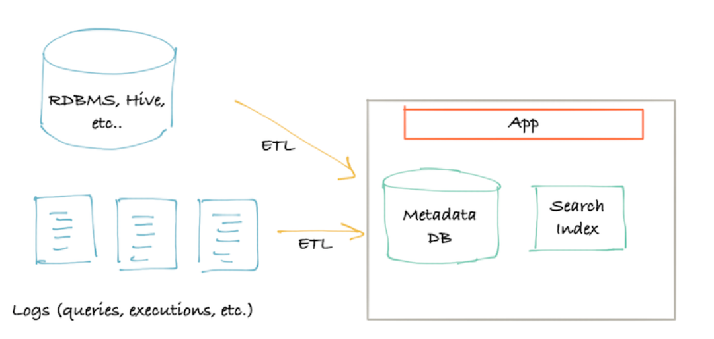
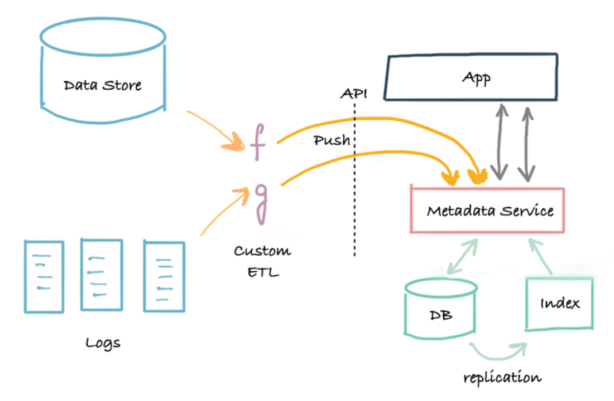
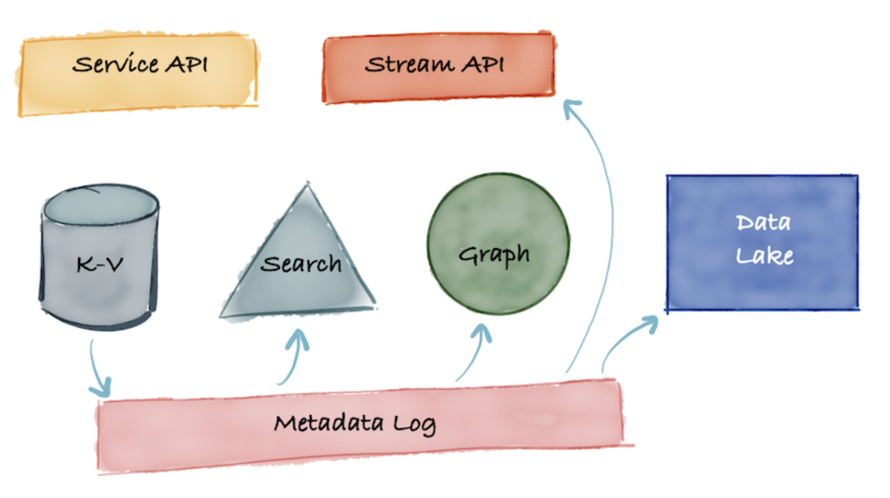
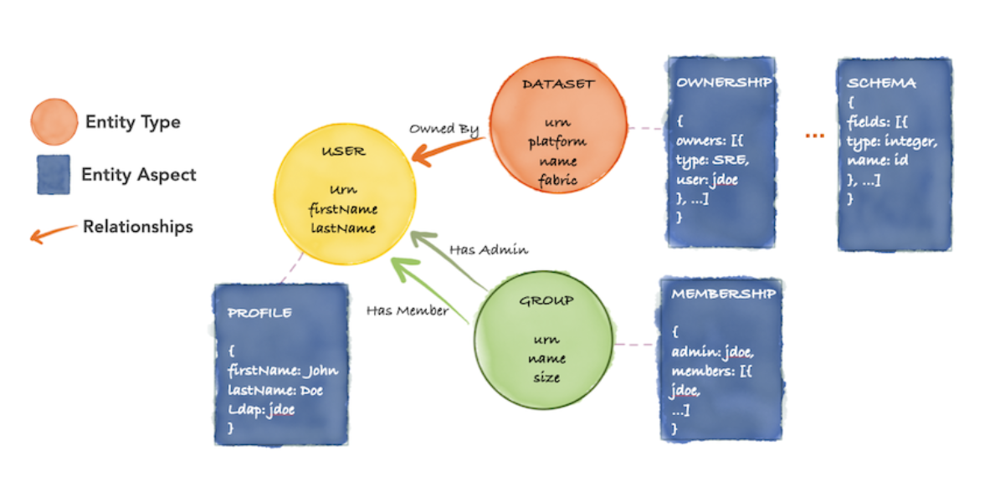

### Intro
`Espresso`, `Databus`, `Kafka`를 만든 팀이 어떤 문제를 발견했을까.
LinkedIn의 데이터 인프라 팀은 스트리밍, 분산 처리, 효율적인 배치 처리까지 데이터 플랫폼에 필요한 거의 모든 것을 구축했다.
그런데 정작 **어떤 데이터가 있는지, 그 데이터를 믿을 수 있는지, 누가 소유하는지**를 파악하는 툴이 없었다.
#
데이터를 처리하는 기술은 충분히 성숙했지만, 데이터 자체를 탐색하고 이해하는 문제는 해결되지 않았던 것이다.
이 문제를 해결하기 위해 2019년 LinkedIn이 발표한 것이 `DataHub`다. `DataHub`는 2020년 2월에 오픈소스로 공개됐다.

### Data Discovery가 왜 어려운가
대규모 조직에서 수백, 수천 개의 데이터셋이 존재할 때, 어떤 데이터를 사용해야 하는지 아는 것은 생각보다 훨씬 어렵다.
단순히 데이터를 검색하는 것을 넘어서 스키마, 소유자, 데이터 계보(`lineage`), 품질 정보까지 통합적으로 관리되어야 한다.
LinkedIn에서는 이미 팀마다 흩어진 데이터를 파악하기 위해 각자 방식으로 문서를 만들고 있었지만,
그 메타데이터들은 금방 구식이 되거나 서로 일관성이 없는 문제가 있었다.
#
이러한 문제는 LinkedIn만의 것이 아니다. 데이터 검색·탐색 플랫폼(`Data Discovery Platform`)은 여러 회사가 독립적으로 구축해왔고,
그 아키텍처는 세대를 거듭하면서 발전해왔다.

### 1세대: Monolith everything

*출처: DataHub: A Generalized Metadata Search & Discovery Tool, LinkedIn Engineering Blog 2019*
#
가장 초기 형태는 `Pull-based ETL`로 동작하는 모놀리식 구조다.
데이터 소스로부터 직접 데이터를 끌어와 메타데이터 형태로 가공하고, 변환(`Transforming`)도 ETL 파이프라인 안에 포함시키는 방식이다.
`Spotify`의 Liexikon, `Shopify`의 Artifact, `Airbnb`의 Dataportal이 이 방식을 사용한다.
#
빠르게 구축할 수 있다는 장점이 있지만, 근본적인 한계가 있다.
`Push` 기반이 아니기 때문에 메타데이터가 항상 최신 상태를 반영하지 못한다.
데이터가 변경되더라도 ETL이 다시 실행될 때까지 반영이 안 되는 것이다.
보통 야간 배치로 돌기 때문에 문제가 생기면 아무도 없는 새벽에 대응해야 하는 운영 부담도 있다.

### 2세대: 3-tier app with a service API

*출처: DataHub: A Generalized Metadata Search & Discovery Tool, LinkedIn Engineering Blog 2019*
#
2세대는 API 서버를 중심에 두는 3계층 구조다.
`Pull-based ETL` 대신 각 데이터 소스가 API를 통해 메타데이터를 `Push`하는 방식으로 바뀐다.
`Apache Gobblin`이 대표적인 이 구조의 예시다.
#
API라는 명확한 인터페이스가 생겼기 때문에, 다양한 소스를 표준화된 방식으로 연결할 수 있다.
각 소스에서 데이터를 정제한 뒤 API를 통해 `Metadata Store`에 적재하고, 특정 데이터 필드에 메타데이터를 태깅하거나 조회하는 것도 API로 처리된다.
#
하지만 여전히 해결되지 않은 문제들이 있다.
소스 데이터가 변경되더라도 실시간으로 반영되지 않는다는 점은 1세대와 크게 다르지 않다.
변화에 대한 로그가 남지 않아서 언제 무엇이 바뀌었는지 추적하기도 어렵다.
더 중요한 문제는, 중앙의 메타데이터 팀이 모델링부터 인프라, 서비스 운영까지 모두 담당해야 한다는 것이다.
새로운 메타데이터 타입이 필요하면 중앙팀에 요청해야 하고, 그 팀이 병목이 된다.
메타데이터 서비스가 다운되면 연결된 소스 시스템도 영향을 받을 수 있다는 가용성 문제도 있다.

### 3세대: Event-sourced metadata

*출처: DataHub: Popular Metadata Architectures Explained, LinkedIn Engineering Blog*
#
3세대는 이벤트 소싱(`Event Sourcing`) 기반의 아키텍처다.
`DataHub`가 바로 이 3세대에 해당한다.
#
핵심 철학은 **로그가 중심이 되어야 한다**는 것이다.
마치 분산 시스템에서 `Kafka`가 이벤트 로그를 중심으로 여러 시스템을 연결하듯,
메타데이터도 변경 이벤트 로그를 중심으로 관리되어야 한다는 발상이다.
#
메타데이터 프로바이더(소스 시스템)는 스트리밍 기반 API나 카탈로그 서비스 API를 통해 메타데이터를 `Push`한다.
이 변경 로그가 저장되고, 그 로그를 소비하여 검색 인덱스와 그래프 DB에 적재된다.
그 결과 소스 데이터의 변경이 실시간으로 메타데이터에 반영된다.
#
또 다른 핵심은 **탈중앙화된 메타데이터 모델**이다.

*출처: DataHub: Popular Metadata Architectures Explained, LinkedIn Engineering Blog*
#
메타데이터 모델은 그래프로 표현된다.
각 데이터 엔티티(데이터셋, 사용자, 파이프라인 등)에 여러 팀이 독립적으로 `Aspect`를 붙이는 구조다.
예를 들어 보안팀은 소유권(`Ownership`) 정보를 붙이고, 데이터 플랫폼 팀은 스키마 정보를 붙이고, 거버넌스 팀은 태그를 붙인다.
중앙팀의 승인 없이 각 팀이 자신의 도메인에 해당하는 메타데이터를 자율적으로 관리할 수 있다.
#
이것이 2세대의 가장 큰 병목, 즉 중앙 메타데이터 팀에 모든 변경이 집중되는 문제를 해결하는 방법이다.
각 팀은 새로운 `Aspect` 타입을 독립적으로 정의하고 배포할 수 있어서, 메타데이터 플랫폼이 조직의 성장에 맞춰 유연하게 확장된다.

### Outro
`DataHub`는 단순히 메타데이터를 저장하는 카탈로그를 넘어, 데이터 생태계 전체를 연결하는 플랫폼으로 설계됐다.
1세대의 Pull-based 배치, 2세대의 API 기반 Push를 거쳐, 이벤트 소싱과 탈중앙화 모델로 발전한 3세대의 흐름은
마이크로서비스와 이벤트 드리븐 아키텍처의 발전과 정확히 같은 궤적을 따른다.
#
데이터가 많아질수록 "어떤 데이터가 있는가"를 아는 것이 "데이터를 어떻게 처리하는가"만큼 중요해진다.
`DataHub`는 그 질문에 대한 LinkedIn의 답이다.

### Reference
- [DataHub: A Generalized Metadata Search & Discovery Tool](https://www.linkedin.com/blog/engineering/archive/data-hub) — LinkedIn Engineering Blog, 2019
- [DataHub: Popular Metadata Architectures Explained](https://www.linkedin.com/blog/engineering/data-management/datahub-popular-metadata-architectures-explained) — LinkedIn Engineering Blog
