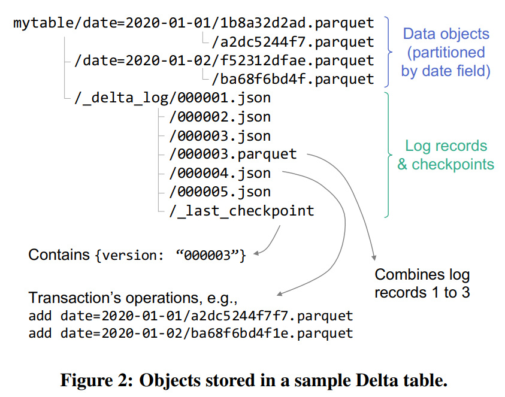

### Intro
데이터 엔지니어링 환경에서 `Amazon S3`나 `Google Cloud Storage` 같은 오브젝트 스토리지는 이제 기본 인프라가 됐다.
저렴한 비용과 무한에 가까운 확장성 덕분에 데이터 레이크의 실질적인 표준 저장소로 자리 잡았다.
그런데 이 편리한 저장소에는 불편한 진실이 있다. **ACID 트랜잭션을 지원하지 않는다는 것**이다.
#
여러 파일을 동시에 업데이트하다가 도중에 실패하면? 다른 사람이 쓰는 도중에 내가 읽으면? 오브젝트 스토리지는 이런 상황에서 일관된 데이터를 보장해 주지 않는다.
그래서 데이터 레이크는 데이터 품질 문제를 안고 있는 경우가 많았고, 이를 `Data Swamp`라고 한다.
#
`Delta Lake`는 이 문제를 해결한다. Databricks가 개발하고 2020년 `VLDB`에서 발표한 이 시스템은, 오브젝트 스토리지 위에 트랜잭션 로그를 얹어 `ACID` 보장을 달성한다. 
이 글에서는 Delta Lake가 어떻게 그것을 가능하게 하는지 살펴본다.

### Object Storage의 한계
오브젝트 스토리지는 Key-Value 구조다. 파일을 저장하고 꺼내는 것은 잘 하지만, 전통적인 데이터베이스가 당연하게 제공하던 기능들이 없다.
#
첫 번째 문제는 **업데이트**다. 오브젝트 스토리지에서는 파일의 일부를 수정할 수 없다. 변경이 필요하면 해당 파일 전체를 새로 써야 한다. `Parquet` 파일에서 특정 행을 삭제하거나 수정하는 것이 불가능한 이유가 여기에 있다.
#
두 번째는 **일관성** 문제다. 논문이 작성된 2020년 당시 `S3`는 Eventual Consistency만 보장했다. 특히 `PUT`을 하기 전에 `GET`을 했던 경우, S3는 "파일 없음"이라는 결과를 캐싱한다. 그래서 `PUT` 이후에도 이전 캐시 결과를 반환하는 경우가 생긴다. 여러 서버 간 동기화가 완료되지 않은 상태에서는, 10개를 업로드했는데 8개만 보이는 상황도 발생할 수 있다. (AWS는 2020년 12월 이후 S3에 강한 일관성을 도입하여 현재는 이 문제가 해소됐다.)
#
세 번째는 **LIST 성능**이다. `S3`의 LIST API는 한 번에 최대 1000개의 오브젝트 목록만 반환하며, 호출 자체에 10–100ms가 소요된다. 수백만 개의 파일로 구성된 대용량 테이블이라면 메타데이터 탐색만으로도 엄청난 비용이 발생한다.
#
이런 한계를 극복하기 위한 기존의 시도들이 있었다. 디렉토리 구조에 파티션 정보를 담아 LIST 범위를 줄이거나, 커스텀 스토리지 엔진을 만들거나, 오브젝트 스토어 자체에 메타데이터를 저장하는 방식이었다. 하지만 어느 것도 ACID 보장과 고성능을 동시에 달성하지 못했다.

### Delta Lake의 핵심 아이디어
`Delta Lake`의 핵심은 단순하다. 오브젝트 스토리지에 **WAL(Write-Ahead Log)**을 추가하는 것이다.
#
데이터베이스 분야에서 WAL은 오래된 개념이다. 실제 데이터를 변경하기 전에 변경 이력을 로그로 먼저 기록함으로써 장애가 생겨도 복구할 수 있도록 한다. `Delta Lake`는 이 개념을 오브젝트 스토리지에 적용했다. 각 트랜잭션의 내용을 `_delta_log` 디렉토리 아래에 JSON 파일로 기록하고, 이 로그를 통해 테이블의 현재 상태를 재구성한다.
#
로그에는 단순한 변경 이력뿐 아니라, 각 파일의 `min/max` 같은 통계 정보도 함께 기록된다. 쿼리 실행 시 이 통계 정보를 활용해 읽을 필요 없는 파일을 건너뛸 수 있어 LIST API 없이도 효율적인 데이터 탐색이 가능해진다.
#
그리고 동시에 여러 작업이 진행될 때는 **낙관적 동시성 제어** (`Optimistic Concurrency`)를 사용한다. 충돌이 자주 없다고 가정하고 작업을 진행하되, 마지막에 충돌을 감지하고 처리하는 방식이다.

### Storage Format
`Delta Lake` 테이블은 세 가지 요소로 구성된다.



*출처: Delta Lake: High-Performance ACID Table Storage over Cloud Object Stores, VLDB 2020*
#
첫 번째는 **데이터 파일**이다. 실제 데이터는 `Parquet` 형식으로 저장된다. 한번 기록된 데이터 파일은 수정되지 않는다(immutable). 수정이 필요할 때는 새로운 파일을 만들고, 이전 파일을 로그에서 제거하는 방식으로 처리한다.
#
두 번째는 **트랜잭션 로그**(`_delta_log/*.json`)다. 모든 테이블 변경 사항이 버전 번호 순서로 기록된다. `0000000000000000001.json`, `0000000000000000002.json`과 같이 순차적인 JSON 파일로 저장되며, 각 파일에는 어떤 데이터 파일이 추가·삭제됐는지, 테이블의 스키마가 무엇인지, 통계 정보가 무엇인지가 담긴다.
#
세 번째는 **체크포인트 파일**(`_delta_log/*.parquet`)이다. 로그가 쌓일수록 처음부터 모든 로그를 읽어야 하는 비용이 증가한다. 이를 방지하기 위해 기본적으로 **10개의 트랜잭션마다 체크포인트를 생성**한다. 체크포인트는 그 시점까지의 테이블 상태를 `Parquet` 형식으로 압축 저장한 것이다. 가장 최근 체크포인트의 위치는 `_delta_log/_last_checkpoint` 파일에 기록되어 빠르게 접근할 수 있다.
#
이 구조 덕분에 LIST API를 반복 호출할 필요 없이, 로그와 체크포인트만 읽으면 테이블의 현재 상태를 빠르게 파악할 수 있다.

### Access Protocols
`Delta Lake`의 읽기와 쓰기는 트랜잭션 로그를 중심으로 동작한다.

**테이블 읽기**는 다음 순서로 이루어진다. 먼저 `_last_checkpoint` 파일을 읽어 가장 최근 체크포인트 ID를 확인한다. 이후 체크포인트 이후에 추가된 로그 파일이 있는지 추적하고, 체크포인트와 로그 파일을 합산하여 현재 테이블의 파일 목록을 구성한다. 그런 다음 각 파일에 기록된 min/max 통계정보를 기반으로 쿼리 조건에 해당하지 않는 파일 전체를 건너뛰는 **Data Skipping**을 수행한 뒤, 필요한 파일만 실제로 읽는다.
#
**테이블 쓰기**는 조금 더 복잡하다. 먼저 최신 로그에서 현재 버전 번호 `r`을 확인하고, 체크포인트 이후의 모든 변경 로그도 확인한다. 새로운 데이터 파일은 `GUID`로 이름을 지어 충돌 없이 병렬로 생성한다. 그 다음, 생성된 파일들의 참조를 `r+1.json` 로그 파일에 기록한다. 로그가 충분히 쌓였다면 새로운 체크포인트 `Parquet` 파일도 함께 생성한다.
#
여기서 핵심은 **로그 파일 기록의 원자성**이다. `r+1.json`을 기록할 때, 이미 같은 파일이 존재하면 실패해야 한다. 이를 위해 `put-if-absent` 연산이 필요한데, 클라우드 벤더마다 지원 방식이 다르다.

| 스토리지 | 원자적 쓰기 방법 |
|---------|----------------|
| Google Cloud Storage | `put-if-absent` 네이티브 지원 |
| Azure Blob Store | `put-if-absent` 네이티브 지원 |
| HDFS | 임시 파일 생성 후 rename |
| Azure Data Lake Storage | 임시 파일 생성 후 rename |
| AWS S3 | `put-if-absent`·rename 미지원 → Delta Lake Engine이 별도 coordination으로 처리 |

### Isolation Levels
`Delta Lake`는 **Snapshot Isolation**을 기본 격리 수준으로 제공한다.
#
읽기 작업은 트랜잭션이 시작된 시점의 스냅샷을 기반으로 수행된다. 읽는 도중 다른 누군가가 데이터를 변경해도, 읽기 작업에는 영향을 미치지 않는다. 데이터 파일과 로그가 불변(immutable)이기 때문에 가능한 일이다.
#
만약 Serializability가 필요하다면 dummy write를 통해 로그 레코드 ID를 직접 기록하는 방식을 사용할 수 있다. 다만 현재 `Delta Lake`의 ACID 보장은 **단일 테이블 범위**로 제한된다. 여러 테이블에 걸친 트랜잭션은 지원하지 않는다.

### Transaction Rates
`put-if-absent` 연산에는 약 10–100ms의 레이턴시가 있다. 얼핏 느린 것처럼 보이지만, `Delta Lake`는 **여러 데이터를 하나의 트랜잭션으로 묶어** 배치 처리함으로써 이 레이턴시를 희석시킨다.
#
실제로 `Spark` 스트리밍 잡에서 이 정도 레이턴시로도 충분한 처리량을 달성할 수 있다고 논문에서 확인됐다. 더 낮은 레이턴시가 필요한 경우에는 커스텀 `LogStore`를 개발해야 한다.

### Features in Delta

#### Time Travel
`Delta Lake`의 가장 매력적인 기능 중 하나다. 데이터 파일과 로그가 불변이기 때문에 `Delta Lake`는 **MVCC(Multi-Version Concurrency Control)** 방식으로 동시성을 제어한다. 읽기 작업은 항상 특정 버전의 스냅샷을 참조하므로, 현재 진행 중인 쓰기와 충돌 없이 과거 특정 시점의 데이터를 그대로 읽어올 수 있다.

```sql
-- 특정 날짜 기준으로 과거 데이터 조회
SELECT * FROM events TIMESTAMP AS OF '2023-10-01';

-- 특정 버전의 데이터 조회
SELECT * FROM events VERSION AS OF 100;
```

이전에는 데이터에 문제가 생기면 백업 없이는 복구가 불가능했지만, `Delta Lake`에서는 손상된 버전 이전으로 즉시 롤백할 수 있다. `MLflow`와도 연동되어 모델 학습에 사용한 데이터셋을 버전과 함께 추적할 수 있다.

#### Efficient UPSERT, DELETE and MERGE
일반 `Parquet` 파일은 한번 쓰면 수정할 수 없다. `Delta Lake`는 트랜잭션 로그를 활용해 이를 가능하게 한다. 변경된 데이터를 새 파일로 기록하고, 로그에서 이전 파일을 제거 표시하는 방식이다.
#
이를 통해 데이터 레이크에서도 GDPR 같은 규정에 따른 데이터 삭제 요청이나, CDC(Change Data Capture) 기반 UPSERT 처리가 가능해진다.

#### Streaming Ingest and Consumption
`Delta Lake`는 `Kafka`나 `Kinesis` 없이도 로그 파일 자체를 스트리밍 소스로 활용할 수 있다.
#
스트리밍 환경에서는 작은 파일이 빠르게 많이 생성되는 문제가 발생한다. 작은 파일이 많아지면 메타데이터 오버헤드가 커지고 읽기 성능이 저하된다. `Delta Lake`는 백그라운드 **Write Compaction** 작업으로 이 파일들을 1GB 단위로 통합한다. Compaction은 데이터를 변경하지 않기 때문에 로그에 `dataChange: false`로 표시되어, 스트리밍 소비자가 이를 새로운 데이터로 오인하지 않는다.
#
또한 **Exactly-Once** 처리도 지원한다. 트랜잭션 로그에 `txn` 액션을 기록해두면, 스트리밍 애플리케이션이 중간에 중단되었다가 재시작해도 이미 처리한 데이터를 중복 처리하지 않는다.

```json
// 000004.json (4번 버전 트랜잭션 로그)
{"txn": {"appId": "Spark-Streaming-App-A", "version": 150, "lastUpdated": 16900}}
{"add": {"path": "data-file-01.parquet", "size": 1048576}}
{"add": {"path": "data-file-02.parquet", "size": 2097152}}
```

`appId`와 `version` 조합으로 어디까지 처리했는지를 식별하고, 재시작 시 중복 처리를 방지한다.

#### Data Layout Optimization
파티셔닝은 쿼리 성능을 높이는 기본 전략이다. 그런데 `Hive` 스타일의 디렉토리 파티셔닝은 속성이 늘어날수록 파티션 수가 폭발적으로 증가한다. `sourceIp`, `destIp`, `time`이라는 세 속성에 각각 N개의 값이 있다면 N³개의 파티션이 생긴다. 더구나 한번 정한 파티셔닝 구조는 쉽게 바꿀 수 없다.

```
/data/sourceIp=1.1.1.1/destIp=2.2.2.2/time=2024-01/
/data/sourceIp=1.1.1.1/destIp=2.2.2.2/time=2024-02/
/data/sourceIp=1.1.1.1/destIp=3.3.3.3/time=2024-01/
...
문제: 3개 속성 × 각 N개 값 = N³개 파티션 → 폭발적 증가
```

`Delta Lake`는 **Z-Ordering**으로 이 문제를 해결한다. 물리적으로 디렉토리를 나누는 대신, `Parquet` 파일 내부의 저장 순서를 재배치한다. Z-Ordering은 여러 차원의 값을 하나의 Z-value로 변환해 비슷한 특성을 가진 데이터를 물리적으로 가까이 배치한다.

```
예: (x=5, y=3) → Z-value 계산

x = 5 = 101 (binary)
y = 3 = 011 (binary)

비트를 교차로 섞으면:
x: _1_0_1
y: 0_1_1_

결과: 011011 = 27
```

이렇게 계산된 Z-value 순서대로 데이터를 정렬하여 파일에 저장한다. Z-value 자체는 별도로 저장하지 않으며, 결과적으로 비슷한 `sourceIp`와 `destIp` 값을 가진 행들이 같은 파일 내에 밀집되어 데이터 스킵 효율이 크게 향상된다.
#
`OPTIMIZE` 커맨드를 실행하면 Compaction과 Z-Ordering이 백그라운드로 수행되며, 파일들이 1GB 단위로 정리된다.

#### Caching
클라우드 스토리지의 읽기 레이턴시는 5–10ms, 처리량은 50–100MB/s 수준이다. 자주 접근하는 데이터는 로컬에 캐싱하는 것이 성능에 유리하다.
#
`Delta Lake`는 데이터 파일이 불변이고 읽기가 스냅샷 기반이기 때문에, **캐시 일관성 문제 없이 안전하게 로컬 캐싱을 적용**할 수 있다. 한번 쓰인 파일은 변경되지 않으므로, 캐시한 내용이 나중에 틀려질 걱정이 없다.

#### Audit Logging
`commitInfo` 레코드를 통해 언제, 누가, 어떤 작업을 했는지를 트랜잭션 로그에 기록한다. 별도 감사 시스템 없이도 테이블 변경 이력을 추적할 수 있다.

#### Schema Evolution
스키마 변경 이력도 트랜잭션 로그에 기록된다. 덕분에 과거 데이터 파일은 기록 당시의 스키마로 유효하게 인식된다.
#
**칼럼을 추가**하는 경우에는 이전 데이터를 재생성하지 않아도 된다. 이전 파일의 해당 컬럼은 `null`로 처리된다. 반면 **칼럼을 삭제하거나 타입을 변경**하는 경우에는 이전 데이터를 새 스키마에 맞게 재생성해야 한다.
#
또한 **스키마 강제화(Schema Enforcement)** 기능을 통해 스키마와 맞지 않는 데이터가 쓰여지는 것을 사전에 차단한다. 타입이 맞지 않는 데이터나 불필요한 컬럼이 들어오면 쓰기 자체를 거부해 데이터 품질을 지킨다.

#### ETL Engine 호환성
`Spark`는 `Delta Lake`를 가장 완전하게 지원한다. `Presto`, `AWS Athena`, `AWS Redshift`, `Snowflake`는 symlink manifest 방식으로 Delta Lake 테이블을 읽을 수 있다. 다만 manifest 파일이 실시간으로 동기화되지 않아 최신 데이터가 즉시 반영되지 않을 수 있다는 한계가 있다. `Hive`는 별도 Connector가 구현되어 지원된다.

| 엔진 | 지원 방식 | 실시간성 |
|-----|---------|---------|
| Spark | 네이티브 지원 | O |
| Hive | 별도 Connector | O |
| Presto / Athena / Redshift / Snowflake | symlink manifest | △ (지연 가능) |

### Outro
`Delta Lake`는 오브젝트 스토리지의 한계를 트랜잭션 로그라는 단순한 아이디어로 극복했다. 새로운 저장소 시스템을 만든 것이 아니라, 기존의 저렴하고 확장성 있는 스토리지 위에 신뢰성 레이어를 얹은 것이다.
#
`Parquet`의 읽기 성능, 오브젝트 스토리지의 확장성을 그대로 유지하면서 ACID, Time Travel, Schema Evolution, Streaming 지원까지 갖추게 됐다. 데이터 레이크가 갖는 유연함과 데이터 웨어하우스가 갖는 신뢰성을 동시에 추구하는 **Lakehouse** 아키텍처의 실질적인 토대가 `Delta Lake`다. 이후 등장한 `Apache Iceberg`, `Apache Hudi` 같은 오픈 테이블 포맷들도 같은 문제의식에서 출발한다는 점을 생각하면, Delta Lake가 데이터 플랫폼 분야에서 가진 의미를 실감할 수 있다.

### Reference
- Armbrust, M., et al. "Delta Lake: High-Performance ACID Table Storage over Cloud Object Stores." *VLDB 2020*. https://www.vldb.org/pvldb/vol13/p3411-armbrust.pdf
