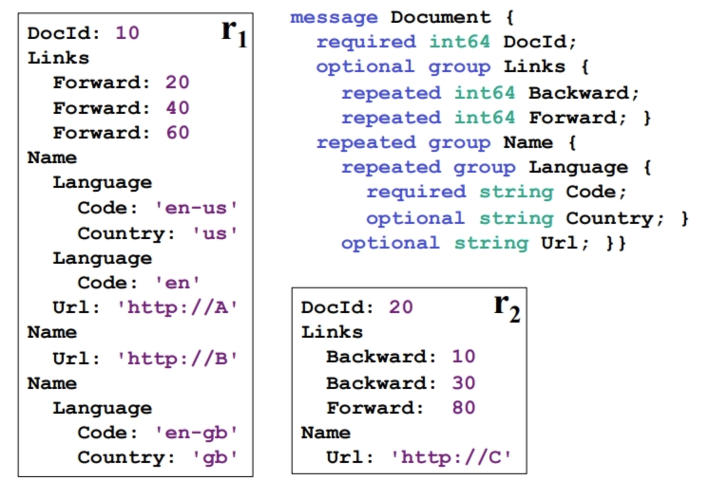
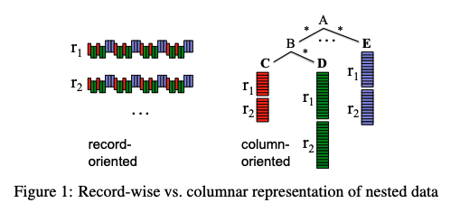
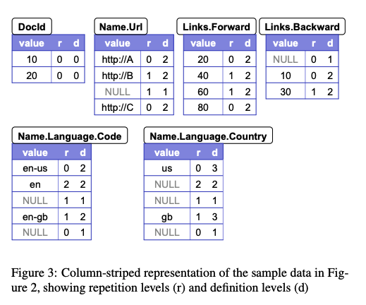
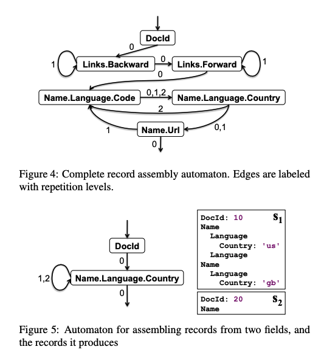
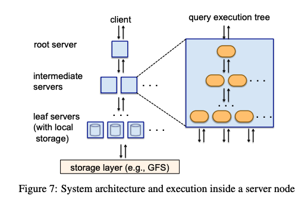

### Intro
`Google`은 하루에도 수조 건의 로그와 이벤트 데이터를 쌓는다.
"어제 광고 클릭이 몇 번이었지?"라는 질문에 답하려면 수십억 행을 뒤져야 하는데,
기존 `MapReduce` 방식으로는 파이프라인을 구성하고 몇 시간을 기다려야 했다.
`Dremel`은 이걸 수십 초 안에 해결한다.
#
기존 대용량 처리 시스템에는 두 가지 문제가 있었다.
첫째, 분석을 시작하기 전에 데이터를 로딩해야 하는데 수 테라바이트 규모에서 이 준비 시간 자체가 병목이었다.
둘째, `Hive`나 `Pig`처럼 SQL을 `MapReduce` 작업으로 변환하는 방식은 변환 오버헤드가 크고 즉각적인 탐색 쿼리에는 너무 무거웠다.
`Dremel`은 이 두 문제를 각각 **컬럼형 저장 포맷**과 **트리 기반 분산 실행**으로 해결한다.

### 데이터 모델
`Dremel`의 데이터 모델은 `Google`이 내부적으로 개발한 `Protocol Buffers`에서 출발한다.
관계형 데이터베이스처럼 모든 것을 납작한 테이블에 억지로 담는 대신, 현실 세계의 계층 구조를 그대로 표현할 수 있도록 설계됐다.
#
데이터의 타입은 재귀적으로 정의된다. 타입은 더 이상 쪼갤 수 없는 원자값(`int64`, `float`, `string` 등)이거나,
여러 필드를 묶은 레코드다. 레코드의 각 필드는 이름과 타입, 그리고 출현 횟수를 나타내는 라벨을 가진다.
라벨이 없으면 `required`(정확히 1번), `?`이면 `optional`(0 또는 1번), `*`이면 `repeated`(0번 이상)다.
필드의 타입이 다시 레코드가 될 수 있기 때문에 구조는 얼마든지 깊게 중첩될 수 있다.
#
논문에서 예시로 드는 `Document` 스키마를 보면 이렇다.



`DocId`는 `required` 정수 필드이고, `Links`는 `optional` 그룹으로 안에 `repeated` 정수인 `Backward`와 `Forward`를 담는다.
`Name`은 `repeated` 그룹으로 `repeated` 그룹인 `Language`와 `optional` 문자열인 `Url`을 포함하며,
`Language` 안에는 `required`인 `Code`와 `optional`인 `Country`가 있다.
스키마가 트리 구조이므로 어떤 필드든 루트에서 내려오는 점 표기법으로 경로를 표현한다.
`Name.Language.Code`, `Links.Forward`처럼 경로 표현이 곧 컬럼의 이름이 된다.

### 컬럼형 저장
분석 쿼리는 보통 수천 개의 컬럼 중 2~3개만 본다.
행 단위로 저장하면 필요 없는 데이터까지 디스크에서 전부 읽어야 하지만,
컬럼 단위로 저장하면 필요한 컬럼만 꺼내면 된다.
`Name.Language.Code`만 필요한 쿼리라면 나머지 컬럼은 디스크에서 아예 읽지 않아도 된다.



그런데 값만 나열하면 구조 정보가 사라진다.
`['en-us', 'en', 'en-gb']`만 봐서는 `'en-us'`와 `'en'`이 같은 `Name` 안에 있는지,
`Name[1]`에는 `Language`가 아예 없었다는 사실 같은 것들을 알 수 없다.
`Dremel`은 이 구조 정보를 보존하기 위해 각 값에 두 개의 숫자를 함께 기록한다.
#


`r(repetition level)`은 "경로에서 가장 최근에 반복된 필드가 몇 번째냐"를 알려준다.
`Name.Language.Code` 경로에서 반복 가능한 필드는 `Name`(1번째)과 `Language`(2번째)다.
`r=0`이면 완전히 새 레코드, `r=1`이면 `Name`이 새로 시작됨, `r=2`면 `Language`만 바뀐 것이다.
`r`이 클수록 더 안쪽에서만 변화가 일어났다는 뜻이다.
#
`d(definition level)`은 "왜 NULL인가"를 알려준다.
`Name.Language.Country` 경로에서 `optional`이거나 `repeated`인 필드는 `Name`, `Language`, `Country` 세 개다.
`d=3`이면 셋 다 있는 완전한 값, `d=2`면 `Name`과 `Language`는 있지만 `Country`가 없는 것,
`d=1`이면 `Name`만 있고 `Language`조차 없는 것, `d=0`이면 `Name` 자체가 없는 것이다.
같은 NULL이라도 어느 레벨의 부모가 없어서 NULL이 된 건지 숫자 하나로 정확히 구분한다.
#
몇 가지 최적화도 함께 적용된다.
NULL은 `d`값으로 추론 가능하기 때문에 저장하지 않는다.
`DocId`처럼 `required`이고 반복도 없는 필드는 `r`과 `d`가 항상 0이므로 두 숫자를 아예 저장하지 않는다.
레벨 값은 필요한 최솟값의 비트만 쓴다. 최대 `d`가 3이면 2비트로 충분하다.

### 레코드와 컬럼 간 변환
레코드를 컬럼으로 쪼갤 때 가장 까다로운 부분은 값이 없는 필드다.
스키마에 필드가 수천 개 있어도 실제 레코드 하나에 사용되는 필드는 일부뿐인 경우가 많은데,
없는 필드마다 트리 전체를 탐색하면 낭비가 심하다.
`Dremel`은 **Field Writer Tree**로 이 문제를 해결한다.



#
스키마와 동일한 트리 구조로 writer들을 배치하고 두 가지 규칙을 적용한다.
자식 writer는 부모의 현재 `r`, `d` 상태를 상속하고, 자식 writer는 자신의 데이터가 생길 때만 실행된다.
예를 들어 `Name[1]`에 `Language`가 없을 때 `Code` writer는 아무것도 하지 않는다.
그 다음 `Name[2]`의 `Code` 값이 들어오는 순간, `Code` writer는 부모 상태를 확인해
`Name[1]`이 건너뛰어졌다는 사실을 알아채고 NULL을 자동으로 먼저 채운 뒤 실제 값을 기록한다.
#
반대 방향, 컬럼에서 레코드를 재조립할 때는 **유한 상태 기계(FSM)**를 활용한다.
쿼리에 포함된 컬럼들로 FSM을 자동 생성하는 것이 핵심이다.
`DocId`와 `Name.Language.Country` 두 컬럼만 선택한다고 하면 상태는 딱 두 개다.
`s1`에서 `DocId`를 읽고 `s2`로 넘어가 `Country`를 읽는다.
`s2`에서 다음 값의 `r`을 보면 `r=2`일 때는 `Language`가 반복된 것이므로 `s2`에서 계속,
`r=1`이면 `Name`이 반복된 것이므로 같은 레코드 안에서 `Name`을 올리고 `s2` 계속,
`r=0`이면 새 레코드이므로 `s1`으로 돌아가 다음 `DocId`부터 읽는다.
`r`값이 "어디로 돌아가야 하는지"를 직접 알려주기 때문에 복잡한 포인터나 스택 없이 다음 동작이 결정된다.
그리고 선택하지 않은 컬럼은 디스크에서 아예 읽지 않는다.

### 쿼리
`Dremel`은 `SQL`과 동일한 문법으로 중첩 컬럼형 데이터를 질의한다.
#
`WHERE`절 필터링은 트리의 가지 단위로 진행된다.
조건을 만족하지 않는 `Name` 그룹 전체를 잘라내는 방식이라
같은 `r1` 레코드 안에서도 조건에 맞는 `Name`만 남기고 나머지는 제거한다.
#
`SELECT`절은 입력 필드의 중첩 레벨을 그대로 출력에 반영한다.
`WITHIN` 키워드를 사용하면 특정 그룹 안에서 집계할 수 있다.
아래 예시에서 `COUNT(Name.Language.Code) WITHIN Name`은 전체 레코드가 아니라 각 `Name` 그룹 안에서 `Code`를 셀 것을 의미한다.

```sql
SELECT
  DocId                                   AS Id,
  COUNT(Name.Language.Code) WITHIN Name  AS Cnt,
  Name.Url + ',' + Name.Language.Code    AS Str
```

결과도 중첩 구조를 유지해서, `Name`이 반복되는 레코드라면 결과에도 `Name` 단위의 `Cnt`가 반복된다.

### 분산 실행
컬럼형 저장으로 I/O를 줄였다면, 이제 수천 대 서버를 어떻게 동시에 활용하는지가 문제다.
`Dremel`은 트리 형태의 서버 계층을 쓴다. 맨 위의 root server, 중간의 intermediate server들,
그리고 실제 데이터를 읽는 leaf server들로 구성된다.
핵심 아이디어는 두 가지다. 쿼리는 트리를 타고 내려가면서 잘게 분해되고, 결과는 올라오면서 단계적으로 집계된다.

#
root server가 아래 쿼리를 받으면 테이블 T를 구성하는 모든 tablet을 파악하고 쿼리를 재작성한다.

```sql
SELECT A, COUNT(B) FROM T GROUP BY A
```

각 level 1 서버에는 자신의 파티션 `T¹ᵢ`에 대한 서브쿼리가 내려간다.

```sql
SELECT A, COUNT(B) AS c FROM T¹ᵢ GROUP BY A
```

이 과정이 각 레벨마다 반복되어 leaf에 도달하면 각 leaf는 자신이 담당하는 tablet 조각만 스캔한다.



leaf들이 병렬로 스캔해 부분 결과를 만들면 intermediate server가 합산하고, root가 최종 집계해 반환한다.
`COUNT`가 위로 올라가면서 `SUM(c)`로 바뀌는 이유가 여기 있다.
각 파티션의 `COUNT`를 이미 구했으니 위에서는 더하기만 하면 된다.
#
leaf 내부에서는 레코드를 완전히 재조립하지 않는다.
필요한 컬럼의 stripe만 선택해 `r=0` 경계를 기준으로 동기화하면서 값을 읽는 즉시 필터링과 집계를 수행한다.
`top-k`나 `count-distinct`처럼 정확한 답을 한 번의 패스로 구하기 어려운 쿼리는 근사 알고리즘으로 속도를 확보한다.

### Query Dispatcher
여러 사용자가 동시에 쿼리를 날리는 환경에서 `Query Dispatcher`가 교통정리를 담당한다.
우선순위에 따라 쿼리를 스케줄링하고 서버 부하를 균등하게 분배한다.
#
슬롯은 leaf server의 실행 스레드 하나다. 태블릿 수가 슬롯 수보다 훨씬 많기 때문에 슬롯 하나가 태블릿을 순차적으로 여러 개 처리한다.
논문의 예시를 보면 3,000대 서버에 스레드가 8개씩이면 24,000 슬롯이 되고, 태블릿이 100,000개라면 슬롯당 약 5개를 처리한다.
#
장애 대응은 세 가지 방식으로 이루어진다.
첫째, 쿼리 실행 중 dispatcher가 처리 시간 히스토그램을 만들어 비정상적으로 느린 태블릿을 감지하면 다른 서버에 재배정한다.
둘째, 태블릿은 기본적으로 3중 복제되어 특정 replica에 접근하지 못하면 자동으로 다른 replica로 전환한다.
셋째, 최소 스캔 비율 파라미터를 98%로 설정하면 전체 태블릿의 98%만 스캔해도 결과를 반환한다.
극히 느린 태블릿 몇 개 때문에 전체 쿼리가 기다리지 않아도 된다.
#
leaf server는 지금 처리 중인 블록 다음에 올 블록을 미리 읽어오는 비동기 prefetch도 수행한다.
덕분에 read-ahead 캐시 히트율이 95%에 달한다.

### Outro
`Dremel`의 성능은 하나의 마법에서 나오지 않는다. 세 아이디어가 맞물려야 한다.
중첩 데이터 모델이 없으면 `Protocol Buffers` 같은 실제 데이터를 그대로 분석할 수 없다.
`r/d` 인코딩을 가진 컬럼형 저장이 없으면 중첩 구조를 컬럼으로 쪼갤 수 없고 I/O 절감도 없다.
트리 기반 분산 실행이 없으면 수천 대 서버를 동시에 활용해 수조 행을 수십 초에 스캔할 수 없다.
이 세 가지가 합쳐져 "데이터를 적재하는 즉시 SQL로 분석한다"는 목표가 현실이 된다.
`Dremel`은 이후 `Google BigQuery`의 기반이 되었고, `Apache Parquet` 포맷도 이 논문의 컬럼 인코딩 아이디어를 직접 채택했다.
