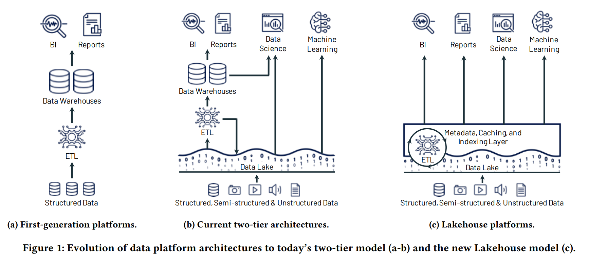
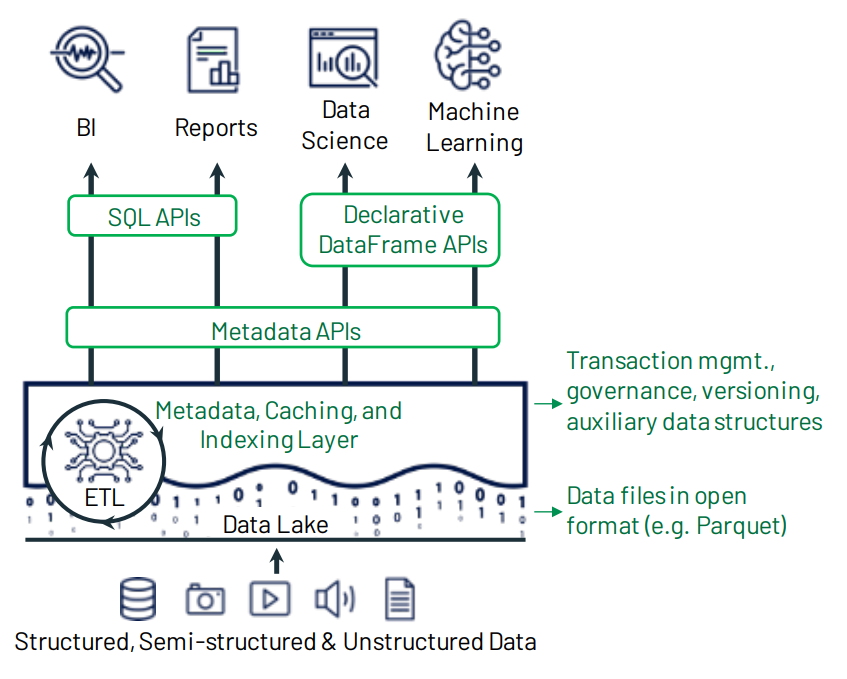

### Intro
데이터 엔지니어링의 역사는 어떻게 하면 데이터를 더 싸게, 더 빠르게, 더 안정적으로 다룰 수 있을지에 대한 끊임없는 고민이다.
그 과정에서 `Data Warehouse`와 `Data Lake`라는 두 가지 접근법이 등장했고, 많은 조직이 두 시스템을 함께 운영하는 `2-tier 아키텍처`를 채택했다.
#
`Data Warehouse`는 정형화된 데이터를 SQL로 분석하기에 최적화된 시스템이다. 데이터 품질과 성능은 뛰어나지만, 비정형 데이터나 대규모 ML 워크로드를 처리하기에는 적합하지 않다.
그래서 등장한 것이 `Data Lake`다. 비정형 데이터를 포함한 모든 원시 데이터를 저렴한 오브젝트 스토리지에 쌓아두고, 필요할 때마다 꺼내 쓰는 방식이다.
#
문제는 두 시스템을 동시에 운영하다 보면 복잡성이 기하급수적으로 증가한다는 것이다.
2021년 CIDR에서 발표된 Lakehouse 논문은 이 문제에 정면으로 맞서며, 두 시스템의 장점을 하나의 아키텍처에 담는 방법을 제안한다.

### Motivation

*출처: Lakehouse: A New Generation of Open Platforms that Unify Data Warehousing and Advanced Analytics, CIDR 2021*
#
`Data Lake + Data Warehouse`로 이루어진 2-tier 아키텍처가 왜 문제인지는 직접 운영해본 사람이라면 쉽게 공감할 수 있다.
#
첫 번째 문제는 **복잡성**이다. 두 시스템을 동기화 상태로 유지하는 것 자체가 큰 엔지니어링 과제다. `Data Lake`에서 데이터를 ETL 처리한 뒤 `Warehouse`에 적재하는 파이프라인을 구축해야 하고, 이 파이프라인이 실패하면 두 시스템 사이의 데이터가 불일치 상태가 된다. 일관성 유지가 어렵고, 관리 비용도 높아진다.
#
두 번째는 **데이터 신선도** 문제다. `Warehouse`의 데이터는 ETL 파이프라인이 실행된 시점의 스냅샷이다. 원본 데이터인 `Data Lake`가 업데이트돼도 `Warehouse`는 즉시 반영되지 않는다. 분석가가 보는 데이터가 최신이 아닐 수 있는 것이다.
#
세 번째는 **Raw Data 접근 병목**이다. ML 엔지니어가 모델 학습을 위해 원시 데이터에 바로 접근하고 싶어도, 2-tier 구조에서는 `Warehouse`를 거치거나 별도 파이프라인을 통해야 한다. 직접 `Data Lake`를 조회하는 방법도 있지만, `Spark SQL`, `Presto`, `Hive`, `AWS Athena` 같은 쿼리 엔진들은 `Data Lake` 스토리지를 직접 조회할 때 두 가지 문제를 피할 수 없었다. `ACID 트랜잭션`이 보장되지 않는다는 것과, 쿼리 성능이 전용 `Warehouse`에 비해 떨어진다는 것이다.
#
네 번째는 **ML 워크로드의 부적합성**이다. `Warehouse`는 SQL 기반의 BI 분석에 최적화돼 있다. ML 엔지니어가 필요한 건 `Python` 코드와 대규모 데이터셋이다. `ODBC/JDBC`로 데이터를 끌어오는 방식은 비효율적이고, `Warehouse`의 SQL 인터페이스만으로는 ML 전처리 파이프라인을 구축하기 어렵다.

### Lakehouse Architecture

*출처: Lakehouse: A New Generation of Open Platforms that Unify Data Warehousing and Advanced Analytics, CIDR 2021*
#
`Lakehouse`가 제안하는 해법의 핵심은 **Storage Layer와 Computing Layer를 완전히 분리**하는 것이다.
#
`Storage Layer`는 `Amazon S3`, `Google Cloud Storage`, `Azure Blob Storage` 같은 클라우드 오브젝트 스토리지다. 저렴하고 무한에 가까운 확장성을 가진 이 스토리지를 데이터의 단일 진실 공급원(`Single Source of Truth`)으로 삼는다. 파일 포맷은 `Apache Parquet`을 사용한다. `Parquet`은 컬럼형 포맷으로 분석 쿼리에 최적화돼 있고, 오픈 포맷이기 때문에 특정 벤더에 종속되지 않는다.
#
그런데 오브젝트 스토리지와 `Parquet`만으로는 `ACID 트랜잭션`도 없고, 쿼리 성능도 보장할 수 없다. 여기서 **Metadata Layer**가 등장한다. `Delta Lake` 또는 `Apache Iceberg`가 이 역할을 담당하며, 오브젝트 스토리지 위에 트랜잭션 로그를 얹어 `ACID` 보장과 메타데이터 관리를 가능하게 한다.
#
`Computing Layer`는 이 위에 자유롭게 올릴 수 있다. `Spark`, `Presto`, `Dask`, ML 프레임워크 등 필요한 엔진을 선택해서 사용한다. 데이터는 스토리지에 분리되어 있기 때문에 컴퓨팅 자원은 필요할 때만 키고 끄면 된다.

### Metadata Layer
`Metadata Layer`의 핵심 역할은 **ACID 트랜잭션 관리**다. `Delta Lake`를 예로 들면, 각 테이블마다 `Parquet` 형태의 트랜잭션 로그 파일을 저장한다. 어떤 데이터 파일이 어느 테이블에 속하는지, 어떤 트랜잭션이 언제 발생했는지가 이 로그에 기록된다.
#
기존에 `Parquet` 파일로 `Data Lake`를 구축한 경우라면 `Delta Lake`로의 전환이 비교적 수월하다. 기존 `Parquet` 파일 위에 트랜잭션 로그만 추가하면 되기 때문이다.
#
`Metadata Layer`가 주는 또 다른 이점은 **스키마 강제화**다. 데이터를 적재할 때 미리 정의된 스키마와 맞지 않는 데이터가 들어오면 쓰기 자체를 거부한다. 타입이 맞지 않는 컬럼, 예상치 못한 필드, 누락된 필수 값들이 `Data Lake`로 흘러들어가 `Data Swamp`가 되는 것을 원천 차단한다. 이를 통해 데이터 품질을 시스템 레벨에서 보장할 수 있다.
#
`Governance` 기능도 빼놓을 수 없다. 테이블 단위의 **접근 제어**와 **Audit Logging**이 가능해진다. 누가 언제 어떤 데이터를 조회하거나 변경했는지가 트랜잭션 로그에 기록되기 때문에, 별도의 감사 시스템 없이도 데이터 접근 이력을 추적할 수 있다.

### SQL Performance
`Lakehouse`가 풀어야 할 핵심 과제 중 하나는 SQL 성능이다. `Snowflake` 같은 전용 `Warehouse`는 SQL 성능을 극대화하기 위해 독자적인 내부 포맷으로 데이터를 저장한다. 하지만 `Lakehouse`는 오픈 포맷인 `Parquet`을 고수해야 한다. 그렇다면 어떻게 성능을 끌어올릴 수 있을까.

#### Caching
저장 포맷은 `Parquet`으로 고정돼 있지만, 메모리에 올릴 때는 다르다. `Delta Lake` 엔진은 `Parquet` 파일을 압축 해제하여 컬럼형 인메모리 포맷으로 캐싱한다. 자주 쿼리되는 데이터는 메모리에서 바로 서빙되므로 클라우드 스토리지 I/O 레이턴시를 피할 수 있다.
#
캐시 일관성은 트랜잭션 로그로 보장된다. 데이터 파일이 변경되면 트랜잭션 로그에 새로운 항목이 기록된다. 캐시된 데이터가 최신인지 확인할 때 스토리지를 전부 스캔할 필요 없이 로그만 확인하면 되므로, 동기화되지 않은 stale 캐시를 읽을 걱정이 없다.

#### Auxiliary Data
쿼리 최적화를 위해 트랜잭션 로그 파일 안에 **통계 데이터**를 함께 저장한다. `Bloom Filter`와 `Min-Max Value`가 대표적이다.
#
`Bloom Filter`는 특정 값이 파일에 존재하는지 여부를 빠르게 판별한다. `Min-Max Value`는 파일 내 컬럼의 최솟값과 최댓값을 기록한다. 쿼리의 필터 조건이 파일의 Min-Max 범위를 벗어나면 그 파일 전체를 읽지 않고 건너뛸 수 있다(`Data Skipping`). 수천 개의 `Parquet` 파일 중 실제로 필요한 파일만 읽어내는 것이 가능해진다.

#### Data Layout
데이터를 물리적으로 어떻게 배치하느냐도 쿼리 성능에 큰 영향을 미친다. `Lakehouse`에서는 **Z-order**를 사용해 유사한 속성을 가진 데이터를 물리적으로 가까이 배치한다.
#
Z-order는 여러 차원의 값을 하나의 Z-value로 변환하여 정렬하는 방식이다. 예를 들어 `userId`와 `eventDate` 두 컬럼에 Z-order를 적용하면, 비슷한 `userId`와 비슷한 `eventDate`를 가진 행들이 같은 파일 안에 몰리게 된다. 이후 두 컬럼을 조건으로 쿼리할 때 읽어야 할 파일 수가 크게 줄어든다.

### DataFrame API
`Warehouse`의 SQL 인터페이스만으로는 ML 워크로드를 처리하기 어렵다. 피처 엔지니어링, 데이터 전처리, 대규모 행렬 연산은 `Python` 코드로 표현하는 것이 훨씬 자연스럽다.
#
`Lakehouse`는 이를 위해 **Spark DataFrame**과 **Koalas**를 통한 DataFrame API를 지원한다. `Koalas`는 `Pandas`와 동일한 인터페이스를 제공하면서 내부적으로 `Spark`로 분산 처리된다. ML 엔지니어가 익숙한 `Pandas` 코드를 그대로 작성하면, 엔진이 이를 `Spark SQL` 실행 계획으로 변환하여 대규모 데이터셋에 적용한다.
#
이 덕분에 데이터 분석가는 SQL로, ML 엔지니어는 Python으로, 각자 익숙한 인터페이스를 사용하면서 동일한 데이터 스토어에 접근할 수 있다. 데이터를 별도 시스템으로 복사하거나 파이프라인을 거칠 필요 없이, 원시 데이터에 바로 접근하는 것이다.

### Outro
`Lakehouse`는 `Data Lake`와 `Data Warehouse`를 대체하는 개념이 아니다. 두 시스템을 별도로 운영할 때 발생하는 복잡성, 일관성 문제, ML 워크로드 부적합성이라는 구조적 문제를 단일 아키텍처로 해결하려는 시도다.
#
오브젝트 스토리지의 저렴함과 확장성을 유지하면서, `Metadata Layer`를 통해 `ACID`, 스키마 강제화, Governance를 달성한다. SQL 분석가와 ML 엔지니어 모두가 동일한 데이터에 각자의 방식으로 접근할 수 있게 된다.
#
현재 `Databricks`의 `Delta Lake`, `Apache Iceberg`, `Apache Hudi`가 이 Lakehouse 아키텍처의 Metadata Layer를 구현하는 대표적인 오픈 소스 포맷이다. 클라우드 벤더들도 각자의 Lakehouse 서비스를 내놓고 있다. 2021년 논문에서 제안된 아이디어가 지금 데이터 엔지니어링의 주류 패러다임이 된 셈이다.

### Reference
- Armbrust, M., et al. "Lakehouse: A New Generation of Open Platforms that Unify Data Warehousing and Advanced Analytics." *CIDR 2021*. https://www.cidrdb.org/cidr2021/papers/cidr2021_paper17.pdf
