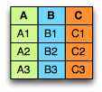
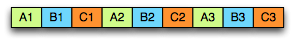
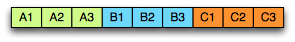
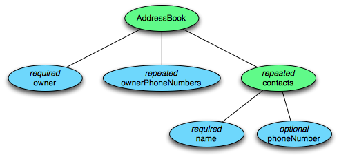
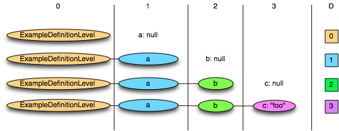
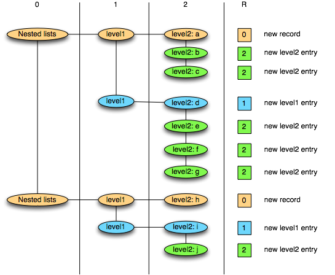
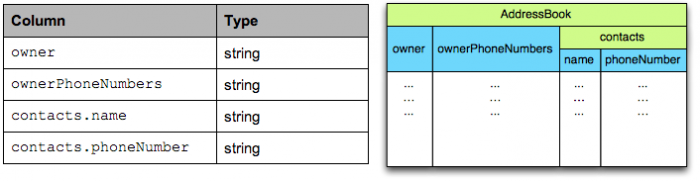
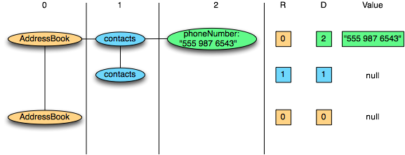
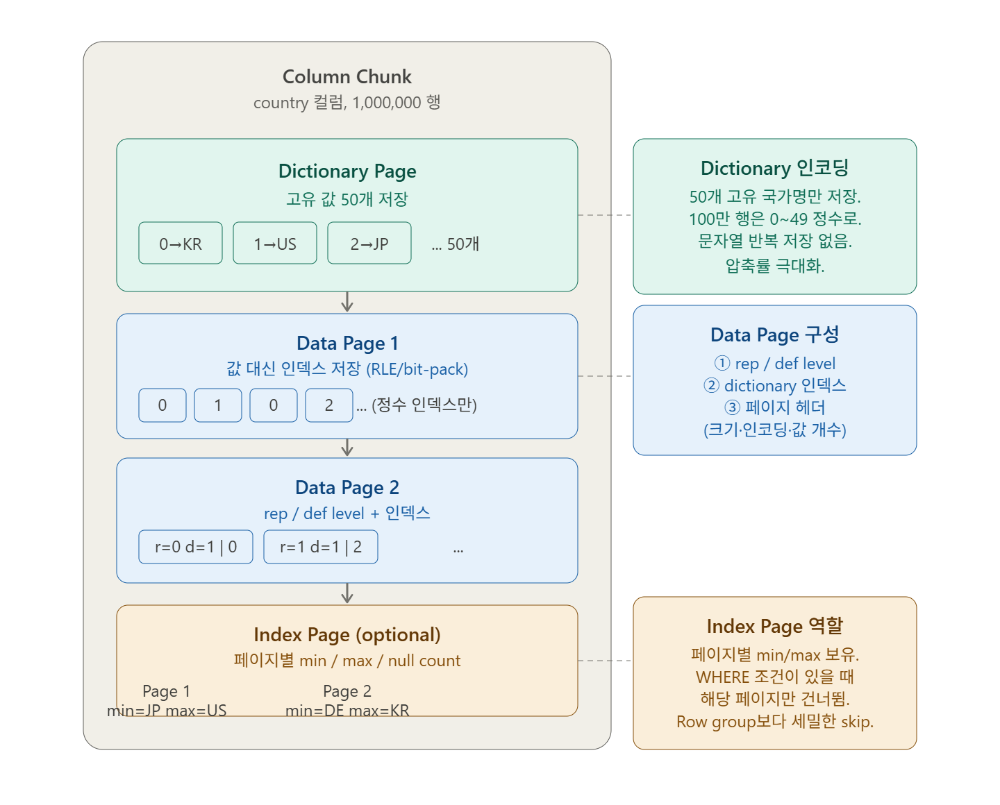

### Intro
`Google Dremel` 논문이 중첩 데이터를 컬럼으로 저장하는 이론을 제시했다면, `Apache Parquet`는 그 이론을 `Hadoop` 에코시스템에 실제로 구현한 오픈소스 파일 포맷이다.
`Twitter`와 `Cloudera`가 2012년 공동 개발을 시작했고, 이후 `Apache` 최상위 프로젝트가 되어 `Spark`, `Hive`, `Impala`, `BigQuery` 등 주요 빅데이터 프레임워크의 표준 저장 포맷으로 자리 잡았다.
`Twitter`가 `Parquet`를 실제 운영 데이터셋에 적용한 결과, 저장 크기가 기존 대비 1/3로 줄었고 일부 컬럼만 읽는 분석 쿼리의 스캔 시간은 그 이상으로 단축됐다.
#
이 포스트에서는 두 가지를 다룬다. 첫째, 중첩 구조를 가진 데이터를 어떻게 손실 없이 컬럼에 담는가. 둘째, 그렇게 인코딩된 데이터가 실제 파일 안에서 어떻게 배치되는가.
`Dremel` 포스트에서 `r/d` 인코딩 개념을 이미 다뤘으니, 여기서는 `AddressBook` 예제로 구체적인 흐름을 따라가며 직접 손으로 분해하고 복원해본다.

### 컬럼 저장소(columnar storage)
같은 데이터를 저장하는 방법에는 두 가지가 있다. A, B, C 세 컬럼을 가진 테이블을 예로 들면 아래와 같다.



`로우 지향(row-oriented)`은 한 레코드를 통째로 연속해서 쓴다.



`컬럼 지향(column-oriented)`은 같은 속성끼리 모아서 쓴다.



분석 쿼리는 보통 수십 개의 컬럼 중 2~3개만 본다. 로우 지향으로 저장하면 필요 없는 컬럼까지 디스크에서 전부 읽어야 하지만, 컬럼 지향은 필요한 컬럼만 꺼내면 된다.
같은 타입의 값이 연속으로 쌓이기 때문에 압축 효율도 훨씬 높아지고, 타입이 동일한 값끼리 묶이므로 인코딩·디코딩도 빠르다.

### 중첩 데이터의 문제
단순한 테이블이라면 컬럼 저장이 쉽다. 그런데 실제 데이터는 중첩(nested) 구조를 가진다. `Parquet`가 다루는 스키마는 아래처럼 생겼다.

```
message AddressBook {
  required string owner;
  repeated string ownerPhoneNumbers;
  repeated group contacts {
    required string name;
    optional string phoneNumber;
  }
}
```

각 필드는 세 종류 중 하나다. `required`는 반드시 존재하고, `optional`은 있거나 없거나이며, `repeated`는 0개 이상 반복된다.
#
핵심 과제는 이 중첩 레코드를 평평한 컬럼으로 저장한 뒤, 정보 손실 없이 원래 구조로 복원하는 것이다.
`Parquet`는 원시 타입(primitive type) 리프 노드마다 컬럼을 하나씩 만든다. 이 스키마에서는 `owner`, `ownerPhoneNumbers`, `contacts.name`, `contacts.phoneNumber` 총 4개 컬럼이 생성된다.


#
문제는 값만 나열하면 구조 정보가 사라진다는 점이다. `["Dmitriy Ryaboy", "Chris Aniszczyk"]`만 봐서는 두 이름이 같은 레코드 안에 있는지, 서로 다른 레코드에 속하는지 알 수 없다.

### Definition Level & Repetition Level
각 컬럼의 값 옆에 두 개의 정수를 함께 저장하면 원본 중첩 구조를 완전히 복원할 수 있다. 이것이 `Dremel` 논문의 핵심 아이디어다.

`Definition Level`은 "이 값이 null인가?"를 표현한다. 경로상 `optional`·`repeated` 필드 중 실제로 정의된 것이 몇 개인지 나타낸다. 최댓값이면 실제 값이 존재하고, 그보다 작으면 해당 레벨에서 null이 시작된다. `required` 필드는 항상 존재하므로 카운트하지 않는다.
#
definition level을 직관적으로 이해하려면 단순한 중첩 예제가 도움이 된다.

```
message ExampleDefinitionLevel {
  optional group a {
    optional group b {
      optional string c;
    }
  }
}
```

`a`, `b`, `c` 모두 `optional`이므로 `a.b.c` 컬럼의 최대 definition level은 3이다.



- D=3: `c`가 정의됨 (a, b, c 모두 존재)
- D=2: `b`까지는 정의됐지만 `c`가 null
- D=1: `a`만 정의됐고 `b`가 null
- D=0: `a` 자체가 null

만약 `b`를 `required`로 바꾸면 최대 def level은 2로 줄어든다. `required` 필드는 항상 존재하므로 카운트하지 않기 때문이다. 이처럼 `required`를 적절히 사용하면 레벨 값의 범위를 줄여 저장 비트를 절약할 수 있다.
#
`Repetition Level`은 "어디서 반복이 시작됐나?"를 표현한다. 경로상 어느 `repeated` 필드에서 이 값이 새로 시작됐는지 나타낸다. `0`이면 완전히 새로운 최상위 레코드이고, `n`이면 경로상 n번째 `repeated` 필드에서 반복이 시작됐다는 의미다.
#
repetition level은 리스트 안의 리스트(list of lists) 예제에서 더 명확하게 드러난다.



- R=0: 새 최상위 레코드 시작 → level1 리스트와 level2 리스트 모두 새로 생성
- R=1: 현재 레코드 안에서 새 level1 리스트 시작 → level2 리스트도 새로 생성
- R=2: 현재 level2 리스트에 값 추가

`optional`·`required` 필드는 반복되지 않으므로 repetition level이 필요 없다. repetition level은 오직 `repeated` 필드에만 부여된다.
#
`AddressBook` 스키마에서 각 컬럼의 최대 레벨은 아래와 같다.



| 컬럼 | 최대 def level | 최대 rep level |
|------|--------------|--------------|
| `owner` | 생략 (required) | 생략 |
| `ownerPhoneNumbers` | 1 | 1 |
| `contacts.name` | 1 | 1 |
| `contacts.phoneNumber` | 2 | 1 |

`contacts.phoneNumber`의 최대 def level이 2인 이유는 경로상 `optional`/`repeated` 필드가 `contacts`(repeated)와 `phoneNumber`(optional) 두 개이기 때문이다.

### Record Shredding — 레코드를 컬럼으로
예제 레코드 두 개를 준비한다.

```
// 레코드 1
AddressBook {
  owner: "Julien Le Dem"
  ownerPhoneNumbers: "555 123 4567"
  ownerPhoneNumbers: "555 666 1337"
  contacts: { name: "Dmitriy Ryaboy",  phoneNumber: "555 987 6543" }
  contacts: { name: "Chris Aniszczyk" }  // phoneNumber 없음
}

// 레코드 2
AddressBook {
  owner: "A. Nonymous"
  // contacts 없음
}
```

이 두 레코드를 4개 컬럼으로 분해하면 다음과 같다. `owner`는 `required`이므로 rep·def 레벨 없이 값만 저장된다.

**ownerPhoneNumbers**

| 값 | R | D |
|----|---|---|
| "555 123 4567" | 0 | 1 |
| "555 666 1337" | 1 | 1 |
| null (레코드 2) | 0 | 0 |

**contacts.name**

| 값 | R | D |
|----|---|---|
| "Dmitriy Ryaboy" | 0 | 1 |
| "Chris Aniszczyk" | 1 | 1 |
| null (레코드 2) | 0 | 0 |

**contacts.phoneNumber**

| 값 | R | D |
|----|---|---|
| "555 987 6543" | 0 | 2 |
| null (Chris) | 1 | 1 |
| null (레코드 2) | 0 | 0 |



`contacts.phoneNumber`의 세 번째 행을 보면 D=1과 D=0이 둘 다 null이지만 의미가 다르다.
D=1은 "`contacts`는 있지만 `phoneNumber`가 없음"이고, D=0은 "`contacts` 자체가 없음"이다.
이 차이 하나가 레코드 복원 시 완전히 다른 구조를 만들어낸다.

### Record Assembly — 컬럼에서 레코드로
`contacts.phoneNumber` 컬럼의 세 항목을 순서대로 읽으며 레코드를 재조립한다.
#
**항목 1: R=0, D=2, "555 987 6543"**
R=0이므로 새 레코드를 생성한다. 루트부터 D=2 수준까지 구조를 만들고, D가 최대값이므로 실제 값을 삽입한다.
결과: 레코드 1 생성, `contacts[0].phoneNumber = "555 987 6543"`
#
**항목 2: R=1, D=1**
R=1이므로 새 레코드가 아니다. 레벨 1(`contacts`)에서 반복이 시작됐으므로 `contacts`를 하나 더 추가한다.
D=1은 `contacts`까지만 정의됐다는 뜻이므로 `phoneNumber`는 null, 빈 contacts 그룹만 생성된다.
결과: 레코드 1에 `contacts[1]` 추가, `phoneNumber = null`
#
**항목 3: R=0, D=0**
R=0이므로 새 레코드를 생성한다. D=0은 루트 수준에서 이미 null이라는 뜻이므로 `contacts` 자체가 없다.
결과: 레코드 2 생성, `contacts` 없음
#
복원된 두 레코드는 원본과 100% 동일하다. 두 개의 정수만으로 어떤 중첩 구조도 손실 없이 재조립할 수 있다.

### 저장 오버헤드
레벨 값은 스키마 깊이에 따라 몇 비트면 충분하다.

| 비트 수 | 표현 가능한 최대 깊이 |
|--------|------------------|
| 1 bit | 깊이 1 (0 또는 1) |
| 2 bits | 깊이 3 (0~3) |
| 3 bits | 깊이 7 (0~7) |

추가 최적화도 있다. `required` 필드는 def level이 항상 최대이므로 저장하지 않는다. 반복이 없는 필드는 rep level이 항상 0이므로 역시 생략한다. 모든 필드가 `required`인 flat 스키마라면 rep·def 레벨 자체가 완전히 사라진다. `SQL`의 `NOT NULL` 컬럼과 동일한 표현이 되는 셈이다.
#
null이 많은 컬럼은 `RLE(Run-Length Encoding)`로 수백만 개의 0을 단 몇 바이트로 압축할 수 있다.
결국 이 표현 방식은 flat 스키마 컬럼 저장의 일반화다. 모든 필드가 `required`인 단순한 경우가 rep·def=0인 특수 케이스가 된다.

### Parquet 파일 구조
지금까지는 중첩 데이터를 컬럼에 인코딩하는 방법을 다뤘다. 이번엔 그렇게 인코딩된 데이터가 실제 파일 안에 어떻게 배치되는지 살펴본다.

```
+---------------------------+
|  Magic Number ("PAR1")    |  4 bytes — 파일 시작
+---------------------------+
|  Row Group 0              |
|    Column Chunk 0.0       |
|    Column Chunk 0.1       |
|    Column Chunk 0.2       |
+---------------------------+
|  Row Group 1              |
|    Column Chunk 1.0       |
+---------------------------+
|  File Metadata (Footer)   |
+---------------------------+
|  Footer Length (4 bytes)  |
+---------------------------+
|  Magic Number ("PAR1")    |  4 bytes — 파일 끝
+---------------------------+
```

파일은 `PAR1`이라는 매직 넘버로 시작하고 끝난다. 실제 데이터는 가운데 `row group`들에, 파일 메타데이터(`footer`)는 맨 끝에 위치한다.
쿼리 엔진은 파일을 열 때 마지막 8바이트를 먼저 읽어 `footer` 길이를 파악하고, `footer`만으로 스키마·row group 위치·컬럼 통계를 모두 파악한 뒤 필요한 데이터만 선택적으로 읽는다.

### Row Group
`Row group`은 전체 행을 수평으로 나눈 덩어리다. 1천만 행짜리 파일에 row group 크기가 100만이면 10개의 row group으로 구성된다.
#
row group이 중요한 이유는 세 가지다. 여러 스레드·코어가 서로 다른 row group을 동시에 처리할 수 있어 병렬 처리가 가능하고, 한 번에 하나씩 처리하므로 메모리 사용량이 제한된다.
가장 강력한 이점은 `predicate pushdown`이다. 각 row group은 컬럼별 min/max 통계를 갖는다. `WHERE date > '2025-06-01'` 같은 조건이 있을 때, max 날짜가 이미 그 이전인 row group은 데이터를 읽지 않고 통째로 건너뛴다.
#
기본 크기는 `Apache Spark`가 128 MB(압축 후), `PyArrow`가 64 MB이며 `DuckDB`는 자동으로 조정한다. 작을수록 predicate pushdown 효율이 높아지고, 클수록 압축률이 좋아진다. 일반적으로 50 MB ~ 256 MB 사이가 권장된다.

### Column Chunk & Page
`Row group` 안에서 데이터는 컬럼별로 저장된다. `(id, name, age, city)` 4개 컬럼, row group 2개짜리 파일은 총 8개의 `column chunk`를 갖는다.

```
Row Group 0: [id_chunk | name_chunk | age_chunk | city_chunk]
Row Group 1: [id_chunk | name_chunk | age_chunk | city_chunk]
```

`column chunk`는 디스크에 연속으로 저장된다. 쿼리에서 `id`와 `age`만 필요하면 `name`과 `city` chunk는 아예 읽지 않는다. 이것이 `column pruning`이다. 각 column chunk는 독립적인 압축 코덱을 가질 수 있다.
#
`column chunk`는 다시 `page`로 나뉜다. `page`는 `Parquet`에서 압축과 인코딩의 최소 단위이며 보통 1 MB 내외다.



`page`는 세 종류가 있다.
#
**Data Page**는 실제 컬럼 값이 저장된다. repetition/definition level, 인코딩된 값, 페이지 헤더(크기, 인코딩 타입, 값 개수)가 포함된다.
#
**Dictionary Page**는 dictionary 인코딩 사용 시 column chunk의 첫 번째 page로 등장한다. 해당 컬럼의 고유 값 목록을 담고, 이후 data page들은 값 대신 dictionary 인덱스(정수)를 쓴다. `country` 컬럼이 1백만 행이지만 고유 국가가 50개뿐이라면, 50개짜리 dictionary page 하나와 정수 인덱스로 이루어진 data page들로 구성된다.
#
**Index Page**는 컬럼 인덱스와 오프셋 인덱스를 저장한다. 페이지 단위 min/max를 기록해 row group 안에서도 특정 page만 건너뛸 수 있게 한다.

### 인코딩과 압축
`Parquet`는 컬럼 타입과 데이터 특성에 따라 여러 인코딩을 선택한다.

| 인코딩 | 설명 | 적합한 경우 |
|--------|------|-----------|
| Plain | 값을 그대로 저장 | 범용 폴백 |
| Dictionary | 고유 값 사전 + 정수 인덱스 | 카디널리티가 낮은 컬럼 (국가, 상태 코드 등) |
| RLE | 연속 반복 값을 (값, 횟수) 쌍으로 압축 | 정렬된 데이터, 반복이 많은 컬럼 |
| Delta Encoding | 연속 값의 차이만 저장 | 정렬된 정수, 타임스탬프, auto-increment ID |
| Byte Stream Split | float 바이트를 재배열해 압축률 향상 | 부동소수점 컬럼 |

대부분의 writer는 기본적으로 `Dictionary` 인코딩을 시도하고, dictionary 크기가 일정 임계값(보통 1 MB)을 넘으면 `Plain`으로 폴백한다.
#
인코딩 이후 각 page는 추가로 압축된다.

| 코덱 | 속도 | 압축률 | 특징 |
|------|------|--------|------|
| Snappy | 매우 빠름 | 보통 | 많은 도구의 기본값. 인터랙티브 워크로드에 적합 |
| Zstd | 빠름 | 높음 | 속도와 압축률의 최적 균형. 최근 권장 기본값 |
| Gzip | 느림 | 높음 | 오래된 레거시 환경 호환 |
| LZ4 | 매우 빠름 | 낮음 | 압축보다 속도가 중요한 경우 |
| Brotli | 느림 | 매우 높음 | 저장 비용 최소화가 목표일 때 |

이 계층 구조 덕분에 쿼리 엔진은 세 단계로 데이터를 스킵할 수 있다. 파일·디렉토리 수준의 파티션 프루닝, `footer` 통계를 활용한 row group 스킵, 그리고 column index를 이용한 page 스킵이다.

```
파일
└── Row Group (수평 분할, 수십~수백 MB)
    └── Column Chunk (컬럼 단위, row group당 1개)
        └── Page (최소 I/O 단위, ~1 MB)
            ├── Dictionary Page (고유 값 사전)
            ├── Data Page (실제 값 + rep/def level)
            └── Index Page (min/max 통계)
```

### Outro
중첩 데이터를 컬럼으로 저장하면 각 값의 구조 정보가 사라진다. `Dremel`은 이 문제를 두 개의 정수로 해결한다.
`Definition Level`은 null의 깊이, 즉 경로상 어디까지 정의됐는가를 나타낸다. `Repetition Level`은 반복의 시작점, 즉 경로상 어느 `repeated` 필드에서 새로 시작됐는가를 나타낸다.
#
이 두 숫자만 있으면 어떤 중첩 구조도 손실 없이 컬럼에 쓰고 원본으로 복원할 수 있다.
`Parquet`는 이 `Dremel` 인코딩 방식을 그대로 채택해 `Hadoop` 에코시스템에 구현한 파일 포맷이다.
`Spark`, `BigQuery`, `Hive`가 표준 저장 포맷으로 채택한 이유는 단순히 컬럼 저장이라서가 아니라, 중첩 구조까지 정보 손실 없이 컬럼화할 수 있는 이 설계 덕분이다.
