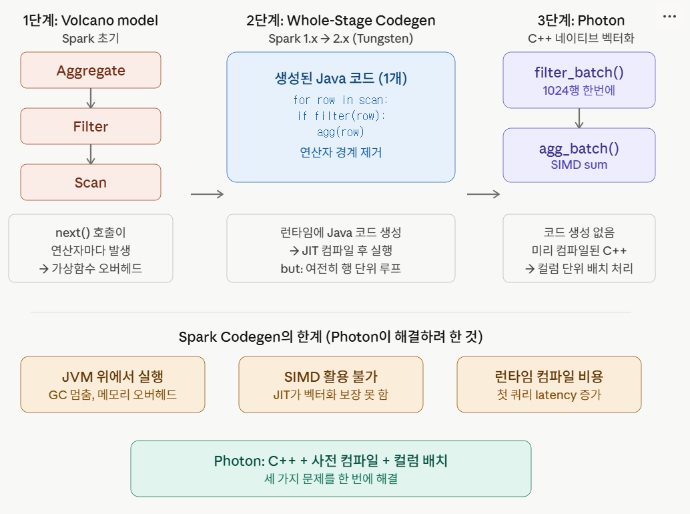
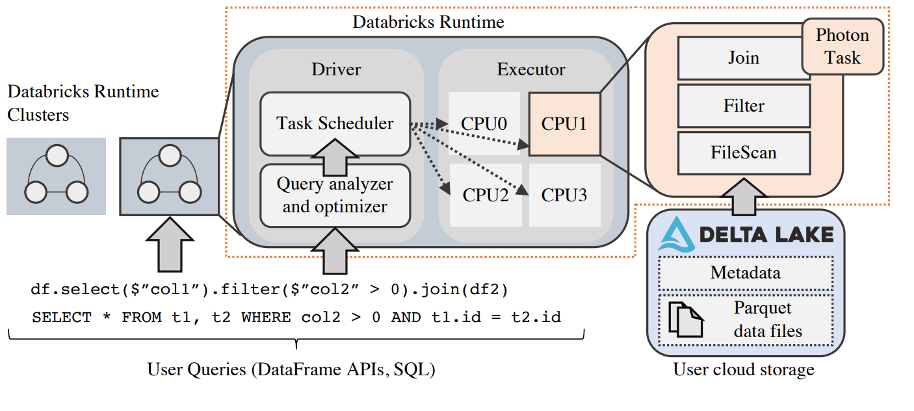
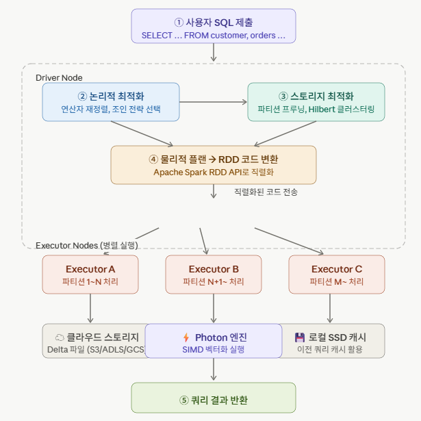
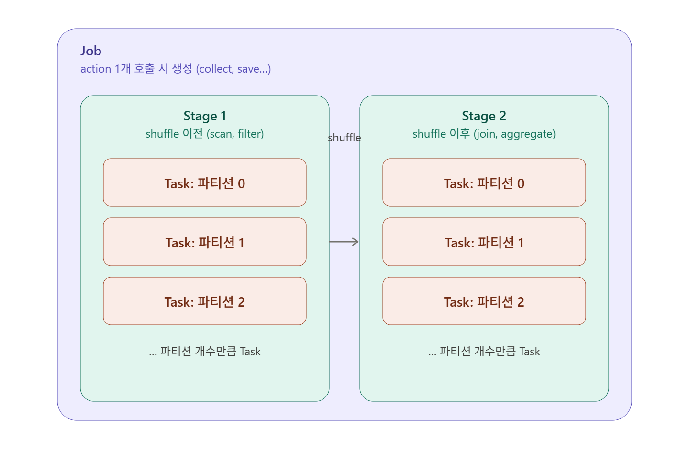
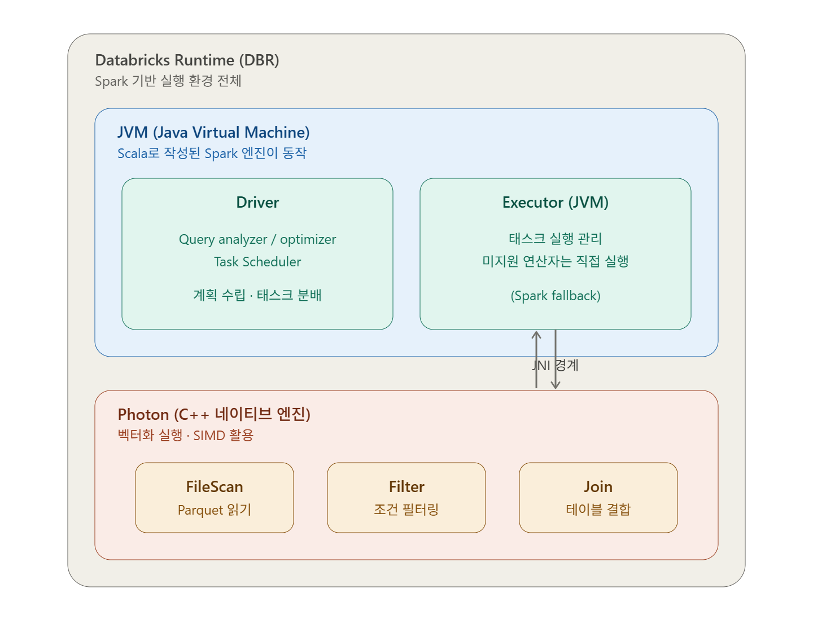
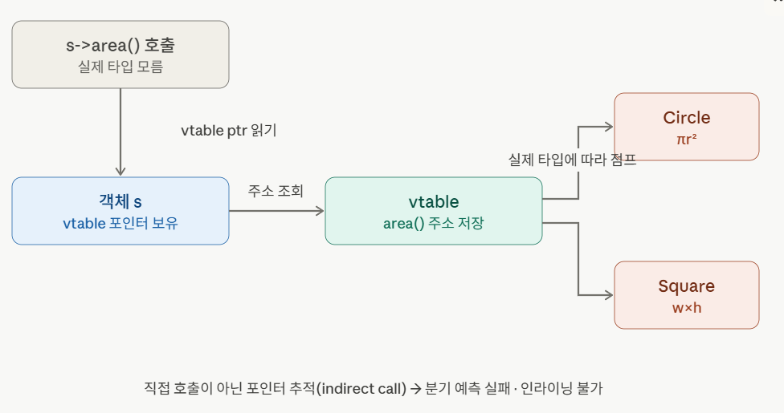
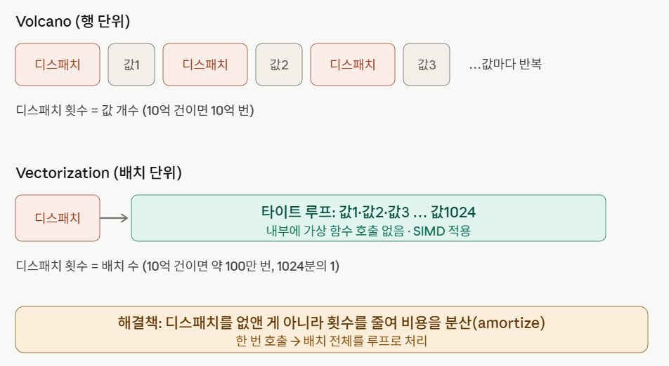
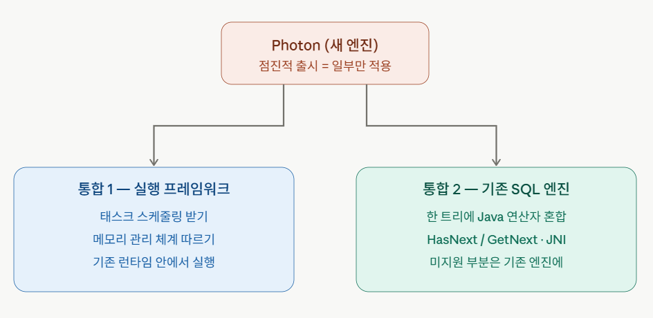
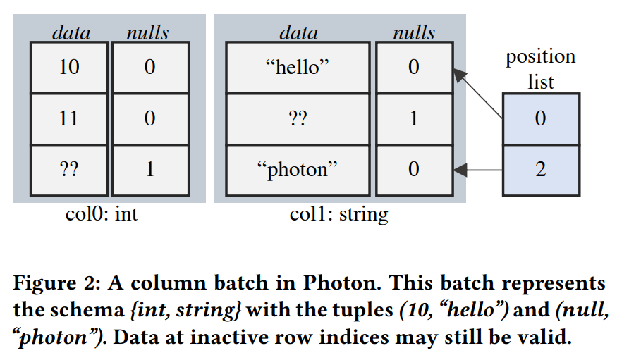
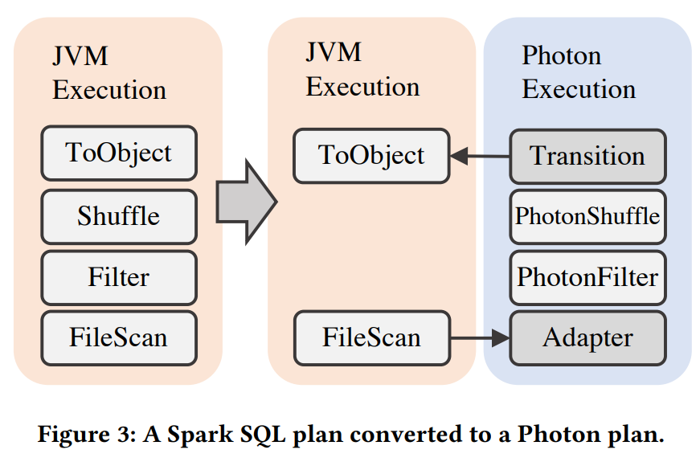

### Intro
데이터 플랫폼을 운영하다 보면 `DataLake`와 `DataWarehouse`를 따로 두는 2계층 구조를 자주 만나게 된다.
`DataLake`는 원시 데이터를 저렴하게 보관하는 역할을 하고, `DataWarehouse`는 분석에 최적화된 정제 데이터를 관리하는 역할을 한다.
이 구조는 직관적이지만, 두 계층 사이의 데이터 동기화와 거버넌스 관리가 복잡해지는 단점이 있다.
#
이 문제를 해결하기 위해 등장한 것이 `Lakehouse`다.
`Lakehouse`는 `DataLake`의 저렴한 오픈 스토리지 위에 `ACID` 트랜잭션, 데이터 거버넌스, `SQL` 지원을 더한 아키텍처다.
두 계층을 하나로 합쳤으니 관리는 단순해졌지만, 저장 레이어와 쿼리 레이어 모두에서 성능 최적화가 필요했다.
#
`Photon`은 그 과제를 해결하기 위해 `Databricks`가 2022년 `SIGMOD`에서 발표한 `C++` 기반 `Vectorized Query Engine`이다.
`SQL`과 `Apache Spark DataFrame API`를 모두 지원하며, `Spark`에 임베딩되어 `Spark` 생태계와 완전한 호환성을 유지하면서도 `CPU` 성능을 극대화하는 것이 목표였다.

### 요구사항

*출처: Photon: A Fast Query Engine for Lakehouse Systems, SIGMOD 2022*
#
`Photon`이 충족해야 할 핵심 요구사항은 두 가지였다.
#
첫 번째는 **Raw, Uncurated 데이터 지원**이다. 전통적인 `SQL` 웨어하우스는 정제되고 스키마가 잡힌 데이터를 전제로 설계된다.
반면 `Lakehouse`에서는 스키마가 없거나 `NULL`이 많고, 통계 정보도 없는 원시 데이터를 그대로 처리할 수 있어야 한다.
#
두 번째는 **기존 Spark API 호환성**이다. `Spark API`로 작업하는 사용자가 많기 때문에 완전한 호환이 필수였다.
소수점 연산 오차 처리 방식, `NULL` 값 처리 방식까지 `Spark`와 동일한 결과를 내도록 `C++` 엔진을 튜닝해야 했다.
`Spark`의 `UDF`는 `JVM`에서 실행되고 `Photon`은 `C++`에서 실행되기 때문에, 두 코드가 충돌하지 않도록 `Apache Spark` 기반의 `Databricks Runtime(DBR)`을 개발했다.
만약 쿼리 안에 `Photon`이 아직 구현하지 않은 `Spark SQL` 연산자가 있다면, 해당 부분만 기존 `Spark SQL`로 처리하는 점진적 전환 방식을 택했다.

### Databricks Lakehouse 아키텍처

*출처: Photon: A Fast Query Engine for Lakehouse Systems, SIGMOD 2022*
#
`Databricks Lakehouse`는 4개의 계층으로 구성된다.
맨 아래 **Datalake Storage Layer**는 `S3`, `GCS` 같은 클라우드 오브젝트 스토리지다.
그 위 **Automatic Data Management Layer**는 `Delta Lake`가 담당하며 `ACID` 트랜잭션, 스키마 관리, 데이터 정렬을 책임진다.
**Execution Layer**가 `Photon`이 담당하는 계층이고, 가장 위에 **User Interface Layer**로 `SQL`과 `DataFrame API` 등 사용자 접점이 위치한다.
#
여기서 흥미로운 점이 있다. `Delta Lake`는 데이터 정렬에 `Z-curve` 대신 **Hilbert Curve**를 사용한다.
`Z-curve`는 다차원 공간에서 인접한 좌표를 선형으로 매핑하는 방식인데, 곡선 경로가 갑자기 멀리 점프하는 구간이 생긴다.
`Hilbert Curve`는 이 점프 문제를 개선해 인접 데이터를 더 일관되게 가깝게 배치한다. 덕분에 범위 스캔 시 읽어야 하는 데이터 블록 수가 줄어든다.

### Databricks Runtime (DBR)

*출처: Photon: A Fast Query Engine for Lakehouse Systems, SIGMOD 2022*
#
`DBR`은 `Apache Spark API`를 제공하는 실행 환경이다.
애플리케이션이 `DBR`에 `Job`을 제출하면, `Job`은 `Stage` 단위로 쪼개진다.
각 `Stage`는 데이터 파티션 단위로 분산 처리되며, 이전 `Stage`가 끝나야 다음 `Stage`가 시작되는 `stage boundary`를 갖는다.
#
단일 **Driver 노드**가 스케줄링과 쿼리 플래닝을 담당한다.
**Executor 노드**는 스레드 풀 기반으로 멀티스레딩하며 실제 데이터를 읽고 처리한다.
`SQL` 쿼리든 `DataFrame API`든 동일한 실행 흐름을 거친다.
#

*출처: Photon: A Fast Query Engine for Lakehouse Systems, SIGMOD 2022*
#
쿼리가 실행되면 `Driver Node`가 쿼리를 최적화하여 실행 계획을 생성한다.
물리적 실행 계획까지 최적화된 후 `Spark RDD API`를 사용하는 실행 가능한 코드로 변환되고, 직렬화된 코드가 `Executor`로 전달된다.
`Executor`는 클라우드 스토리지에서 파티션 데이터를 가져와 처리한다.

### Execution Engine 설계 결정

*출처: Photon: A Fast Query Engine for Lakehouse Systems, SIGMOD 2022*
#
`Photon`을 설계하면서 세 가지 큰 결정을 해야 했다.
`JVM`으로 갈지 네이티브로 갈지, 어떤 벡터화 방식을 쓸지, 행 기반으로 할지 컬럼 기반으로 할지가 그것이다.

### JVM vs. Native Execution
과거 빅데이터 처리의 병목은 **IO**였다. 데이터를 읽거나 셔플하는 데 걸리는 시간이 너무 길어서 `CPU`는 대부분 기다리는 데 시간을 썼다.
#
그런데 상황이 바뀌었다. 세 가지 이유로 `CPU`가 새로운 병목이 됐다.
클라우드 스토리지와 네트워크 속도가 빨라지면서 `IO` 대기 시간이 줄었고, `Parquet`의 `row group` 필터나 `Delta Lake`의 데이터 스킵 덕분에 애초에 읽지 않는 데이터가 많아졌다.
게다가 `Parquet`, `ORC` 같은 압축·인코딩 포맷은 읽을 때 `CPU`를 많이 소모한다.
#
결론적으로 `CPU` 성능을 더 끌어올려야 했는데, `JVM`은 한계가 명확했다.
`JVM`의 `JIT(Just-in-Time Compiler)`는 자동으로 `SIMD` 벡터화를 시도하지만, 루프 구조가 조금만 복잡해져도 벡터화를 포기하고 개발자가 이를 제어할 방법이 없다.
`JVM GC`가 메모리를 관리하면서 데이터가 힙 곳곳에 흩어지기 때문에 캐시 미스가 잦고, `JVM` 메서드 하나의 최대 바이트코드 크기가 `64KB`로 제한되어 있다.
`JIT`이 컴파일한 기계어를 저장하는 `code cache`도 한정적이라, 한계를 넘어서면 `code generation` 자체가 극도로 느려진다.
#
이런 이유로 `Photon`은 **C++ 네이티브 실행 엔진**을 선택했다.
완전히 독립된 별도 서버로 동작하는 것이 아니라, **컴파일된 공유 라이브러리** 형태로 `JVM`에 로드된다.
같은 `JVM` 프로세스 안에서 실행되며 `JNI`로 `Java` 런타임과 통신한다.
별도 프로세스였다면 데이터를 네트워크나 `IPC`로 주고받아야 해서 느렸겠지만, 같은 프로세스 안이라 메모리를 공유할 수 있다.

### Interpreted Vectorization vs. Code Generation
높은 성능을 내기 위한 벡터화 방식은 두 가지가 있다.
#
**Code Generation** 방식은 쿼리에 맞는 코드를 런타임에 생성·컴파일해서 실행한다. `Spark SQL`이 채택한 방식인데, 앞서 살펴본 `JVM`의 `code cache` 한계 문제를 피하기 어렵다.
#
**Interpreted Vectorized** 방식은 동적 디스패치(가상 함수 호출) 메커니즘을 사용한다.
가상 함수는 같은 이름으로 오버라이딩된 함수들 중에서 실행 시점에 실제 타입을 보고 어떤 함수를 호출할지 결정하는 방식이다.
#

*출처: Photon: A Fast Query Engine for Lakehouse Systems, SIGMOD 2022*
#
동적 디스패치는 직접 호출보다 단계가 많아 비용이 크다.
`CPU`는 다음 실행할 명령을 미리 예측해 파이프라인을 채우는데, 가상 함수는 실행 직전까지 어디로 점프할지 모르기 때문에 예측이 어렵다.
함수를 호출부에 인라인으로 넣는 최적화도 불가능하다.
그럼에도 `Photon`은 **Interpreted Vectorized 방식**을 선택했다.
#

*출처: Photon: A Fast Query Engine for Lakehouse Systems, SIGMOD 2022*
#
핵심 이유는 **배치 처리**다.
행(row) 단위가 아닌 배치(batch) 단위로 데이터를 처리하면, 가상 함수 호출 1번으로 수천 개의 데이터를 처리할 수 있다.
디스패치 오버헤드가 배치 안의 모든 데이터에 분산된다.
또한 `Photon`은 데이터 배치를 받을 때 데이터 속성(`NULL` 존재 여부, 정렬 여부 등)을 검사하여 상황에 맞는 빠른 코드 실행 경로를 동적으로 선택한다.

### Row vs. Column-Oriented Execution
`Spark SQL`의 행(row) 기반 인메모리 포맷 대신 **컬럼형(columnar) 인메모리 포맷**을 사용하기로 했다.
같은 컬럼의 값들이 메모리에서 인접하게 배치되므로 `SIMD` 명령어로 여러 값을 한꺼번에 처리하기에 적합하다.
연산과 데이터 파이프라이닝이 효율적이고, 데이터 교환 시 직렬화도 유리하다.

### Partial Rollout (점진적 도입)

*출처: Photon: A Fast Query Engine for Lakehouse Systems, SIGMOD 2022*
#
`Photon`은 처음부터 모든 연산을 지원하지는 않았다.
한 쿼리 안에서 `Photon` 연산자와 기존 `Java` 연산자가 섞여서 실행될 수 있어야 했다.
`Photon`이 아직 지원하지 않는 `Spark SQL` 기능은 기존 `Spark`가 처리하고, `Photon`이 지원하는 부분만 점진적으로 교체하는 전략이다.
이를 통해 `Spark` 생태계 위에서 안정적으로 `Photon`을 도입할 수 있었다.

### Batched Columnar Data Layout

*출처: Photon: A Fast Query Engine for Lakehouse Systems, SIGMOD 2022*
#
`Photon`에서 데이터의 기본 단위는 **column vector**다.
하나의 컬럼에 대해 배치 크기만큼의 값을 연속된 메모리에 담은 배열이다.
배치 크기를 `CPU` 캐시(`L1/L2`)에 맞게 설정하면 캐시 히트 효율을 높일 수 있다.
#
여러 `column vector`의 컬렉션이 **column batch**다.
```
index:  0      1      2      3
id    vector:  [101]  [102]  [103]  [104]
name  vector:  ["A"]  ["B"]  ["C"]  ["D"]
age   vector:  [25]   [30]   [22]   [40]
                 ↑
              index 0번 → (101, "A", 25) 한 행
```
#
`column batch`는 **position list**를 갖는다.
`WHERE age > 24` 같은 필터를 적용할 때, 실제 데이터를 복사하거나 이동하는 대신 `position list`만 수정한다.
```
column vectors: 그대로 유지 (값을 옮기지 않음)
position list:  [0, 1, 3]    ← index 2 (age=22) 가 빠짐
```
행에 접근할 때는 `position list`를 통한 간접 참조를 사용한다.
```c
for (int i = 0; i < position_list.size; i++) {
    int row = position_list[i];   // 먼저 실제 인덱스를 꺼내고
    process(values[row]);          // 그 인덱스로 값에 접근
}
```
데이터를 이동하지 않으므로 메모리 복사 비용이 없고, 필터가 여러 개 중첩되어도 `position list` 수정만으로 처리가 끝난다.

### Vectorized Execution Kernels
**Kernel**은 하나 이상의 데이터 벡터에 대해 고도로 최적화된 루프를 실행하는 함수다.
`Photon`에서 실제 데이터를 처리하는 거의 모든 연산이 `kernel`로 구현되어 있다.
#
`kernel`을 최적화하는 방법은 두 가지다. 개발자가 직접 `SIMD` 명령어를 작성하거나, 컴파일러의 자동 벡터화를 활용한다.
`C++`로 작성했기 때문에 `JVM`과 달리 `SIMD` 활용을 개발자가 직접 제어할 수 있다는 점이 핵심이다.
`Kernel`은 여러 벡터와 `column batch`의 `position list`를 입력으로 받아 결과 벡터를 하나 출력하는 구조다.

### Filters and Conditionals
`Photon`에서 필터는 `column batch`의 `position list`를 수정하는 방식으로 구현된다.
데이터를 복사하지 않고 "어떤 행을 볼 것인가"를 `position list`로만 표현한다.
#
`CASE WHEN` 같은 조건 분기도 같은 원리다.
각 분기에 해당하는 `position list`를 별도로 만들어 해당 분기의 `kernel`을 호출한다.
서로 다른 분기의 `kernel`이 각자의 `position list`를 가지고 독립적으로 실행되므로, 불필요한 조건 검사 없이 처리할 수 있다.

### Vectorized Hash Table
`Photon`의 해시 테이블은 배치 단위로 한꺼번에 조회한다. 조회는 3단계로 이루어진다.
#
**1단계 (Hashing)** — 해싱 커널이 배치의 모든 키에 해시 함수를 `SIMD`로 한꺼번에 적용한다.
```
키 배치:    [k1, k2, k3, k4]
   ↓ hashing kernel (SIMD)
해시 값:    [h1, h2, h3, h4]
```
**2단계 (Probe)** — 계산된 해시값으로 해시 테이블 엔트리를 가리키는 포인터를 로드한다. 해시 엔트리는 행(row) 형태로 저장된다.
```
해시 값 → probe kernel → [ptr1, ptr2, ptr3, ptr4]
```
**3단계 (Key Comparison)** — 포인터가 가리키는 엔트리의 키와 실제 조회 키를 비교한다. 해시 충돌이 있을 수 있기 때문이다.
불일치하는 행들의 `position list`를 만들어 다음 버킷으로 이동해 계속 탐색한다.
이 `Vectorized Hash Table`은 **Hash Join**과 **Hash Aggregation**에서 사용된다.

### Hash Join
`Hash Join`은 두 테이블을 특정 키로 연결할 때 사용한다.
```sql
SELECT *
FROM orders o
JOIN customers c ON o.customer_id = c.id
```
**① Build 단계** — 작은 쪽 테이블(`customers`)을 읽어 해시 테이블을 만든다.
```
customers 해시 테이블:
  hash(id=1) → [1, "Alice", ...]
  hash(id=2) → [2, "Bob", ...]
```
**② Probe 단계** — 큰 쪽 테이블(`orders`)을 배치 단위로 읽으며, 각 배치의 `customer_id`로 해시 테이블을 조회한다. 일치하면 두 행을 합쳐 결과를 낸다.
```
orders의 customer_id=2 → 해시 테이블 probe → "Bob" 찾음 → 주문 + Bob 합침
```
앞에서 설명한 해싱 → probe → key comparison 3단계가 바로 이 Probe 단계다.

### Vector Memory Management
배치마다 결과를 담을 새 벡터가 필요한데, `OS`에 매번 메모리를 요청하는 것은 느린 작업이다.
`Photon`은 용도별로 세 가지 풀을 사용한다.
배치 처리 중 잠깐 썼다가 바로 버리는 **transient column batch**는 내부 버퍼 풀에서 빠르게 재사용하고, 문자열 같은 **가변 길이 데이터**는 `append-only` 풀을 쓴다.
오래 살아야 하는 큰 할당은 **external memory manager**가 담당한다.

### Adaptive Execution
`Lakehouse`에서는 모든 데이터에 메타데이터가 있는 것이 아니다.
스키마가 없거나 `NULL`이 빈번한 경우도 있다.
#
`Photon`은 런타임에 배치별로 메타데이터를 수집하고, 그에 맞게 최적 실행 경로를 동적으로 선택하는 **batch-level adaptivity** 기능을 갖추고 있다.
예를 들어 배치 안에 `NULL`이 전혀 없다면 `NULL` 처리 분기를 건너뛰는 빠른 경로를 선택할 수 있다.
이 기능 덕분에 메타데이터가 불완전한 `Raw` 데이터에서도 가능한 최대의 성능을 끌어낼 수 있다.

### Spark Plan을 Photon Plan으로 변환

*출처: Photon: A Fast Query Engine for Lakehouse Systems, SIGMOD 2022*
#
`Spark SQL`의 옵티마이저 **Catalyst**가 이 변환을 담당한다.
`Catalyst`는 패턴 매칭 방식으로 물리 계획 트리를 순회하다가, 어떤 노드가 패턴에 맞으면 대응하는 `Photon` 노드로 교체한다.
이 과정에서 두 가지 특수 노드가 사용된다.
#
**Adapter 노드**는 `FileScan` 다음에 위치한다.
`Spark Scan`이 읽어온 컬럼형 데이터를 `Photon`의 `column batch`로 매핑하는 역할을 한다.
`Photon`은 데이터를 직접 디스크에서 읽지 않고 `Spark Scan`이 읽어준 데이터를 받아서 처리한다.
이미 컬럼 형태로 읽어온 데이터라 컬럼 하나당 포인터 2개(값 벡터 포인터, `NULL` 벡터 포인터)만 넘겨주는 **Zero-Copy**가 가능하다.
```
PhotonFilter
   |
PhotonAdapter   ← Photon 플랜의 맨 아래(leaf), 여기서 데이터를 받음
   ↑
Spark Scan      ← 파일을 실제로 읽음 (JVM)
```
#
**Transition 노드**는 `Photon` 플랜의 맨 위에 위치한다.
`Photon`은 컬럼 단위로 데이터를 처리하고, `Spark JVM` 엔진은 행 단위로 처리하기 때문에 경계에서 `columnar → row` 변환이 필요하다.
실제 변환 비용이 발생하는 유일한 지점이다.
```
Spark Object (JVM, row 단위 처리)
   ↑
[Transition]   ← columnar → row 변환. 실제 변환 비용 발생
   ↑
PhotonShuffle
   ...
PhotonAdapter  ← (zero-copy, 입구)
   ↑
Spark Scan
```

### Photon Plan 실행
`Photon Plan`은 `Catalyst`가 만들기 때문에 `JVM`에 존재한다.
실행을 위해 **Protobuf 메시지로 직렬화**하여 **JNI**로 `Photon` 엔진에 전달하면, `Photon`이 이를 역직렬화해 자체 실행 계획으로 변환한 뒤 실행한다.
#
데이터 교환이 필요한 경우, `Photon`은 `Spark`의 `Shuffle` 프로토콜에 맞춰 `shuffle` 파일을 작성하고 메타데이터를 `Spark`에 전달한다. 실제 `Shuffle`은 `Spark`가 수행한다.

### Unified Memory Management
`Photon`과 `Spark`는 같은 `JVM`에서 공존하므로 메모리 사용을 일관되게 조율해야 한다.
`Photon`은 `Spark`의 통합 메모리 매니저에 연결해서 사용하며, 두 엔진이 하나의 메모리 매니저 아래 조율되도록 했다.
#
메모리 요청은 두 단계로 이루어진다.
**Reservation**은 `Spark` 통합 메모리 매니저에 사용 권한을 요청하는 단계로, 아직 실제 메모리를 받는 것은 아니다.
**Allocation**은 예약한 범위 안에서 실제 메모리를 사용하는 단계다.
#
`Reservation` 단계에서 메모리가 부족하면 **Spill**이 발생한다.
`Spill`은 현재 메모리를 사용하는 프로세스에게 데이터를 디스크로 내보내 메모리를 비우도록 요청하는 것이다.
`Photon`과 `Spark`는 서로에게 `Spill`을 요청할 수 있다.
일반적인 `DB`는 고정된 메모리 예산으로 운영하지만, 데이터 크기를 사전에 알기 어렵기 때문에 공유 풀에서 동적으로 메모리 예산을 조율한다.

### On-heap vs. Off-heap Memory
`Photon`은 대부분 **off-heap 메모리**를 사용한다.
`off-heap`은 `JVM` 힙 바깥의 메모리로 `GC` 대상이 아니기 때문에 `GC` 정지 문제가 없다.
#
다만 `broadcast` 연산은 예외다.
클러스터 전체 노드에 데이터를 배포할 때 `Spark`의 내장 `broadcast` 메커니즘을 사용하는데, 이는 `on-heap` 메모리를 사용한다.
`on-heap`이 가득 차면 `GC`가 돌아야 하는데, `GC`가 제때 실행되지 않으면 `OOM`이 발생할 수 있다.
`Photon`은 이를 방지하기 위해 `GC`를 기다리는 대신 쿼리가 종료되는 시점에 맞춰 `on-heap`을 직접 정리한다.

### Outro
`Photon`은 `JVM` 위에서 한계에 부딪힌 `Spark`의 `CPU` 성능 문제를 `C++` 네이티브 엔진으로 해결한 사례다.
`Spark`에 임베딩되어서 `Vectorized` 실행, 컬럼형 데이터 레이아웃, `SIMD` 활용을 통해 성능을 끌어올렸다.
특히 `Adapter 노드`의 `Zero-Copy`와 `position list` 기반 필터링은 데이터 이동 비용을 최소화하는 영리한 설계다.
`Lakehouse` 환경에서 `Raw` 데이터를 다루는 엔진이 갖춰야 할 것들을 잘 정리한 논문이라고 생각한다.

### Reference
- Behm, A., et al. "Photon: A Fast Query Engine for Lakehouse Systems." SIGMOD, 2022.
- 논문 원문: https://people.eecs.berkeley.edu/~matei/papers/2022/sigmod_photon.pdf
