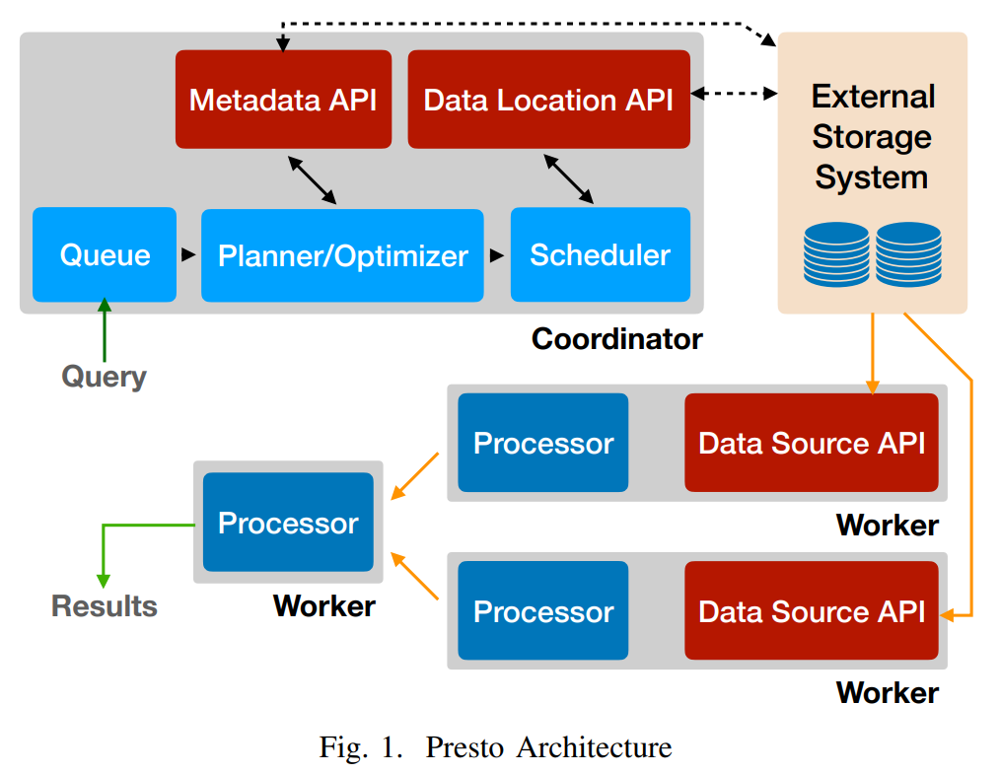
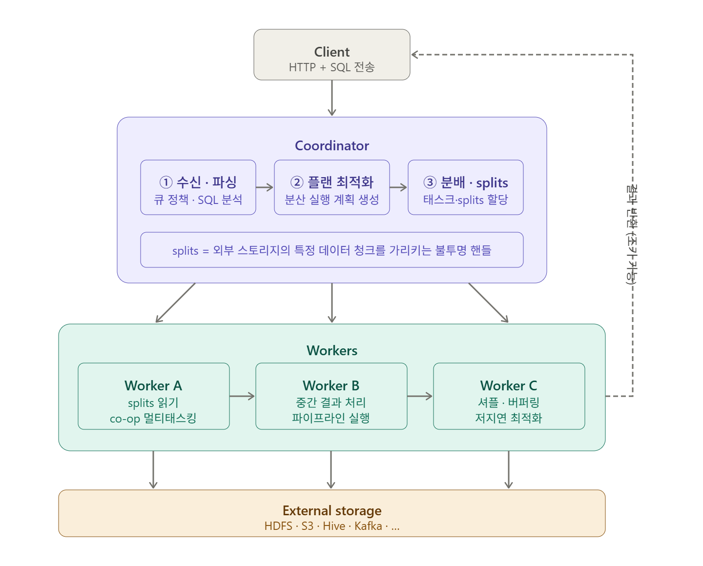
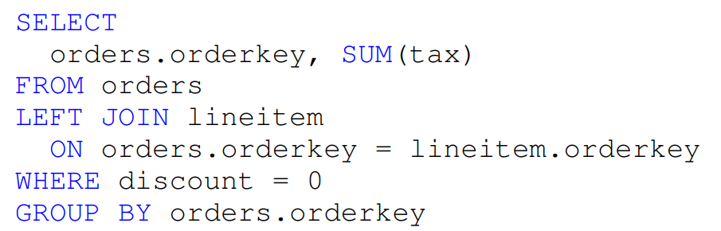
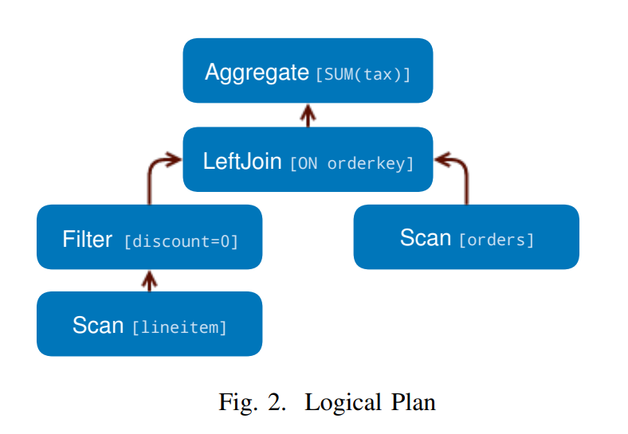
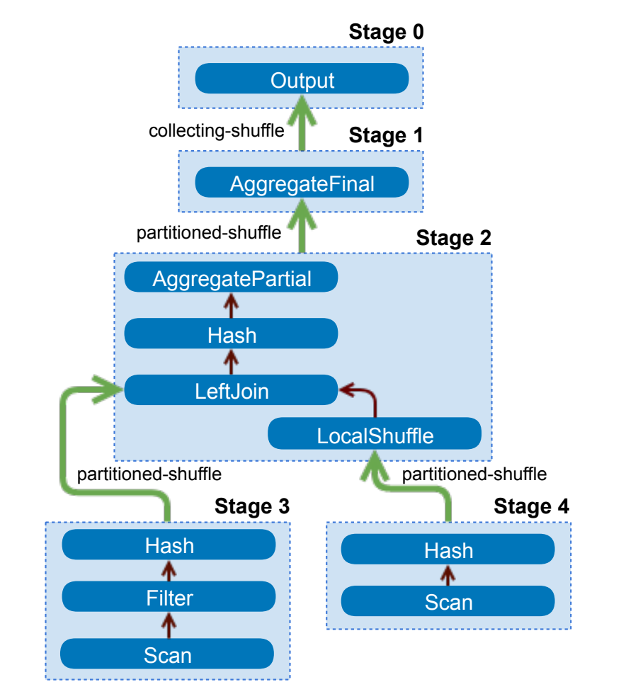
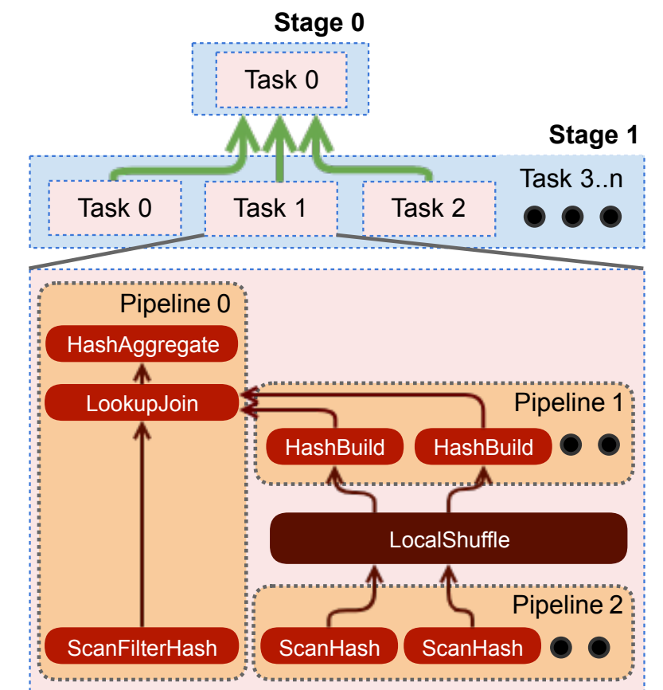

### Intro
`Facebook`은 수천 명의 엔지니어와 데이터 분석가가 매일 페타바이트 규모의 데이터를 분석하는 조직이다.
초기에는 `Hive`를 사용했다. `Hive`는 SQL과 유사한 문법으로 `HDFS`의 데이터를 `MapReduce` 잡으로 변환해 실행하는 시스템인데, 간단한 집계 쿼리 하나를 실행해도 결과를 보기까지 수십 분이 걸렸다.
데이터 분석가가 탐색적 질문 하나를 던지고, 커피 한 잔을 마시고, 회의를 다녀와도 결과가 아직 나오지 않은 상황이 반복됐다.
#
`Facebook`이 원한 것은 단순했다. 수십 TB에 달하는 데이터에도 수초 안에 응답하는 인터랙티브 쿼리 엔진이었다.
그 결과로 2013년부터 내부에서 개발·운영되기 시작한 것이 `Presto`다.
`Presto`는 단일 SQL 인터페이스로 `HDFS`, `S3`, `RDBMS`, `NoSQL` 등 다양한 데이터 소스를 동시에 질의할 수 있는 분산 쿼리 엔진이다.
2019년 ICDE에서 발표된 논문 "Presto: SQL on Everything"은 이 시스템의 설계 원칙과 내부 동작을 상세히 정리한 기록이다.

### 네 가지 유즈케이스
`Presto`는 처음부터 단일 목적이 아닌 다양한 워크로드를 동시에 지원하도록 설계됐다.
`Facebook` 내부에서 실제로 사용되는 워크로드를 크게 네 가지로 분류할 수 있다.
#
첫 번째는 **인터랙티브 분석**이다. 데이터 과학자와 분석가가 탐색적 질문을 실시간으로 던지고 결과를 보는 유형이다. 수초에서 수 분 안에 응답해야 하며, 쿼리 패턴을 예측하기 어렵다.
#
두 번째는 **Batch ETL**이다. 대용량 데이터를 주기적으로 변환하고 다른 저장소에 적재하는 파이프라인이다. 레이턴시보다는 처리량과 메모리 효율이 중요하다.
#
세 번째는 **A/B 테스팅**이다. 실험 그룹과 대조군의 결과를 집계하고 통계적 유의성을 분석한다. 수십억 건의 이벤트 데이터를 대상으로 여러 실험 조건을 동시에 필터링해야 한다.
#
네 번째는 **개발자·광고주 분석**이다. `Facebook` 광고 플랫폼에서 광고주와 외부 개발자가 자신이 집행한 광고의 성과 데이터를 인터랙티브하게 조회하는 유형이다. 정해진 쿼리가 반복적으로 실행되므로 예측 가능한 응답 시간이 중요하다.
#
이 네 가지는 응답 시간, 처리량, 메모리 사용 패턴이 모두 다르다. 하나의 엔진이 이를 모두 소화하려면 실행 전략을 워크로드에 맞게 전환할 수 있어야 한다는 뜻이다.

### 아키텍처
`Presto`의 아키텍처는 단순하다. 하나의 `Coordinator`와 다수의 `Worker`로 구성된 클러스터다.



`Coordinator`는 클라이언트로부터 SQL을 받아 파싱, 최적화, 실행 계획 수립을 담당한다. 쿼리 큐잉, 옵티마이저, 스케줄러가 모두 이 노드 안에 있다. 클라이언트는 `Coordinator`가 제공하는 `RESTful HTTP API`를 통해 쿼리를 제출하고 결과를 받아간다.
#
`Worker`는 실제 데이터를 읽고 연산을 수행하는 노드다. `Coordinator`로부터 실행 계획의 일부를 받아 스토리지에서 데이터를 읽고, 필터·집계·조인을 처리한 뒤 결과를 다음 `Worker`나 `Coordinator`로 전달한다.



`Presto`는 `JVM` 기반으로 동작하며, 수백 개의 동시 쿼리를 처리하는 멀티 테넌트 시스템이다. 단일 클러스터가 인터랙티브 분석 쿼리와 배치 ETL 잡을 함께 처리한다.

### SQL Dialect
`Presto`는 `ANSI SQL` 표준을 기본으로 따른다. 그러나 현실의 데이터는 표준 SQL이 가정하는 단순한 스칼라 타입으로 다 담기지 않는다.
`Facebook`의 로그 데이터에는 `array`, `map`, `struct` 같은 중첩 타입이 빈번히 등장한다.
#
이를 위해 `Presto`는 복잡한 데이터 타입을 자체적으로 정의하고, `transform`, `filter`, `reduce` 같은 고차 함수도 지원한다. 예를 들어 이벤트 배열에서 특정 조건을 만족하는 항목만 추출하거나, 맵의 값을 변환하는 작업을 SQL 안에서 직접 표현할 수 있다.

### 쿼리 실행 파이프라인
SQL이 `Coordinator`에 도착하면 실행까지 세 단계를 거친다.
#
**파싱** 단계에서는 `ANTLR` 파서가 SQL 문자열을 Syntax Tree로 변환한다. 이어서 `Analyzer`가 타입 추론, 함수 해석, 스코프 분석(테이블과 컬럼이 실제로 존재하는지)을 수행한다.



**논리적 계획** 단계에서는 Syntax Tree와 `Analyzer`의 결과를 바탕으로 Logical Execution Tree를 생성한다. 이 트리는 어떤 연산을 어떤 순서로 수행할지를 표현하지만, 아직 분산 실행 방법은 결정되지 않은 상태다.



### 쿼리 옵티마이저
논리 계획이 완성되면 옵티마이저가 이를 물리적 실행 계획으로 변환한다.
탐욕 탐색(greedy search)을 통해 가능한 실행 계획 중 비용이 낮은 것을 선택하는 방식이다.



핵심 최적화 중 하나는 **co-located join**이다. 조인에 참여하는 두 테이블이 동일한 컬럼을 기준으로 파티션되어 있다면, 셔플 없이 같은 `Worker`에서 로컬로 조인할 수 있다. 대용량 조인에서 네트워크 셔플을 제거하는 것은 레이턴시와 처리량 모두에 큰 영향을 미친다.
#
옵티마이저는 테이블의 파티셔닝, 정렬, 버켓팅, 그룹핑 정보를 노드 속성으로 관리하며, 이 정보를 활용해 불필요한 셔플을 최소화한다.
#
물리 계획에서는 **셔플이 필요한 지점을 기준으로 Stage 경계를 설정**한다. Stage 경계는 곧 셔플 경계다. 한 Stage의 출력이 네트워크를 타고 다음 Stage의 입력으로 흘러가는 구간이 셔플이 일어나는 지점이다.

### Task와 Pipeline
물리적 실행 계획이 확정되면 `Coordinator`는 각 Stage를 `Worker`에게 Task 형태로 분배한다.
같은 Stage에 속한 Task들은 동일한 계산 로직을 수행하지만, 각자 다른 데이터 파티션(split)을 담당한다. 이 분할이 Presto 병렬처리의 기본 단위다.
#
하나의 Task 안에는 여러 `Pipeline`이 존재할 수 있다. `Hash Join`이 대표적인 예다.

```
Task (Hash Join 수행)
 ├── Pipeline 1: Scan → HashBuild   ← build side
 ├── Pipeline 2: Scan → HashBuild   ← build side 분할
 └── Pipeline 0: LookupJoin → Aggregate  ← probe side
```

`Pipeline 1`, `Pipeline 2`는 빌드 테이블의 해시를 메모리에 구성하는 작업을 여러 스레드로 병렬 처리한다. `Pipeline 0`은 해시가 완성된 뒤 프로브 테이블 데이터와 조인을 수행한다. `Pipeline` 간 데이터 전달은 네트워크가 아닌 **local in-memory shuffle**로 이루어진다.



### 스케줄링
`Coordinator`는 Task를 `Worker`에 분배할 때 Stage 간 연결을 만들어 셔플로 이어진 프로세서 트리를 구성한다. 데이터는 준비되는 즉시 다음 Stage로 스트리밍된다. 중간 결과를 디스크에 전부 쓰고 다음 Stage를 시작하는 방식이 아니라는 뜻이다.
#
Stage를 어떤 순서로 시작하느냐에 따라 두 가지 전략이 있다.
#
**all-at-once** 전략은 모든 Stage를 동시에 시작한다. 데이터가 생기는 즉시 다음 Stage로 흘러내려가므로 end-to-end 레이턴시가 최소화된다. 인터랙티브 분석이나 A/B 테스팅처럼 빠른 응답이 중요한 워크로드에 적합하다.
#
**phased** 전략은 의존관계 순서대로 Stage를 순차적으로 실행한다. `Hash Join`이라면 빌드 쪽 Stage가 완전히 완료된 뒤에야 프로브 쪽 Stage를 스케줄링한다. 메모리 사용량을 예측하고 제어하기 쉬워 대용량 Batch ETL에 적합하다.

### 배포 토폴로지
`Presto`는 스토리지와 컴퓨트의 관계에 따라 두 가지 토폴로지로 배포된다.

**Shared-Nothing**은 `Worker` 노드가 로컬 스토리지를 직접 보유하는 구조다. `Facebook`에서 A/B 테스팅 워크로드에 사용하는 `Raptor` 커넥터가 이 방식을 따른다. `Raptor`는 `Presto` 전용으로 설계된 스토리지 엔진으로, 메타데이터는 `MySQL`에, 데이터는 로컬 플래시 디스크에 `ORC` 형식으로 저장한다. 데이터가 처리 노드와 같은 물리 서버에 있기 때문에 I/O 레이턴시가 낮고 예측 가능한 처리량을 제공한다.
#
**Shared-Storage**는 `Worker`와 스토리지가 네트워크로 분리된 구조다. `HDFS`나 `S3` 같은 원격 분산 파일시스템을 스토리지로 사용하며, `Interactive Analytics`와 `Batch ETL`에 주로 활용된다. 컴퓨트와 스토리지를 독립적으로 확장할 수 있어 대규모 운영에 유리하고, 별도의 데이터 적재 없이 `Hadoop` 웨어하우스 위에서 바로 쿼리할 수 있다.
#
두 토폴로지의 성능 차이는 실측으로도 확인된다. 논문에서 100대 노드 클러스터에 30TB 규모 `TPC-DS` 벤치마크를 실행한 결과, `Raptor`(Shared-Nothing)가 `Hive/HDFS`(Shared-Storage)보다 대부분의 쿼리에서 빨랐다. 특히 통계 정보 없이 실행한 `Hive/HDFS`와의 격차가 두드러졌고, 테이블·컬럼 통계를 제공하면 옵티마이저가 비용 기반 조인 전략을 선택할 수 있어 성능 차이가 줄어들었다.
#
두 토폴로지는 **태스크 스케줄링 방식**도 다르다. `Shared-Nothing`에서는 `Worker`가 반드시 해당 스토리지 노드와 같은 위치에 배치되어야 하므로, 스케줄러가 `Connector Data Layout API`를 통해 태스크 배치를 제약 조건으로 관리한다. 반면 `Shared-Storage`에서는 어느 `Worker`에나 태스크를 자유롭게 배치할 수 있어 부하 분산이 유연하다.
#
`Facebook`에서는 두 방식을 워크로드에 따라 혼용한다. 탐색적 분석은 `Hive/HDFS`(Shared-Storage)에서 수행하고, 자주 조회하는 집계 결과나 대시보드용 데이터는 `Raptor`(Shared-Nothing)로 적재해 저지연 응답을 보장하는 2단계 패턴을 운영한다.

| | Shared-Nothing (Raptor) | Shared-Storage (Hive/HDFS) |
|-|------------------------|---------------------------|
| 스토리지 위치 | Worker 로컬 플래시 디스크 | 원격 분산 파일시스템 |
| I/O 특성 | 저지연, 예측 가능한 처리량 | 네트워크 레이턴시 존재 |
| 태스크 배치 | 스토리지 노드에 고정 | 자유로운 부하 분산 |
| 확장성 | 컴퓨트·스토리지 함께 확장 | 컴퓨트·스토리지 독립 확장 |
| 주요 유즈케이스 | A/B 테스팅, 대시보드 | Interactive Analytics, Batch ETL |

### Volcano Model과 Presto의 개선
지금까지 쿼리가 파싱되고, 최적화되고, Task로 분배되고, 스케줄링되는 흐름을 살펴봤다.
이제 Task가 실제로 어떻게 실행되는지, 그 안의 실행 엔진을 들여다볼 차례다.
#
`Presto`의 실행 엔진을 이해하려면 전통적인 쿼리 실행 모델인 `Volcano Model`을 먼저 알아야 한다.
`Volcano Model`은 1994년에 제안된 Pull 기반 반복자 패턴이다. 최상위 `Operator`가 `next()`를 호출하면, 그 호출이 연쇄적으로 아래로 전파되며 데이터를 한 row씩 끌어올리는 방식이다.

```
결과 필요 → Aggregate.next()
               └→ Join.next()
                    └→ Filter.next()
                         └→ Scan.next()
                              └→ 디스크에서 row 하나 읽기
```

각 `Operator`는 `open()`, `next()`, `close()` 세 가지 인터페이스만 구현하면 된다. 덕분에 `Aggregate → Sort → Join → Filter → Scan`처럼 `Operator`를 레고 블록처럼 자유롭게 조합할 수 있다. 구현이 단순하고 새로운 `Operator` 추가도 쉬워서 1990년대 데이터베이스 시스템에서 널리 채택됐다.
#
하지만 row 하나씩 처리하는 방식에는 구조적인 한계가 있다. 1억 개의 row를 처리하면 `next()` 호출이 1억 번, 가상 함수 디스패치가 1억 번 일어난다. `next()`가 인터페이스 메서드이기 때문에 매 호출마다 런타임에 실제 구현체를 찾아야 하고, CPU의 분기 예측이 자꾸 실패한다. 실제 연산(덧셈, 비교)에 쓰이는 시간보다 "다음 row를 가져오는 인프라 코드"에 쓰이는 시간이 더 많은 상황이 발생한다. 무엇보다 멀티 테넌시 환경에서 데이터가 없으면 스레드가 블로킹되기 때문에, 수백 개의 쿼리가 동시에 돌아가는 환경에서는 스레드가 죄다 블로킹에 묶여버린다.
#
`Presto`는 세 가지 핵심 개선으로 이 문제를 해결했다.
#
첫 번째는 **Page 단위 처리**다. `Volcano Model`이 row 1개를 반환하는 `next()`를 사용한다면, `Presto`는 수천 개의 row를 컬럼형으로 묶은 `Page`를 반환한다. 한 번 호출에 수천 row를 처리하므로 함수 호출 오버헤드가 수천 배 줄어들고, 컬럼형 배치라 같은 타입의 값이 연속된 메모리에 있어 CPU 캐시 효율도 좋아진다.
#
두 번째는 **Driver Loop와 Cooperative Multitasking**이다. `Volcano Model`은 데이터가 없으면 스레드를 블로킹한다. `Presto`의 `Driver Loop`는 다르다. `Operator`가 처리할 데이터가 없으면 즉시 `yield`하고, 같은 스레드에서 다른 `Task`를 처리한 뒤 돌아온다. 스레드 하나가 여러 `Task`를 협력적으로 시분할해 처리하므로, 수백 개의 쿼리가 동시에 돌아도 스레드가 블로킹에 묶이지 않는다.
#
세 번째는 **Code Generation**이다. `Volcano Model`에서 `next()`는 인터페이스 메서드라 매 호출마다 런타임 디스패치가 필요하다. `Presto`는 쿼리가 들어오면 그 쿼리에 맞는 전용 `bytecode`를 생성한다. 타입이 고정되고, JIT 컴파일러가 이를 monomorphic 호출로 인식해 가상 함수 디스패치를 제거한다. 특히 `WHERE` 조건 평가나 해시 계산처럼 tight loop에서 반복 실행되는 코드에서 효과가 크다.

| 항목 | Volcano Model | Presto Driver Loop |
|------|--------------|-------------------|
| 처리 단위 | Row 1개 | Page (수천 row, 컬럼형) |
| 제어 흐름 | 재귀 pull | 반복 루프 |
| 블로킹 | 스레드 블로킹 | yield 후 다른 Task로 전환 |
| 가상 함수 | 매 row마다 dispatch | Code generation으로 제거 |
| 멀티테넌시 | 어려움 | Cooperative multitasking |

### Outro
`Presto`가 보여준 것은 "하나의 SQL 엔진으로 모든 것을 질의한다"는 아이디어가 실제로 동작한다는 증명이다.
`HDFS`부터 `S3`, `MySQL`, `Cassandra`까지 커넥터 인터페이스 하나로 연결하고, 쿼리가 들어오면 레이턴시 우선인지 처리량 우선인지에 따라 스케줄링 전략을 바꾸며, `Volcano Model`의 한계를 `Page` 처리와 `Code Generation`으로 극복했다.
#
`Presto`는 이후 `Facebook`이 오픈소스로 공개하고, 일부 핵심 개발자들이 분리해 `Trino`라는 이름으로 독립 프로젝트를 이어가고 있다. 오늘날 많은 클라우드 데이터 플랫폼에서 인터랙티브 SQL 엔진의 기반으로 쓰이고 있다.

### Reference
Raghav Sethi et al., "Presto: SQL on Everything", ICDE 2019.

이미지 출처: Presto 논문 (https://trino.io/Presto_SQL_on_Everything.pdf)
