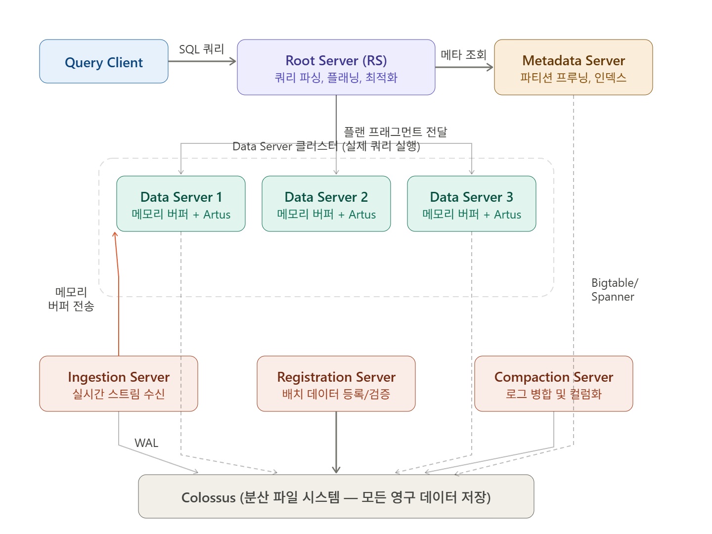
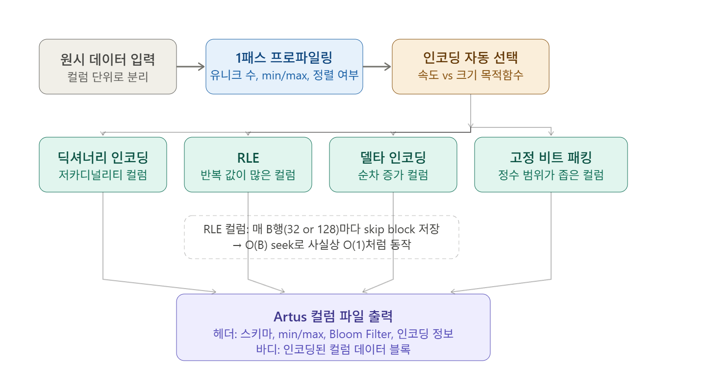
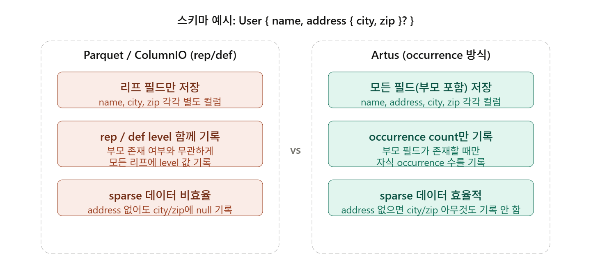

### Intro
`YouTube`는 하루에 수조 개의 데이터를 생성하는 플랫폼이다.
수억 명의 크리에이터와 시청자, 수십억 건의 조회수, 수십억 시간의 시청 데이터가 매일 쌓이고,
이 데이터는 크리에이터 대시보드, 영상 페이지의 조회수, 서버 모니터링, 데이터 분석 등 전혀 다른 목적으로 소비된다.
#
문제는 이 워크로드들의 요구사항이 너무 달라서, `YouTube`는 각각을 위한 별도 시스템을 운영해왔다는 점이다.
애드혹 분석과 내부 대시보드에는 `Dremel`, 외부 공개 대시보드에는 `Mesa`와 `BigTable`, 서비스 모니터링에는 `Monarch`, 영상 페이지의 조회수·좋아요 수 같은 임베디드 통계에는 `Vitess`를 사용했다.
이 분산된 구조는 데이터를 여러 시스템에 각각 로드하는 중복 ETL 파이프라인을 만들었고, 시스템 간 데이터 불일치를 일으켰으며, 각 시스템이 서로 다른 API를 사용해 횡단 분석이 어려웠다.
#
2019년 VLDB에 발표된 `Procella` 논문은 이 모든 것을 **단 하나의 SQL 쿼리 엔진으로 통합**한 경험을 담고 있다.

### 네 가지 워크로드
`Procella`가 동시에 커버해야 하는 워크로드는 요구사항이 극단적으로 다른 네 가지다.
#
`Reporting & Dashboarding`은 크리에이터와 내부 팀이 사용하는 대시보드다. 하루에 수천억 건씩 쌓이는 데이터를 대상으로 수만 건의 정형화된 쿼리를 수십 밀리초 안에 처리해야 한다. 복잡한 `GROUP BY`와 대용량 집계가 기본이며 데이터 신선도도 중요하다.
#
`Embedded Statistics`는 영상 페이지에서 보이는 조회수, 좋아요 수 같은 숫자들이다. 쿼리 자체는 단순하지만 수백만 건의 실시간 업데이트와 수백만 건의 조회가 동시에 일어나므로 밀리초 단위 응답이 요구된다. 매 요청마다 수억 행을 집계할 수는 없기 때문에 사전에 집계해 둔 값을 꺼내 보여주는 방식으로 동작한다.
#
`Monitoring`은 서비스 상태를 추적하는 엔지니어링용 워크로드다. 대시보드와 비슷하지만 추가로 오래된 데이터 자동 만료, 다운샘플링, 시계열 특화 함수가 필요하다.
#
`Ad-hoc Analysis`는 데이터 과학자, 분석가, 엔지니어가 수행하는 복잡한 탐색 쿼리다. 수조 건의 행에 걸쳐 다단계 집계, 조인, 중첩 데이터 처리 등을 수행하며 쿼리 패턴을 예측할 수 없다. 응답 시간은 수 초에서 수 분까지 허용된다.

### 아키텍처 — 6개의 서버 컴포넌트
`Procella`는 스토리지(`Colossus`)와 컴퓨트(`Borg`)를 완전히 분리하는 `Google` 인프라 위에서 동작한다.
`Colossus`에 저장된 파일은 불변(immutable)이며 모든 읽기/쓰기는 RPC를 통해 원격으로 이루어진다.
이 제약이 `Procella` 설계의 상당 부분을 결정했다.



시스템은 6개의 독립적인 컴포넌트로 구성된다.
#
`Root Server(RS)`는 클라이언트가 SQL 쿼리를 보내는 진입점이다. 쿼리 파싱, 최적화 계획 수립, 실행 트리 구성을 담당하며 전체 쿼리 실행을 조율하고 최종 결과를 클라이언트에 반환한다.
#
`Data Server(DS)`는 실제 데이터를 읽고 연산을 수행하는 핵심 워커다. `RS`로부터 실행 계획의 일부(plan fragment)를 받아 `Colossus`에서 데이터를 읽고 필터, 집계, 조인 등을 처리한다. 컴퓨트를 데이터 가까이 밀어붙이는(pushdown) 것이 기본 전략이다.
#
`Metadata Server(MDS)`는 테이블 스키마, 파티션 정보, 인덱스 등을 관리한다. `RS`가 쿼리 계획을 세울 때 실제로 읽어야 할 파일을 최소화하는 tablet pruning의 핵심 정보를 제공한다.
#
`Ingestion Server(IgS)`는 실시간 스트림 데이터의 입구다. 데이터를 받으면 두 경로로 동시에 처리한다. 하나는 `Colossus`의 `Write-Ahead Log(WAL)`에 기록해 영속성을 확보하는 경로이고, 다른 하나는 `Data Server`의 메모리 버퍼에 직접 전달해 수 초 내 쿼리가 가능하도록 하는 경로다. 이 병렬 처리 덕분에 데이터가 들어오는 즉시 쿼리할 수 있으면서도 내구성이 보장된다.
#
`Registration Server(RgS)`는 배치 데이터를 시스템에 등록한다. 스키마 하위 호환성 검증, 파일 헤더에서 메타데이터 추출, `Bloom Filter` 생성 등을 담당한다.
#
`Compaction Server`는 `IgS`가 쌓아놓은 작은 WAL 조각들을 주기적으로 읽어 더 크고 효율적인 컬럼 포맷 파일로 병합한다. 이 과정에서 사용자 정의 SQL 로직을 적용해 오래된 데이터 만료, 다운샘플링, 중복 제거 등을 수행할 수 있다.

### Artus — 컬럼 포맷
`Procella` 초기에는 `Google`의 기존 컬럼 포맷인 `Capacitor`를 그대로 사용했다. `Capacitor`는 `BigQuery`에서 쓰이는 포맷으로, 수조 건의 행을 대규모로 스캔하는 애드혹 분석에 잘 최적화되어 있다.
#
문제는 `Procella`가 애드혹 분석만 담당하지 않는다는 점이었다. 영상 조회수를 밀리초 안에 돌려줘야 하는 임베디드 통계 워크로드, 특정 크리에이터의 지난 7일 데이터만 뽑는 리포팅 워크로드처럼 수백만 건의 단건 조회(point lookup)와 좁은 범위 스캔(range scan)이 `Capacitor` 위에서는 느렸다. 범용 압축 알고리즘이 블록 단위로 압축되어 있어, 한 행을 읽으려면 해당 블록 전체를 압축 해제해야 했기 때문이다.
#
이 문제를 해결하기 위해 설계된 것이 `Artus`다. 목표는 명확하다. 대규모 풀 스캔에서도 `Capacitor`와 비슷한 성능을 내면서, 동시에 단건 조회에서도 빠르게 동작하는 것이다.



`Artus`가 데이터를 저장할 때 가장 먼저 하는 일은 압축이 아니다. 데이터를 한 번 훑어 특성을 파악하는 프로파일링이다. 1패스에서 컬럼의 유니크 값 수, 최솟값/최댓값, 정렬 여부, 데이터 분포 등을 수집한다. 그 다음 이 정보를 바탕으로 해당 컬럼에 가장 적합한 인코딩을 자동으로 선택한다. 사용자는 "속도 우선"인지 "크기 우선"인지 목적함수만 지정하면 된다.
#
**딕셔너리 인코딩**은 유니크 값이 적은 컬럼에 적용한다. `country` 컬럼은 값이 수백 개에 불과하므로, 문자열 대신 정수 인덱스를 저장하고 딕셔너리를 따로 유지한다. 실행 엔진은 압축 해제 없이 인덱스 값 그대로 집계나 필터를 수행할 수 있다.
#
**RLE(Run-Length Encoding)**은 같은 값이 연속으로 반복되는 컬럼에 적용한다. `(값, 반복횟수)` 쌍으로 저장하므로 공간을 크게 줄인다. 단, RLE 컬럼에서 특정 행으로 직접 점프하려면 중간을 건너뛸 방법이 필요하다. `Artus`는 매 B행(기본값 32 또는 128)마다 skip block을 저장해 컬럼의 내부 상태를 기록한다. 원하는 행 근처의 skip block에서 시작해 최대 B행만 앞으로 스캔하면 되므로 사실상 O(1)에 가까운 접근이 가능하다.
#
**델타 인코딩**은 타임스탬프나 순차 증가하는 ID처럼 값의 증분이 작은 컬럼에 적합하다. 절대값 대신 이전 값과의 차이만 저장한다.
#
**고정 비트 패킹**은 정수 범위가 좁은 컬럼에 적용한다. 0~255 범위의 값은 8비트로 표현 가능하므로 64비트 정수 배열 대신 8배 적은 공간을 쓴다. 이 방식에서는 행 번호로 직접 인덱싱이 가능해 O(1) 랜덤 접근이 자연스럽게 보장된다.
#
이렇게 선택된 인코딩들은 `ZSTD` 같은 범용 압축 알고리즘 대비 2배 이내의 압축률을 유지하면서도, 블록 전체를 압축 해제하지 않고 원하는 행에 직접 접근할 수 있다. 실제 벤치마크에서 `Artus`의 디스크 저장 크기(2060KB)는 `Capacitor`(2406KB)보다 오히려 작았다.
#
정렬된 컬럼에서는 Binary Search로 O(log N) 조회가 가능하다. 모든 컬럼에서 임의의 행 번호를 주면 O(1) 또는 O(B)에 해당 위치로 직접 점프할 수 있다. 이 두 가지를 합치면 기본 키 기준으로 특정 행을 K개 컬럼에서 찾는 전체 비용이 **O(log N + K)** 가 된다. 이 성질이 특히 중요한 곳은 분산 Lookup Join이다. 조인의 오른쪽 테이블을 분산 해시맵처럼 취급해, 왼쪽 테이블의 각 키로 오른쪽 `Data Server`에 RPC를 날리면 `Artus`의 빠른 단건 조회 덕분에 별도로 인메모리 해시 테이블을 구성하지 않고도 효율적으로 조인을 수행할 수 있다.

### 중첩 데이터 표현
`Artus`에서 가장 독창적인 부분이 중첩(nested) 및 반복(repeated) 데이터 처리다.



`Parquet`, `Capacitor`, `Google`의 `ColumnIO`는 모두 `Dremel` 논문에서 제안된 repetition/definition level(rep/def) 방식을 쓴다. 이 방식은 스키마 트리에서 리프(leaf) 필드들만 컬럼으로 저장하고, 각 값마다 "이 필드가 어느 깊이에서 반복되었는지(repetition level)"와 "부모 중 어디까지 존재하는지(definition level)"를 함께 기록한다.
#
아래 스키마를 예로 들어보자.

```
User {
  required string name
  optional group address {
    required string city
    required string zip
  }
}
```

세 개의 레코드를 저장한다.

```
Record 1: { name: "Alice", address: { city: "Seoul",  zip: "04524" } }
Record 2: { name: "Bob"   }  // address 없음
Record 3: { name: "Carol", address: { city: "Busan",  zip: "48058" } }
```

rep/def 방식은 리프 필드(`address.city`, `address.zip`)에 Bob의 레코드에도 반드시 null 항목을 기록해야 한다.

| 컬럼 | Record 1 | Record 2 (address 없음) | Record 3 |
|------|---------|------------------------|---------|
| `name` | Alice | Bob | Carol |
| `address.city` | Seoul (def=1) | **null (def=0)** | Busan (def=1) |
| `address.zip` | 04524 (def=1) | **null (def=0)** | 48058 (def=1) |

#
`Artus`는 다른 방식을 택했다. 리프뿐만 아니라 모든 필드(부모 포함)를 별도 컬럼으로 저장한다. 그리고 부모 필드(`address`)가 존재하는 경우에만 자식이 몇 번 등장했는지 occurrence count를 기록한다. `address`가 없는 레코드에서는 `city`와 `zip`에 아무것도 기록하지 않는다.

| 컬럼 | 저장되는 값 | 설명 |
|------|-----------|------|
| `name` | Alice, Bob, Carol | 3개 항목 |
| `address` (occurrence count) | 1, 0, 1 | address가 등장한 횟수 |
| `address.city` | Seoul, Busan | **2개만** — Bob 행은 아예 없음 |
| `address.zip` | 04524, 48058 | **2개만** — Bob 행은 아예 없음 |

occurrence count는 누적(cumulative) 합산으로 저장한다. `address`의 누적 카운트는 `[0, 1, 1, 2]`가 된다. N번째 레코드의 `city` 값을 찾으려면 `cumulative[N]`을 인덱스로 바로 참조하면 된다. Bob(Record 2)은 `cumulative[1] = 1`과 `cumulative[2] = 1`이 같으므로 항목이 0개, 즉 `address` 없음을 O(1)로 판단할 수 있다.
#
이 방식의 장점은 두 가지다. 첫째, `address`가 자주 null인 sparse 데이터에서 null 항목 자체를 아예 쓰지 않으므로 저장 공간이 크게 줄어든다. 둘째, 누적 카운트를 인덱스로 쓰기 때문에 중첩 데이터에서도 O(1) 랜덤 접근이 유지된다. rep/def 방식에서는 특정 레코드의 중첩 데이터에 접근하려면 앞 항목들의 레벨을 순서대로 읽어야 하지만, `Artus`는 누적 카운트만 보고 바로 점프할 수 있다.

### 역인덱스와 실험 분석
`Artus`가 지원하는 특수 기능 중 하나가 역인덱스(Inverted Index)다.
`YouTube`에서의 주요 사용 사례는 A/B 실험 분석이다. 각 레코드에는 해당 요청이 참여한 실험 ID 배열이 들어있다. `WHERE 123 IN ArrayOfExperiments` 쿼리는 수백 개의 원소가 담긴 배열을 모든 레코드에서 순차적으로 탐색해야 하므로, 기존 방식으로는 쿼리 비용의 대부분을 이 필터가 차지했다.
#
`Artus`는 데이터 생성 시점에 "어떤 실험 ID가 어느 행에 있는지"를 미리 계산해 `Roaring Bitmap` 형태의 역인덱스로 파일에 저장한다. 쿼리가 들어오면 해당 실험 ID의 비트맵만 로드해서 직접 행 집합을 얻을 수 있다. `OR` 조건 여러 개도 비트맵 OR 연산 한 번으로 처리된다. 논문에서는 이 최적화로 실험 분석 쿼리의 end-to-end 지연이 **약 500배** 감소했다고 보고한다.

### 적응형 쿼리 최적화
`Procella`의 쿼리 옵티마이저는 전통적인 비용 기반 최적화(CBO)와 런타임 적응형 최적화를 결합한다.
#
컴파일 타임에는 규칙 기반 최적화(필터 푸시다운, 서브쿼리 상관 해제, 상수 폴딩 등)를 적용한다. 실행 타임에는 실제 데이터가 흘러가는 지점에서 수집한 통계(카디널리티, 유니크 카운트, 분위수 등)를 바탕으로 남은 실행 계획을 동적으로 조정한다.
#
예를 들어 조인에서는 양쪽 데이터의 키를 샘플링한 뒤, 한쪽이 충분히 작으면 셔플 없이 브로드캐스트 조인으로 전환한다. 한쪽 키를 `Bloom Filter`로 요약할 수 있으면 반대쪽 데이터를 먼저 걸러내는 프루닝 최적화를 적용한다. 대규모 정렬에서는 먼저 분위수를 추정하고 그에 맞게 데이터를 파티셔닝해 각 샤드에서 로컬 정렬을 수행한다.
#
사전에 데이터 통계를 수집·유지할 필요가 없고 실제 데이터 흐름에서 통계를 얻기 때문에 전통적인 CBO보다 정확하다. 단 10ms 이하의 초저지연 쿼리에는 적응형 최적화 오버헤드가 상대적으로 크기 때문에, 이런 경우 사용자가 쿼리 힌트로 실행 전략을 직접 지정할 수 있게 열어두었다.
#
실행 엔진의 이름은 `Superluminal`(초광속)이다. 많은 분석 엔진이 LLVM으로 네이티브 코드를 컴파일하는 방식을 쓰지만, 수백만 QPS를 처리해야 하는 고빈도 워크로드에서는 컴파일 지연 자체가 병목이 된다. 대신 `C++ 템플릿 메타프로그래밍`으로 컴파일 타임에 코드를 생성한다. `TPC-H` 기준 오픈소스 `Supersonic` 엔진 대비 약 5배 빠른 성능을 보였다.

### 4단계 캐싱 전략
스토리지와 컴퓨트를 분리한 구조의 가장 큰 약점은 파일을 열거나 읽을 때마다 원격 RPC가 발생한다는 점이다. `Procella`는 이를 4단계 캐시로 상쇄한다.

| 캐시 계층 | 대상 | 효과 |
|---------|-----|------|
| Colossus 메타데이터 캐시 | 파일 핸들(데이터 블록↔Colossus 서버 매핑) | 파일 오픈 시 RPC 제거 |
| 헤더 캐시 | 컬럼 파일의 헤더(오프셋, 크기, min/max) | LRU로 유지 |
| 데이터 캐시 | Artus 실제 데이터 블록 | 디스크·메모리 동일 표현으로 캐시 비용 최소화 |
| 메타데이터 캐시 | 테이블-파일 매핑, 스키마 | MDS 레벨에서 캐싱 |

여기에 **Affinity Scheduling**을 더한다. 동일한 데이터에 대한 요청이 항상 같은 `Data Server`로 가도록 유도해 캐시 히트율을 높인다. 단 해당 서버가 느리거나 다운되면 다른 서버로 요청을 보낼 수 있는 느슨한 어피니티(loose affinity) 방식을 사용해 가용성을 유지한다.
#
실제 리포팅 인스턴스에서는 전체 데이터의 2%만 메모리에 올라가 있지만, 이 전략 덕분에 파일 핸들 캐시 히트율 99% 이상, 데이터 캐시 히트율 약 90%를 달성한다.

### Outro
`Procella`가 보여준 것은 기술적인 성과 이상이다.
`Artus`는 대규모 풀 스캔과 단건 조회를 하나의 포맷으로 커버하고, 적응형 쿼리 옵티마이저는 실행 중 실제 통계를 보고 계획을 갱신하며, `Ingestion Server`와 `Compaction Server`의 이중 경로가 실시간과 배치를 하나의 스토리지로 통합한다.
#
이 세 가지가 맞물려야 `Reporting`, `Embedded Statistics`, `Monitoring`, `Ad-hoc Analysis`라는 서로 이질적인 네 가지 워크로드를 단일 플랫폼에서 처리하는 것이 가능하다. 오늘날 `Procella`는 `YouTube`와 `Google` 내 여러 제품 영역에서 하루 수천억 건의 쿼리를 처리하고 있다.
#
`Dremel`이 "데이터를 적재하는 즉시 SQL로 분석한다"는 목표를 세웠다면, `Procella`는 "분석부터 실시간 서빙까지 하나의 플랫폼으로"라는 한 단계 더 나아간 목표를 달성했다.

### 출처
Biswapesh Chattopadhyay et al., "Procella: Unifying Serving and Analytical Data at YouTube", VLDB 2019.
