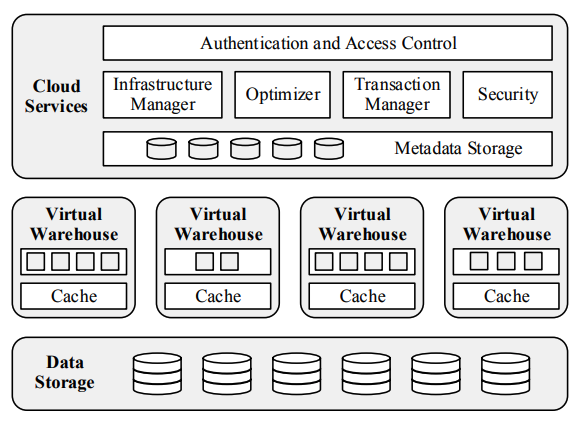
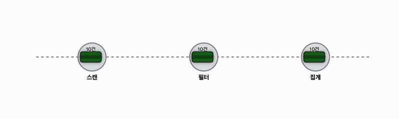
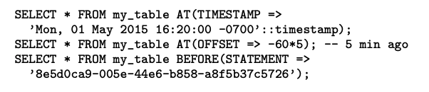
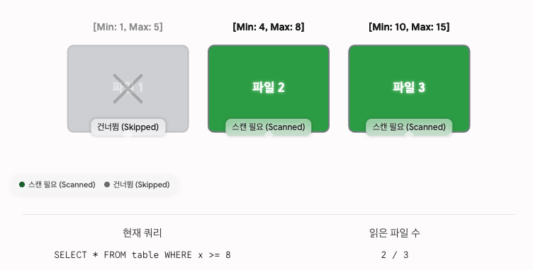
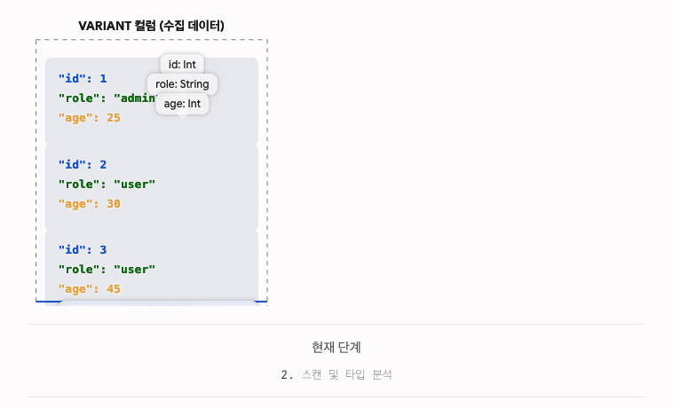
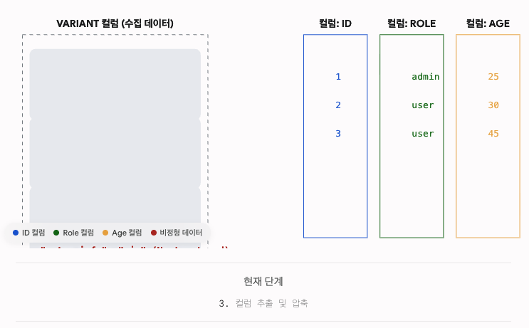
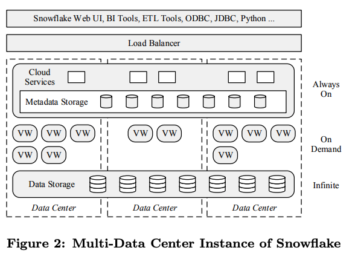
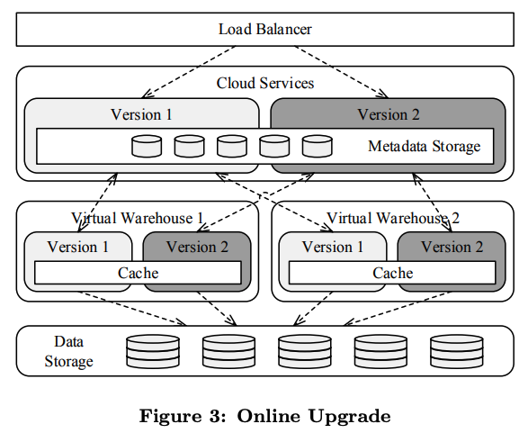

### Intro
클라우드 인프라가 빠르게 성숙하면서 데이터 엔지니어링의 환경도 크게 달라졌다.
기업들은 온프레미스에 구축된 데이터 웨어하우스를 클라우드로 이전하기 시작했고, 다루어야 하는 데이터의 성격도 변했다.
`IoT` 센서 로그, 웹 이벤트, 외부 `API` 응답처럼 스키마가 없거나 반정형(`semi-structured`)인 데이터가 폭발적으로 늘어난 것이다.
#
기존 관계형 데이터 웨어하우스는 이 두 가지 변화에 모두 약했다.
클라우드로 그대로 올리면 저장과 계산이 한 덩어리로 묶여 있어 리소스를 탄력적으로 쓸 수 없었고,
반정형 데이터를 적재하려면 사전에 스키마를 정의해야 해서 파이프라인이 쉽게 깨졌다.
#
`Snowflake`는 이 두 문제를 정면으로 해결하고자 설계된 클라우드 네이티브 데이터 웨어하우스다.
`ANSI SQL`과 `ACID` 트랜잭션을 완전 지원하면서도 `JSON`, `Avro` 같은 반정형 데이터를 직접 다룰 수 있고,
`AWS` 위에서 `SaaS` 형태로 Pay-as-you-go로 동작한다.
`JDBC`, `ODBC` 같은 표준 인터페이스는 물론 `Tableau`, `Looker` 같은 `BI` 도구와도 바로 연동된다.

### Storage와 Compute를 분리하다
2010년대 초반까지 대부분의 분산 데이터 웨어하우스는 `Shared-Nothing` 아키텍처를 채택했다.
각 노드가 `CPU`, 메모리, 스토리지를 모두 갖는 구조로, 단순하고 확장성도 있었다.
하지만 클라우드 환경에서 세 가지 문제가 드러났다.
#
첫째, **리소스 불균형**이다. 스토리지가 꽉 차면 연산 자원이 남아도 노드를 늘려야 하고, 쿼리가 몰리면 스토리지가 여유로워도 계산 노드를 따로 늘릴 수 없다.
저장과 계산이 한 몸이기 때문이다.
둘째, **Hot Spot** 문제다. 작업 부하는 균등하지 않아서 특정 노드에 요청이 몰릴 수 있는데, 노드 간 데이터 소유권이 고정되어 있어 유연하게 대응하기 어렵다.
셋째, **리셔플링** 문제다. 노드를 추가하거나 제거할 때 데이터 소유권을 재분배해야 하고, 이때 대량의 데이터가 네트워크를 타고 이동하면서 서비스 부하가 급격히 올라간다.
#
`Snowflake`는 저장과 계산을 완전히 분리해서 이 문제들을 해결했다.
저장은 `AWS S3` 같은 `Object Storage`가 담당하고, 계산은 `EC2` 인스턴스로 구성된 `Virtual Warehouse(VW)`가 맡는다.
`VW`는 `S3`에서 데이터를 읽어 쿼리를 처리하며, 네트워크 왕복 비용을 줄이기 위해 각 계산 노드는 로컬 `SSD`에 자주 쓰는 `S3` 파일을 캐싱한다.
이를 통해 `Shared-Nothing`과 비슷한 성능을 유지하면서, 저장과 계산을 독립적으로 스케일링할 수 있다.
이 구조를 **Multi-Cluster, Shared-Data 아키텍처**라고 부른다.

### 3계층 아키텍처

*출처: The Snowflake Elastic Data Warehouse, SIGMOD 2016*
#
`Snowflake`는 세 개의 계층으로 구성된다.
가장 아래의 **Data Storage** 계층은 `S3` 같은 `Object Storage`에 불변 파일로 데이터를 저장한다. 무한에 가까운 확장성과 높은 내구성을 제공한다.
중간의 **Virtual Warehouses** 계층은 실제 쿼리를 실행하는 계산 엔진이다.
최상단의 **Cloud Services** 계층은 시스템의 "두뇌"다. 쿼리 최적화, 트랜잭션 관리, 접근 제어, 메타데이터 관리를 담당한다.

### Data Storage
`Snowflake`가 처음 `S3`를 선택한 이유는 두 가지다. 당시 가장 성숙하고 안정적인 클라우드 스토리지였고, 사용자 기반도 가장 컸다.
하지만 `S3`는 로컬 디스크와는 다른 제약이 있다. 로컬보다 접근 레이턴시가 크고, `HTTPS` 통신 때문에 `CPU` 오버헤드도 있다. 무엇보다 파일은 한 번 쓰면 수정이 안 되고 Append도 불가하다.
단, `S3`의 `GET`은 파일의 일부 범위만 읽는 것은 가능하다.
#
`Snowflake`의 파일 포맷은 이 제약에 맞게 설계됐다.
#
테이블은 여러 개의 불변 파일로 수평 파티셔닝되어 저장된다. 전통적인 `RDBMS`의 페이지/블록과 같은 역할을 하는 단위다.
각 파일 안에서는 데이터를 행(`row`) 단위가 아닌 컬럼(`column`) 단위로 묶어서 압축한다. 이를 `PAX(Partition Attributes Across)` 또는 Hybrid Columnar 포맷이라고 부른다.
#
쉽게 말하면 이렇다. 10만 행짜리 테이블이 있을 때, `name` 컬럼 값 10만 개가 한 묶음, `age` 컬럼 값 10만 개가 다른 묶음으로 나란히 파일에 저장된다.
분석 쿼리는 보통 전체 컬럼이 아니라 일부 컬럼만 본다. 컬럼 단위로 묶여 있으면 필요한 컬럼만 골라 읽을 수 있고, 같은 타입의 값이 연속되어 있어 압축률도 훨씬 높다.
#
파일 맨 앞에는 헤더가 있고, 헤더에는 각 컬럼 데이터가 파일 안 어느 위치에 있는지 `offset`이 기록된다.
`S3 GET`은 파일 전체가 아니라 특정 바이트 범위만 요청할 수 있다. 덕분에 헤더만 먼저 내려받아 필요한 컬럼의 위치를 확인한 뒤, 그 구간만 정확히 다운로드할 수 있다. `S3`의 불변성 제약을 오히려 유리하게 활용하는 설계다.
#
일반 데이터베이스는 쿼리 결과를 메모리에 들고 있다가 클라이언트에게 커서(`cursor`)를 통해 조금씩 전달한다.
계산 서버가 결과를 붙잡고 있어야 하므로 메모리를 계속 점유한다.
`Snowflake`는 다르게 동작한다. 연산 결과를 `S3`에 바로 저장하고 클라이언트는 계산 서버를 거치지 않고 `S3`에서 직접 결과를 가져간다.
같은 쿼리를 다시 실행하면 `S3`에 캐시된 결과를 재사용해 중복 연산을 피한다.
#
테이블 파일(데이터)과 별개로, 카탈로그 정보, 통계, 락, 트랜잭션 정보 같은 메타데이터는 `Cloud Services` 계층의 키-값 저장소(`FoundationDB`)에 보관된다.

### Virtual Warehouses
`VW`는 `EC2` 클러스터에 대한 추상화다. 사용자는 직접 `EC2`를 다루지 않고, `VW`를 생성/삭제/크기조정만 한다. 클러스터 크기는 `X-Small`에서 `XX-Large`까지 선택할 수 있다.
`VW`는 순수하게 계산만 담당하기 때문에 데이터베이스에 영향 없이 온디맨드로 생성하고 삭제할 수 있다.
각 쿼리는 정확히 하나의 `VW`에서 실행된다. 쿼리가 시작되면 해당 `VW`의 워커 노드들이 그 쿼리를 위한 프로세스를 별도로 띄우고, 쿼리가 끝나면 프로세스는 사라진다.
#
여러 `VW`가 동시에 같은 테이블에 접근할 수 있다.
`Shared-Nothing` 방식이었다면 `VW`마다 데이터 복사본이 필요했겠지만, `Snowflake`는 데이터가 `S3`에 딱 한 벌만 있고 모든 `VW`가 같은 파일을 읽는다.
`VW`를 10개 늘려도 저장 공간은 전혀 늘지 않고, 각 `VW`는 서로의 실행에 간섭하지 않는다.
같은 비용이라면 4개 노드로 15시간을 돌리는 것보다 32개 노드로 2시간 만에 끝내는 것이 훨씬 효율적이다. 이것이 `VW` 탄력성의 핵심 가치다.
#
`S3`를 직접 매번 읽으면 레이턴시가 크기 때문에 각 워커 노드는 `S3`에서 읽어온 테이블 파일을 로컬 `SSD`에 캐싱해둔다.
문제는 어떤 워커가 어떤 파일을 캐시하고 있는지다. 매번 다른 워커에게 같은 파일 요청이 들어가면 캐시 히트율이 떨어진다.
그래서 쿼리 옵티마이저는 테이블 파일 이름을 해싱해서, 특정 파일은 항상 같은 워커 노드가 처리하도록 라우팅한다.
같은 파일은 늘 같은 노드로 가기 때문에 캐시가 자연스럽게 쌓이고, 캐시는 `LRU(Least-Recently-Used)` 정책으로 관리된다.
#
노드가 추가되거나 제거될 때, `Hadoop`처럼 즉시 데이터를 재분배하지 않는다.
캐시가 없는 새 노드에 쿼리가 할당되면 `S3`에서 받아오면서 자연스럽게 캐시가 채워진다. 이를 **Lazy 리밸런싱**이라고 부른다. 셔플링으로 인한 급격한 부하 없이 균형이 맞춰진다.
특정 워커 노드에 부하가 쏠리면(`skew`), 부하가 적은 다른 노드가 해당 작업을 가로채 `S3`에서 직접 받아 처리할 수 있다. 이를 **File Stealing**이라고 한다.

#### 실행 엔진: Columnar + Vectorized + Push-based

`Snowflake`는 자체 `SQL` 실행 엔진을 구현했다.
이 엔진의 핵심은 세 가지 기법의 결합이다: **컬럼형 실행**, **벡터화 실행**, 그리고 **Push 기반 실행**.
#
첫째, **컬럼형 실행**이다. 분석 쿼리는 수십 개 컬럼 중 2~3개만 보는 경우가 대부분이다. 컬럼 단위로 저장하면 필요한 컬럼만 골라 읽을 수 있고, 같은 타입의 값이 연속 배치되어 `CPU` 캐시 활용도와 `SIMD` 명령어 효율도 함께 오른다.
#
둘째, **벡터화 실행**이다.

*출처: The Snowflake Elastic Data Warehouse, SIGMOD 2016*
#
행 하나씩 처리하는 대신, 컬럼 데이터를 수천 행 단위 배치로 묶어 한꺼번에 처리한다. 루프를 훨씬 적게 돌게 되고 `CPU` 파이프라인을 꽉 채워 쓸 수 있다.
#
셋째, **Push 기반 실행**이다. 전통적인 `Volcano` 모델은 `Pull` 방식으로, 상위 연산자가 하위에게 "다음 행 줘"라고 계속 요청한다. 그 요청마다 함수 호출과 완료 여부 확인이 반복되면서 `CPU` 오버헤드가 쌓인다.
`Push` 기반은 방향이 반대다. 하위 연산자가 처리한 결과를 위로 밀어 올리기만 한다. 요청-응답 왕복이 사라지고, 데이터가 파이프라인을 타고 위로 흘러가는 구조라 `CPU`를 더 효율적으로 쓸 수 있다.

### Cloud Services
`Cloud Services`는 멀티 테넌트로 운영되는 시스템의 두뇌다.
접근 제어, 쿼리 최적화, 트랜잭션 관리를 담당하며 고가용성을 위해 여러 가용 영역에 걸쳐 복제되어 운영된다.
#
모든 사용자 쿼리는 `Cloud Services`를 통과한다.
쿼리가 들어오면 파싱 → 대상 테이블 확인 → 접근 제어 → 쿼리 플랜 최적화 순서로 처리된다.
쿼리 옵티마이저는 `Cascades` 스타일의 탑다운 비용 기반 최적화를 수행한다. 최적화에 필요한 통계는 데이터를 적재하면서 지속적으로 수집된다.
#
`Snowflake`는 `B-tree` 인덱스를 사용하지 않는다. 대신 메타데이터 기반으로 필요한 파일을 찾는다.
조인에서 데이터를 어느 노드로 보낼지 같은 복잡한 결정은 쿼리 플랜 시점이 아니라 실행 시점에 메모리 상태와 통계를 보고 결정한다. 속도보다 견고함을 우선하는 설계다.
최적화가 끝나면 실행 계획이 워커 노드로 배포되고, 실행 중에는 `Cloud Services`가 쿼리 상태, 성능, 워커 노드 상태를 지속적으로 모니터링한다. 모든 쿼리 정보와 통계는 감사(`audit`)와 성능 분석을 위해 저장된다.

#### Concurrency Control: Snapshot Isolation과 MVCC
`Snowflake`는 `OLAP` 워크로드에 맞춰 `ACID` 트랜잭션을 `Snapshot Isolation(SI)` 기반으로 구현했다.
`SI`에서는 읽기 작업이 항상 특정 시점의 스냅샷을 본다. 쓰기 중인 다른 트랜잭션에 방해받지 않는다.
`SI`는 내부적으로 `MVCC(Multi-Version Concurrency Control)`로 구현되어 일정 기간 동안 데이터의 여러 버전이 공존한다.
#
`S3` 파일의 불변성이 여기서 자연스럽게 맞아 들어간다.
테이블에 쓰기 작업이 발생하면, 기존 파일을 수정하는 것이 아니라 새 파일을 생성하고 이전 파일을 메타데이터에서 제거한다. 파일 생성과 삭제 이력이 모두 메타데이터에 기록된다.
이 구조 덕분에 **Time Travel**이 가능하다. 과거 특정 시점의 스냅샷을 `SQL`로 조회할 수 있고, 이전 버전은 90일간 보존된다.

*출처: The Snowflake Elastic Data Warehouse, SIGMOD 2016*

#### Pruning: 인덱스 없이 파일 스킵하기

*출처: The Snowflake Elastic Data Warehouse, SIGMOD 2016*
#
전통적인 데이터베이스는 `B+tree` 인덱스로 특정 값이 어디 있는지 빠르게 찾는다.
하지만 `Snowflake`에는 `B+tree` 인덱스가 없다. 파일이 압축되어 있어 랜덤 접근에 맞지 않고, 대용량 환경에서 인덱스를 만들고 유지하는 비용 자체가 부담이기 때문이다.
#
대신 각 테이블 파일의 메타데이터에 해당 파일이 담고 있는 각 컬럼의 `min`/`max` 값을 기록한다.
쿼리의 `WHERE` 조건을 보고, 그 범위에 해당하는 값이 없는 파일은 아예 읽지 않는다. 이를 **정적 Pruning**이라고 한다.
실행 시점에는 **동적 Pruning**도 수행한다. `Hash Join`에서 build side의 조인 키 분포 정보를 probe side로 전달해, 불필요한 파일을 실행 중에도 걸러낼 수 있다.

### Semi-Structured 데이터: ETL에서 ELT로

기존 `ETL(Extract → Transform → Load)` 방식에서는 데이터를 적재하기 전에 스키마를 확정해야 했다.
`JSON`에 새 필드가 하나 추가되면 파이프라인이 통째로 터지는 일이 빈번했다. 이를 `Schema-on-Write`라고 한다.

*출처: The Snowflake Elastic Data Warehouse, SIGMOD 2016*
#
`Snowflake`는 `VARIANT`, `ARRAY`, `OBJECT` 타입을 `SQL`에 추가했다.
`VARIANT`는 `JSON`, `Avro`, `XML` 등 어떤 형태의 데이터도 담을 수 있는 타입이다.
내부적으로 바이너리로 압축되어 있지만, `Key-Value Lookup`을 지원해 조인 성능도 확보했다.
#
`VARIANT`에 데이터를 넣으면 `Snowflake`가 나중에 타입을 파싱하고 추론한다.
스키마를 나중에 `SQL`로 정하면 되는 **Schema-on-Read** 방식이다.
이를 통해 `ELT(Extract → Load → Transform)`가 가능해진다.
데이터를 일단 `VARIANT`로 적재하고, 분석에 필요한 필드만 쿼리 시점에 동적으로 꺼내 사용한다.
`JavaScript` 기반의 사용자 정의 함수(`UDF`)도 지원한다.

#### VARIANT의 컬럼형 최적화

*출처: The Snowflake Elastic Data Warehouse, SIGMOD 2016*
#
`VARIANT` 타입의 문서를 저장할 때 `Snowflake`는 파일 단위로 통계 분석을 수행한다.
자주 등장하는 경로(`path`)와 타입을 자동으로 추론하고, 해당 데이터를 문서 본체와 분리해 관계형 컬럼처럼 압축 저장한다. `min`/`max` 같은 통계도 컬럼 단위로 관리해 `Pruning`에 활용한다.
#
예를 들어 `{"user": {"id": 123, "name": "Alice"}}` 같은 `JSON`이 대부분의 문서에 반복해서 등장하면,
`user.id`와 `user.name` 컬럼을 따로 분리해 관계형 데이터처럼 저장한다.
쿼리 시점에는 **Projection Pushdown**으로 필요한 컬럼만 선택적으로 읽는다.
파일 수가 많아 메타데이터 오버헤드가 생길 경우엔 **Bloom Filter**로 특정 값이 없는 파일을 빠르게 걸러낸다.
이 덕분에 반정형 데이터에도 `Pruning`과 컬럼 스킵이 적용된다.

### Continuous Availability

*출처: The Snowflake Elastic Data Warehouse, SIGMOD 2016*
#
`S3`는 리전 내 여러 가용 영역에 걸쳐 복제되어 저장된다.
`Cloud Services`의 메타데이터 저장소도 여러 가용 영역에 분산 복제된다.
`Cloud Services` 노드는 `stateless`로 설계되어, 한 노드가 장애를 겪으면 로드 밸런서가 다른 노드로 요청을 자동으로 리다이렉트한다.
`VW`(계산 노드)는 가용 영역에 걸쳐 분산되지 않는다. 네트워크 지연 때문이다. 다만 쿼리 실행 중 워커 노드가 장애를 겪으면 다른 노드에서 자동으로 재시작된다.
#
`Snowflake`는 버저닝을 통해 소프트웨어 업그레이드 중에도 서비스가 중단되지 않도록 한다.

*출처: The Snowflake Elastic Data Warehouse, SIGMOD 2016*
#
메타데이터 저장소와 `VW` 캐시는 버전이 다른 서비스 인스턴스 사이에 공유된다.
새 버전과 구 버전이 잠시 공존하다가, 구 버전 트래픽이 모두 소진되면 완전히 전환된다.
이렇게 다운타임 없이 업그레이드가 가능하다 보니 소프트웨어 개발 주기도 빨라졌다고 한다.

### Outro
`Snowflake`의 핵심은 두 가지 분리에 있다.
#
첫째, **저장과 계산의 분리**다. `S3`와 `VW`를 독립적으로 스케일링할 수 있어 클라우드 환경의 Pay-as-you-go 모델을 최대한 활용한다.
같은 비용으로 더 짧은 시간 안에 결과를 얻거나, 사용하지 않을 때는 계산 리소스를 완전히 내려놓을 수 있다.
#
둘째, **스키마와 데이터의 분리**다. `VARIANT` 타입과 `Schema-on-Read`를 통해 반정형 데이터를 사전 변환 없이 바로 적재하고, 필요한 구조는 쿼리 시점에 `SQL`로 정의한다.
`ETL`에서 `ELT`로의 전환을 가능하게 한 핵심 설계다.
#
이 두 분리가 `Snowflake`를 클라우드 시대의 데이터 웨어하우스로 자리잡게 한 결정적인 선택이었다.
2016년 논문이지만, 오늘날 많은 클라우드 데이터 플랫폼들이 같은 방향을 택하고 있다는 점에서 여전히 유효한 설계 원칙이다.

### Reference
- Dageville, B., et al. (2016). *The Snowflake Elastic Data Warehouse*. Proceedings of the 2016 International Conference on Management of Data (SIGMOD '16). [논문 링크](https://www.cs.cmu.edu/~15721-f24/papers/Snowflake.pdf)
