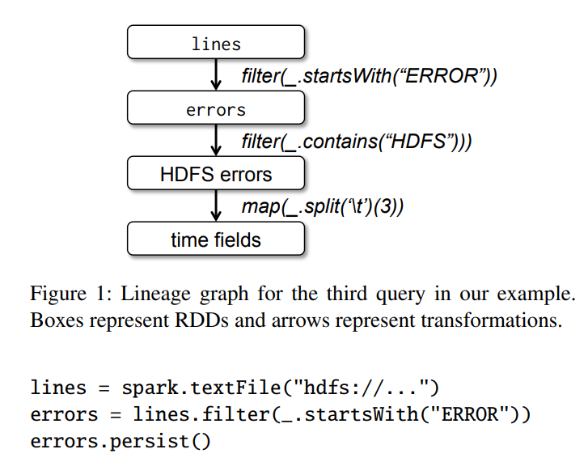
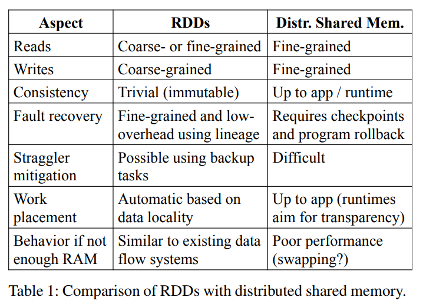
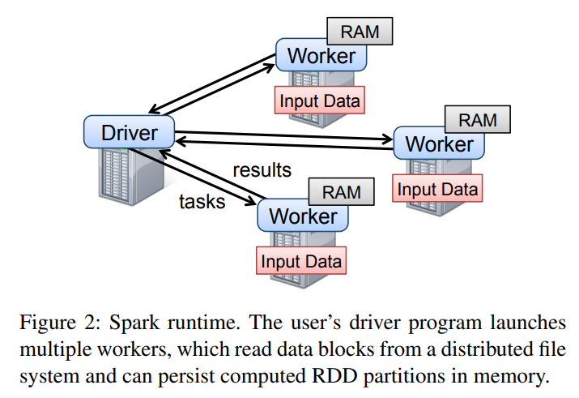
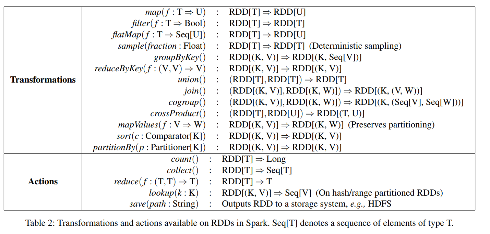
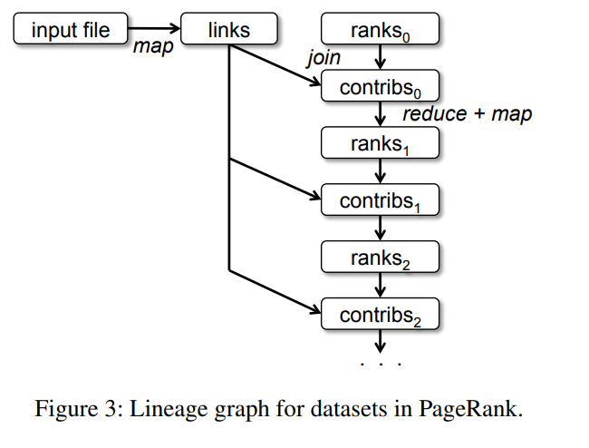
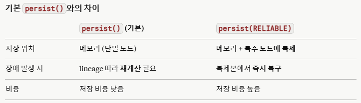
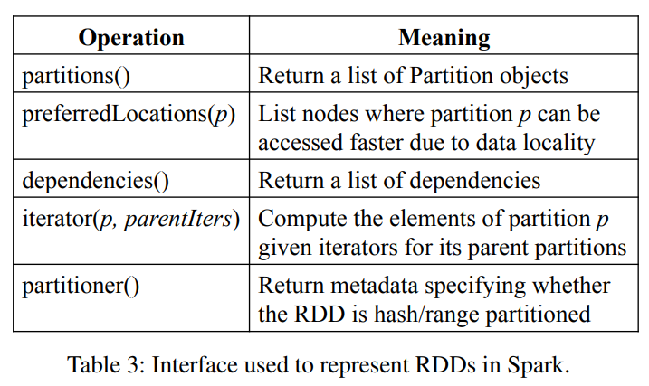
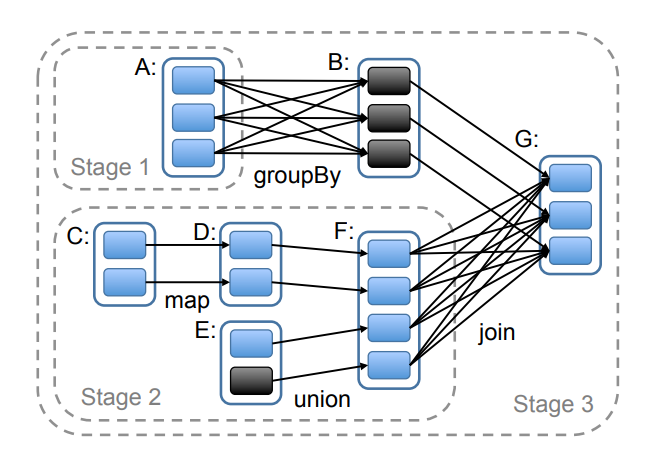

### Intro
2010년 `Spark`가 처음 발표됐을 때 `RDD`는 아이디어 수준의 추상화였다.
2년 후인 2012년, NSDI에서 발표된 논문 "Resilient Distributed Datasets: A Fault-Tolerant Abstraction for In-Memory Cluster Computing"은 `RDD`를 정식 이론으로 정립했다.
`ML`과 그래프 알고리즘처럼 반복적으로 중간 데이터를 재사용하는 워크로드에서 기존 `MapReduce`와 `Dryad`는 매 단계마다 데이터를 디스크에 기록해야 했고, 이는 심각한 성능 병목이었다.
#
`RDD`는 이 문제를 `fault-tolerance`를 체크포인팅이나 복제가 아닌 `Lineage` 재연산으로 해결하며, `Scala`로 구현해 기존 대비 20~40배의 성능 향상을 달성했다.

### Resilient Distributed Datasets
`RDD`는 읽기 전용으로 파티셔닝된 데이터셋이다.
저장된 데이터나 다른 `RDD`로부터 생성되며, `Lazy evaluation`으로 실제 연산은 `Action`이 호출될 때까지 미뤄진다.
`RDD`의 변환 과정은 `Lineage`로 표현되어, 파티션이 유실되면 `Lineage`를 역추적해 재생성할 수 있다.

### 예제: Console Log Mining

#
로그 파일에서 에러 라인을 필터링하고 그 결과를 메모리에 캐싱하는 경우를 생각해보자.
`RDD`를 한 번 캐시해두면 이후 다양한 분석 쿼리를 반복 수행할 때 디스크 I/O 없이 처리할 수 있다.
이것이 `MapReduce`와 `Spark`의 본질적인 차이다. `MapReduce`는 매 단계를 디스크에 기록하지만, `Spark`는 캐싱된 `RDD`를 메모리에서 바로 재사용한다.

### RDD 모델의 장점

#
`RDD`와 `DSM(Distributed Shared Memory)`을 비교하면 `RDD`의 설계 철학이 명확히 드러난다.
`DSM`은 임의의 메모리 위치를 읽고 쓸 수 있어 유연하지만, `fault-tolerance`를 위해 전체 상태를 체크포인트해야 한다.
반면 `RDD`는 `Bulk operation`에 특화되어 있어 전체 데이터셋에 대한 변환을 효율적으로 처리한다.
불변성 덕분에 전체 스냅샷 대신 `Lineage`만 기록하면 되므로 체크포인팅 오버헤드가 크게 줄어든다.
메모리가 부족한 경우에는 디스크로 `fallback`하는 것도 지원한다.
#
단, `RDD`가 모든 상황에 적합한 것은 아니다.
`Batch processing`에는 탁월하지만, 비동기로 `fine-grained`하게 상태를 공유해야 하는 실시간 처리에는 적합하지 않다.

### 스파크 프로그래밍

#
`Driver Program`이 `Lineage`와 `Task` 할당을 추적하며 전체 실행을 조율한다.
`Spark`의 핵심 원칙은 "데이터를 코드가 있는 곳으로 보내지 않고, 코드를 데이터가 있는 곳으로 보낸다"는 것이다.
사용자 함수는 클로저로 직렬화되어 데이터가 위치한 워커 노드로 전송되고 실행된다.

### RDD Transformation과 Actions

#
`RDD` 연산은 `Transformation`과 `Action` 두 가지로 나뉜다.
`map`, `filter`, `groupBy` 같은 `Transformation`은 새 `RDD`를 `lazy`하게 생성한다. 즉, 호출해도 즉시 실행되지 않고 `Lineage`에 기록만 된다.
`count`, `collect`, `save` 같은 `Action`이 호출될 때 비로소 `Lineage`를 따라 실제 연산이 수행되고 결과가 반환된다.
`Spark`는 타입 시스템을 통해 잘못된 연산 조합을 컴파일 시점에 방지한다.

### 예제: PageRank
```scala
val links = spark.textFile(...).map(...).persist()
var ranks = // RDD of (URL, rank) pairs

for (i <- 1 to ITERATIONS) {
  val contribs = links.join(ranks).flatMap {
    case (url, (destLinks, rank)) =>
      destLinks.map(dest => (dest, rank / destLinks.size))
  }
  ranks = contribs.reduceByKey((x, y) => x + y)
    .mapValues(sum => a / N + (1 - a) * sum)
}
```


#
`PageRank`는 `RDD`의 반복 처리 능력을 잘 보여주는 예제다.
`links RDD`는 `(URL → outlinks 목록)` 형태로 `persist()`해두고, `ranks RDD`는 `(URL → rank 점수)` 형태로 반복마다 갱신된다.
매 이터레이션마다 `links`를 재사용할 수 있어 디스크 I/O 없이 반복 처리가 가능하다.
#

#
`links`를 `URL` 기준으로 `hash-partition`해두면 `join` 시 `shuffling`을 제거할 수 있다.

```scala
links = spark.textFile(...).map(...)
             .partitionBy(myPartFunc)
             .persist()
```

`Worker co-location`과 `partitioning`을 활용하면 네트워크 비용을 최소화할 수 있다.

### Representing RDDs

#
`RDD`는 다섯 가지 인터페이스로 정의된다.
`partitions()`는 데이터 파편화 방식을 정의하고, `dependencies()`는 부모 `RDD`와의 `Lineage` 관계를 표현한다.
`iterator(p, parentIters)`는 파티션 `p`의 데이터를 계산하는 수식이며, `preferredLocations(p)`는 네트워크 비용을 최소화하기 위한 최적 서버 위치를 반환한다.
`partitioner()`는 `Hash` 또는 `Range` 기반 파티셔닝 규칙을 정의한다.
#
`Dependency`는 두 종류로 나뉜다.
`Narrow dependency`는 부모 `RDD`의 각 파티션이 자식 `RDD`의 하나의 파티션에만 사용되는 경우로, `map`과 `filter`가 해당된다. 파이프라인 최적화가 가능하고, 장애 시 단일 노드에서 복구할 수 있다.
`Wide dependency`는 부모 `RDD`의 파티션이 여러 자식 파티션에 사용되는 경우로, `groupBy`와 `join`이 해당된다. `MapReduce`처럼 `shuffle`이 필요하며, 복구 시 전체 부모 파티션이 필요하다.

### 구현
`Spark`는 `Scala` 14,000줄로 구현됐으며, `Mesos` 클러스터 매니저 기반에서 동작하고 `Hadoop` 위에서 직접 실행할 수 있다.


#
`Job` 스케쥴러는 `Lineage` 그래프를 분석해 실행 가능한 `Stage`로 이루어진 `DAG`를 생성한다.
각 `Stage`는 `Narrow transformation`으로만 구성되어 파이프라인으로 실행되며, `Wide transformation(shuffle)`이 발생하는 경계에서 `Stage`를 분리한다.
`Task`를 배분할 때는 `data locality`를 고려해 `PreferredLocation` 기반으로 스케쥴링하고, 중간 결과는 `shuffle` 연산을 위해 생성된다.

### Outro
2012년 NSDI에서 발표된 `RDD` 논문은 2010년 `Spark`에서 제시된 아이디어를 이론적으로 완성한 작업이다.
`Lineage` 기반 `fault-tolerance`, `Narrow/Wide dependency` 구분, 다섯 가지 인터페이스로 정의되는 `RDD` 추상화는 이후 `Spark`가 산업 표준으로 자리잡는 토대가 됐다.
