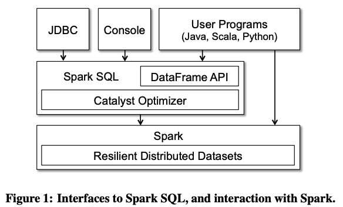
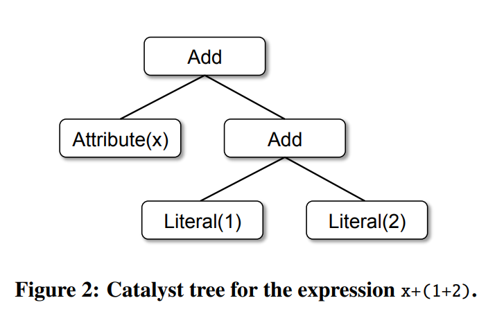
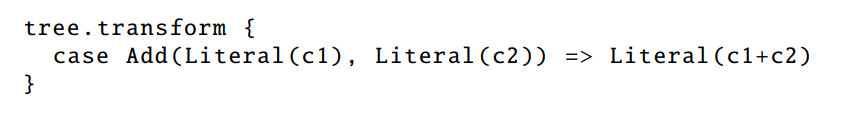
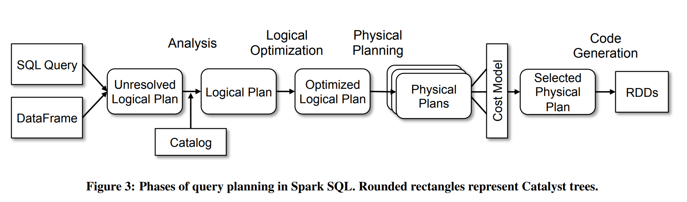
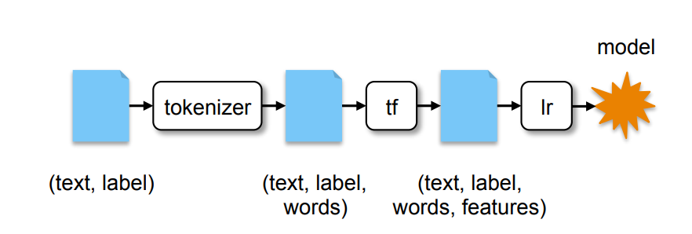

### Intro
`MapReduce`는 대규모 분산 처리를 가능하게 했지만, 모든 연산을 Map과 Reduce 단계로 직접 분해해야 하는 저수준 API였다.
이 불편함을 해소하기 위해 `Pig`, `Hive`, `Dremel` 같은 시스템이 등장해 선언형 쿼리 인터페이스를 제공하면서 생산성을 높여갔다.
#
하지만 현실의 데이터 파이프라인은 관계형 쿼리만으로 처리되지 않는다.
`ETL` 작업의 대상은 대부분 스키마가 없는 `semi-structured data`이고, 머신러닝과 그래프 프로세싱은 전통적인 관계형 시스템과 궁합이 맞지 않는다.
실제 파이프라인은 관계형 쿼리와 절차적 코드를 혼용하는 경우가 대부분인데, 기존 도구들은 이 둘을 하나의 프레임워크 안에서 자연스럽게 통합하지 못했다.
#
`Spark SQL`은 이 문제를 해결하기 위해 2015년 SIGMOD에서 발표됐다.
관계형 연산과 절차적 `Spark` 프로그래밍을 하나의 통일된 추상화 아래 묶고, `Catalyst`라는 확장 가능한 옵티마이저를 통해 두 세계 모두에서 좋은 성능을 이끌어내는 것이 목표였다.
개인적으로 `Spark` 논문 시리즈 중 가장 영향력 있는 논문이라고 생각한다.

### Background
초기 `Spark`에서 `RDD`는 클러스터 전체에 분산되어 처리되는 읽기 전용 데이터셋이었다.
`map`, `filter`, `reduce` 같은 연산을 지원하며, `Lineage` 그래프를 통해 장애 시 데이터를 재연산으로 복구하는 결함 내성을 갖췄다.
`RDD`의 연산은 `lazy`하게 처리되어 실제 `Action`이 호출될 때까지 실행 계획만 쌓아두며, 덕분에 엔진이 연산 계획 전체를 보고 최적화할 수 있었다.
#
관계형 연산 통합의 첫 시도는 `Apache Hive`를 변형한 `Shark`였다.
적당한 성능을 냈지만 세 가지 근본적인 한계가 있었다.
첫째, `Hive` 카탈로그에 등록된 외부 데이터 소스에만 쿼리를 날릴 수 있었다.
둘째, `Spark` 프로그램에서 `Shark`를 사용하려면 SQL 문자열을 직접 넘겨야 했는데, 타입 안정성이 없어 런타임 에러를 유발하기 쉬웠다.
셋째, `Hive` 옵티마이저가 `MapReduce` 전용으로 설계되어 확장이 어려웠고, 머신러닝이나 새로운 데이터 소스를 지원하기에는 한계가 명확했다.

### Spark SQL의 목표
`Spark SQL`이 설정한 목표는 네 가지였다.

1. 관계형 연산을 `Spark` 프로그램과 외부 데이터 저장소 모두로 확장한다.
2. 전통적인 `DBMS`가 수십 년간 축적한 최적화 기법을 적용해 좋은 성능을 제공한다.
3. 새로운 데이터 소스를 쉽게 추가할 수 있도록 하며 `semi-structured data`와 쿼리 페더레이션을 지원한다.
4. 머신러닝, 그래프 처리 같은 고급 분석 알고리즘을 위한 확장 포인트를 제공한다.

### DataFrame API

#
`Spark SQL`은 `Spark`의 라이브러리 형태로 제공된다.
`JDBC`, `Console`, `User Programs` 세 가지 경로로 접근할 수 있으며, 핵심 추상화는 `DataFrame`이다.
#
`DataFrame`은 관계형 데이터베이스의 테이블과 유사하지만, `Spark`에서 `RDD`처럼 조작할 수 있는 분산 데이터 구조다.
`RDD`와의 결정적 차이는 `DataFrame`이 관계형 연산 단계의 스키마와 데이터 타입 정보를 보유한다는 점이다.
이 메타 정보를 바탕으로 엔진은 훨씬 깊은 수준의 최적화를 수행할 수 있다.
`DataFrame`은 기존 테이블이나 `RDD`를 변환해 생성하며, `groupBy`, `join`, `filter` 같은 관계형 연산으로 조작한다.
#
`RDD`와 마찬가지로 `DataFrame`도 `lazy`하게 동작한다.
각 `DataFrame`은 데이터 자체가 아니라 연산 계획을 나타내며, `save`나 `count` 같은 실제 `Action`이 호출될 때까지 실행되지 않는다.
```javascript
ctx = new HiveContext()
users = ctx.table("users")
young = users.where(users("age") < 21)
println(young.count())
```
`users`와 `young`은 `DataFrame`이고, `users("age") < 21`은 `DataFrame DSL` 표현식이다.
`young.count()`를 실행해야 비로소 실제 연산이 시작된다.

### Data Model과 DataFrame Operations
`Spark SQL`은 `Hive`에 기반한 중첩 데이터 모델을 사용한다.
기본 `SQL` 데이터 타입은 물론, `structs`, `arrays`, `maps` 같은 복합 타입도 지원한다.
전통적인 `DBMS`가 복합 타입을 외래 키나 조인으로 우회해 표현하는 것과 달리, `Spark SQL`은 이들을 일급 시민으로 취급한다.
덕분에 `JSON`처럼 중첩된 구조의 데이터를 자연스럽게 다룰 수 있다.
#
`DSL`을 통해 `DataFrame`에 관계형 연산을 표현한다.
```scala
employees
  .join(dept, employees("deptId") === dept("id"))
  .where(employees("gender") === "female")
  .groupBy(dept("id"), dept("name"))
  .agg(count("name"))
```
`employees("deptId")`는 `deptId` 컬럼을 가리키는 표현식이고, `===`나 `>`같은 연산의 결과는 새로운 표현식을 반환한다.
이 표현식들은 내부적으로 `AST(Abstract Syntax Tree)`로 조립되어 `Catalyst` 옵티마이저로 전달된다.
#
`DataFrame`을 임시 테이블로 등록해 `SQL`과 혼용하는 것도 가능하다.
```scala
users.where(users("age") < 21)
  .registerTempTable("young")
ctx.sql("SELECT count(*), avg(age) FROM young")
```

### Querying Native Datasets
현실의 데이터 파이프라인은 여러 이종 데이터 소스에서 데이터를 가져온다.
각각 다른 라이브러리로 읽어온 데이터를 통합하려면 보통 포맷 변환이 필요한데, 이 과정에서 데이터 복사 비용이 발생한다.
`Spark SQL`은 이 문제를 해결하기 위해 기존 `RDD`를 별도 변환 없이 `DataFrame`으로 직접 승격할 수 있도록 지원한다.
```scala
case class User(name: String, age: Int)
val usersRDD = spark.parallelize(List(User("Alice", 22), User("Bob", 19)))
val usersDF = usersRDD.toDF
```
#
이 방식의 핵심은 전통적인 `ORM`과 다르게 동작한다는 점이다.
`ORM`은 객체를 다른 포맷으로 완전히 직렬화해 새로운 메모리 공간에 복사한다.
반면 `Spark`는 이미 메모리에 존재하는 `RDD` 객체의 주소를 그대로 참조하고, 쿼리에서 필요한 필드만 선택적으로 읽어온다.
객체 복사가 없으므로 성능 저하가 없고, 외부 데이터와의 `join`도 동일한 효율로 처리할 수 있다.

### In-Memory Caching
`Spark SQL`은 데이터를 컬럼형 포맷으로 메모리에 캐싱할 수 있다.
기존 `Spark`의 `Native` 캐시는 `JVM` 객체 형태로 데이터를 보관했는데, 컬럼형 포맷은 `dictionary 인코딩`과 `run-length 인코딩`으로 메모리 사용량을 크게 줄인다.
컬럼형 압축이 가능하기 때문에 스캔 성능도 함께 향상된다.
이 캐싱은 `SQL`을 통해 인터랙티브하게 탐색하는 환경에서 특히 효과적이다.

### User-Defined Functions
순수 `SQL`로는 복잡한 비즈니스 로직이나 머신러닝 추론 같은 작업을 표현하기 어렵다.
기존 데이터베이스에서 `UDF`를 등록하려면 별도 환경에서 컴파일하고 서버에 배포하는 복잡한 과정이 필요했다.
`Spark`의 `UDF`는 이 과정 없이 파이썬이나 스칼라 코드를 인라인으로 작성해 바로 등록할 수 있다.
```scala
val model: LogisticRegressionModel = ...
ctx.udf.register("predict",
  (x: Float, y: Float) => model.predict(Vector(x, y)))
ctx.sql("SELECT predict(age, weight) FROM users")
```
등록된 `UDF`는 `BI` 툴의 `JDBC/ODBC` 인터페이스에서도 동일하게 호출할 수 있다.

### Catalyst Optimizer
`Spark SQL`을 구현하면서 핵심 과제는 확장 가능한 옵티마이저를 만드는 것이었고, 그 결과가 `Catalyst`다.
`Scala`의 함수형 프로그래밍과 패턴 매칭 기능이 옵티마이저의 요구사항과 잘 맞아 `Scala`로 구현됐다.
#
`Catalyst`의 설계 목표는 두 가지다.
새로운 최적화 기법을 쉽게 추가할 수 있어야 하고, 외부 데이터 소스 개발자들이 자신의 소스를 `Catalyst` 최적화 파이프라인에 직접 참여시킬 수 있어야 한다.
범용적인 `Tree` 표현 라이브러리와 `Tree`에 규칙을 적용하는 `Rule` 인프라를 `Catalyst` 내부에 구축하고, 그 위에 관계형 쿼리 최적화 규칙들을 조립했다.

### Trees

#
`Catalyst`의 핵심 데이터 타입은 노드들로 구성된 `Tree`다.
각 노드는 노드 타입과 자식 노드 목록으로 구성되며, 새로운 노드 타입은 `TreeNode` 클래스의 서브클래스로 정의된다.
`Spark SQL`과 `DataFrame`의 쿼리는 모두 내부적으로 이 `Tree` 구조로 표현된다.
노드들은 불변(immutable)이며, 변환 연산은 함수형 방식으로 새로운 트리를 반환한다.

### Rules
`Tree`에 `Rule`을 적용하여 최적화를 수행한다.
`Rule`은 `Scala`의 패턴 매칭을 활용해 일치하는 노드를 찾고 변환한다.
#

#
예를 들어 상수 두 개를 더하는 `Add(Literal(c1), Literal(c2))` 패턴이 발견되면, 런타임에 계산하지 않고 컴파일 시점에 `Literal(c1 + c2)`로 바로 치환한다.
이렇게 개별 `Rule`들을 패턴 매칭으로 조립하면, 새로운 최적화 규칙을 추가하는 작업이 기존 코드에 영향을 주지 않는 독립적인 확장이 된다.
`Rule`들은 `Tree`가 더 이상 변하지 않는 고정점(Fixed Point)에 도달할 때까지 반복적으로 적용된다.

### Using Catalyst in Spark SQL

#
`Catalyst`는 쿼리를 4단계로 처리한다.
#
**Analysis** — `SQL` 쿼리나 `DataFrame`은 먼저 `Unresolved Logical Plan`으로 변환된다.
이 시점에는 컬럼 이름이 실제로 존재하는지, 어떤 타입인지 아직 알 수 없다.
`Catalyst`는 카탈로그 객체를 통해 테이블을 탐색하고 컬럼 이름을 검증한다.
같은 이름의 컬럼이 여러 곳에서 사용될 수 있으므로 각 컬럼에 유니크한 ID를 부여하고, 타입을 추론해 필요한 형변환을 추가한다.
#
**Logical Optimization** — 검증된 `Logical Plan`에 규칙 기반 최적화를 적용한다.
`constant folding`, `predicate pushdown`, `projection pruning`, `null propagation`, `Boolean expression simplification` 같은 규칙들을 적용한다.
예를 들어 `Decimal` 타입의 `SUM`, `AVG` 연산은 일반 정수형보다 계산이 훨씬 무거운데, 중간 계산 시 `Long`으로 변환해 처리하는 최적화가 이 단계에서 적용된다.
```scala
object DecimalAggregates extends Rule[LogicalPlan] {
  val MAX_LONG_DIGITS = 18

  def apply(plan: LogicalPlan): LogicalPlan = {
    plan transformAllExpressions {
      case Sum(e @ DecimalType.Expression(prec, scale)) if prec + 10 <= MAX_LONG_DIGITS =>
        MakeDecimal(Sum(LongValue(e)), prec + 10, scale)
    }
  }
}
```
#
**Physical Planning** — `Logical Plan`을 실제 실행 가능한 `Physical Plan`으로 변환한다.
여러 후보 `Physical Plan`을 생성하고 비용 기반 모델로 하나를 선택한다.
논문 작성 시점에는 비용 기반 선택이 `join` 알고리즘 결정에만 적용됐는데, 조인 대상 테이블 중 하나가 충분히 작다고 판단되면 네트워크 셔플이 필요한 일반 `shuffle join` 대신 `broadcast join`을 선택한다.
규칙 기반 물리적 최적화도 병행한다.
그중 하나가 여러 `projection`과 `filter` 단계를 하나의 `Spark map` 연산으로 합치는 것이다. 데이터를 여러 번 순회하는 대신 한 번의 패스에서 모든 컬럼 선택과 필터를 동시에 처리하므로, 반복적인 데이터 접근 비용을 줄일 수 있다.
`predicate pushdown`과 `projection pushdown`도 이 단계에서 적용된다.
#
**Code Generation** — `Scala`의 `quasiquotes` 기능을 통해 `Java Bytecode`를 생성한다.
`quasiquotes`는 프로그래밍으로 `AST` 트리를 생성하는 메타프로그래밍 기능으로, 생성된 `AST`는 `Scala` 컴파일러를 통해 바이트코드로 변환된다.

### Extension Points
`Catalyst`의 설계 철학은 확장 가능성과 조립 가능성이다.
외부 개발자들이 최적화의 각 단계에 규칙을 추가할 수 있으며, 특히 데이터 소스와 사용자 정의 타입 측면에서 생태계 확장을 적극적으로 지원한다.
#
**Data Sources** — 새로운 데이터 소스를 `Spark SQL`에 통합하려면 `createRelation` 함수를 구현해야 한다.
이 함수는 `key-value` 설정을 받아 `BaseRelation` 객체를 반환하며, 데이터를 읽는 방식은 세 가지 인터페이스로 단계적으로 선택할 수 있다.
`TableScan`은 테이블 전체를 읽는 가장 단순한 형태고, `PrunedScan`은 쿼리에서 요청한 컬럼만 골라 읽어 불필요한 `I/O`를 줄인다.
`PrunedFilteredScan`은 컬럼 선택에 더해 `WHERE` 조건까지 데이터 소스 단으로 밀어넣어 조건에 맞는 행만 읽어온다.
`JDBC` 연동 시 필터 조건을 `RDBMS`로 직접 전달하는 `predicate pushdown`이 대표적인 예다.
이 `API` 덕분에 `Parquet`, `Avro`, `CSV`는 물론 다양한 외부 데이터 저장소를 `Spark SQL` 생태계에 쉽게 통합할 수 있다.
#
**User-Defined Types (UDTs)** — 머신러닝의 벡터나 그래프 알고리즘의 행렬처럼 `Spark`에 내장되지 않은 복합 타입을 `SQL` 테이블에서 다룰 수 있도록 한다.
개발자는 새 타입을 `Spark` 엔진이 이해할 수 있는 기본 데이터 타입으로 변환하는 매핑 규칙만 작성하면 되고, 이후 엔진의 최적화와 메모리 압축 혜택을 그대로 누릴 수 있다.

### Advanced Analytics
`Spark SQL`은 세 가지 고급 분석 시나리오를 직접 지원한다.

### Schema Inference for Semi-structured Data
대용량 데이터 환경에서 `JSON` 같은 `semi-structured` 포맷은 매우 흔하다.
`Spark SQL`은 `JSON` 데이터를 한 번 전체적으로 스캔해 스키마를 자동으로 추론하고, 필요하면 샘플링 방식도 지원한다.
```scala
SELECT loc.lat, loc.long FROM tweets
WHERE text LIKE '%Spark%' AND tags IS NOT NULL
```
스키마 추론 덕분에 위처럼 `JSON`의 중첩 구조에서 바로 필드를 조회하는 쿼리가 가능해진다.

### MLlib 통합

#
`MLlib`은 `Spark`의 머신러닝 라이브러리로, `DataFrame`을 고수준 `API`의 표준 입출력 포맷으로 사용한다.
`SciKit-Learn`처럼 여러 처리 단계를 하나의 흐름으로 연결하는 파이프라인 개념을 도입했는데, 각 단계 간 데이터 전달 규격이 바로 `DataFrame`이다.
#
텍스트 분류 파이프라인을 예로 들면, `(text, label)` 컬럼으로 시작해 `Tokenizer`가 단어 배열인 `words` 컬럼을 추가하고, `TF` 변환이 수학적 벡터인 `features` 컬럼을 추가하며, 마지막으로 로지스틱 회귀가 `features`를 가져다 모델을 학습한다.
컬럼 단위로 입출력을 지정하므로 파이프라인 조립이 유연하고, 각 단계를 독립적으로 교체하거나 재사용할 수 있다.
#
머신러닝에서는 0이 대부분인 거대한 배열인 희소 벡터(`Sparse Vector`)를 빈번하게 다룬다.
앞서 설명한 `UDT` 기능이 여기서 빛을 발한다.
`MLlib` 개발팀은 희소 벡터를 `(타입, 크기, 인덱스 배열, 값 배열)` 네 개의 기본 타입으로 매핑하는 규칙을 작성했고, 덕분에 `Spark` 엔진의 최적화와 컬럼형 메모리 압축 혜택을 머신러닝 데이터에서도 그대로 누릴 수 있게 됐다.

### Query Federation
실제 데이터 파이프라인은 성격이 다른 데이터 소스들을 조합하는 경우가 많다.
`Spark SQL`은 `Catalyst`를 통해 데이터 소스 조회 시 `predicate pushdown`을 적용하고, 서로 다른 소스에서 읽어온 데이터를 `join`할 수 있도록 지원한다.
```scala
CREATE TEMPORARY TABLE logs
USING json OPTIONS (path "logs.json")

SELECT users.id, users.name, logs.message
FROM users JOIN logs
WHERE users.id = logs.userId
AND users.registrationDate > "2015-01-01"
```
`JDBC`로 가져온 `users` 데이터와 `JSON`의 `logs` 데이터를 하나의 쿼리로 `join`하는 것이 가능하다.
`Catalyst`가 각 데이터 소스에 적합한 필터 조건을 전달해 네트워크로 전송되는 데이터 양을 최소화한다.

### Outro
`Spark SQL`은 단순히 `Spark`에 `SQL`을 붙인 것이 아니다.
관계형 연산과 절차적 프로그래밍이라는 두 패러다임을 하나의 `DataFrame` 추상화로 통합하고, `Catalyst`라는 확장 가능한 옵티마이저 위에서 두 세계 모두의 연산을 최적화했다.
`Scala`의 패턴 매칭과 `quasiquotes`를 활용한 `Catalyst`의 설계는 새로운 최적화 규칙과 데이터 소스를 독립적인 확장으로 추가할 수 있게 하여, 이후 `Spark` 생태계가 `Parquet`, `Delta Lake`, `MLlib` 등 다양한 구성 요소를 자연스럽게 흡수하는 기반이 됐다.

### Reference
- Armbrust, M., et al. "Spark SQL: Relational Data Processing in Spark." SIGMOD, 2015.
