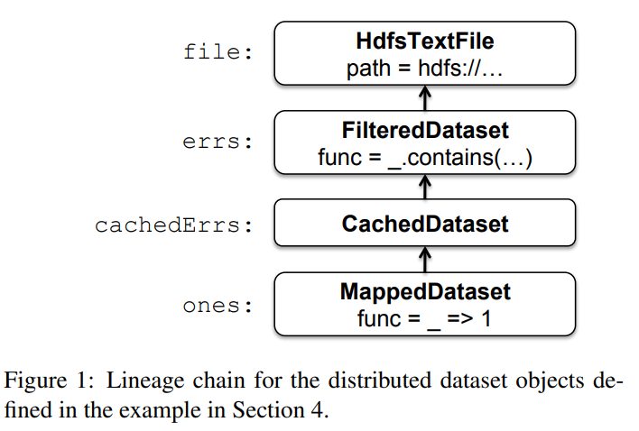

### Intro
`MapReduce`는 대규모 분산 처리의 표준으로 자리 잡았지만, 모든 유즈케이스에 적합하진 않았다.
반복적으로 같은 데이터를 여러 번 처리하는 `Iterative jobs`나, 사용자가 인터랙티브하게 데이터를 탐색하는 `Interactive jobs`에서는 매 단계마다 디스크 I/O가 발생하는 `MapReduce`의 구조가 명확한 한계로 드러났다.
#
`Spark`는 이 문제를 해결하기 위해 2010년 UC Berkeley AMPLab에서 발표한 논문 "Spark: Cluster Computing with Working Sets"에서 처음 소개됐다.
`MapReduce`가 제공하는 `fault-tolerance`와 `scalability`는 그대로 유지하면서, 데이터를 메모리에 올려 반복 처리 비용을 획기적으로 낮추는 것이 핵심 아이디어였다.
`Spark`는 `Scala`로 구현됐으며, `Scala` 인터프리터를 개선한 `Spark Shell`을 통해 사용자가 대화형으로 `RDD`를 정의하고 탐색할 수 있도록 했다.

### Spark의 시작
`Spark`의 프로그래밍 모델은 `Driver Program`을 중심으로 동작한다.
개발자가 `Driver Program`을 작성하면, `Spark`는 이를 분산 환경에서 `RDD`와 병렬 `Operation`의 조합으로 실행한다.

### RDD
`RDD(Resilient Distributed Datasets)`는 `Spark`의 핵심 추상화로, 클러스터 전역에 파티셔닝된 읽기 전용 데이터셋이다.
`RDD`는 `HDFS`에 저장된 파일, `Driver Program`의 메모리에 있는 `Scala Collection`, 또는 기존 `RDD`를 변환해 생성할 수 있다.
#
`RDD`는 `Scala`에서 객체로 정의되며, 논리적으로 어떤 스토리지에 저장된 데이터 집합을 나타낸다.
중요한 특성은 메모리에 로딩된 이후 수정되지 않는 불변(`immutable`)이라는 점이다.
필요에 따라 `RDD`를 메모리에 캐시하거나 디스크에 저장할 수 있으며, 클러스터 전역의 메모리에 캐싱함으로써 `MapReduce`와 같은 형태로 병렬 처리할 수 있다.
#
`RDD`의 복원력(`Resilience`)은 `리니지(Lineage)`를 통해 실현된다.
`리니지`란 데이터의 변환 과정을 기록한 것으로, 특정 파티션이 유실되면 `리니지`를 역추적해 해당 `RDD`를 재생성할 수 있다.
이 덕분에 `RDD`는 실패 시 언제나 재생성될 수 있다는 `Resilient`의 의미를 갖는다.

### Parallel Operations
`Spark`가 제공하는 병렬 연산은 크게 세 가지로 나뉜다.
`reduce`는 파티션별 연산 결과를 `Driver Process`로 모아 최종 합산하고, `collect`는 모든 원소를 `Driver`로 수집한다.
`foreach`는 각 원소에 사용자 정의 함수를 적용하는 데 사용된다.

### Shared Variables
개발자가 작성하는 `map`, `filter`, `reduce` 함수들은 `Spark`에 클로저로 전달되어 워커 노드에서 실행된다.
이 클로저는 내부 스코프에 선언된 변수들을 참조하는데, 분산 환경에서는 이 변수를 효율적으로 공유하는 방법이 필요하다.
#
`Broadcast Variable`은 대용량 읽기 전용 데이터를 효율적으로 배포하기 위한 메커니즘이다.
실제 데이터는 `shared file system`에 저장되고, `Broadcast Variable`은 해당 파일 경로를 가리키는 참조로 직렬화된다.
워커 노드가 변수에 접근할 때 로컬 캐시를 먼저 확인하고, 없으면 파일 시스템에서 읽어온다.
#
`Accumulator`는 워커 노드에서 집계한 값을 `Driver`로 전달하는 변수다.
각 `Accumulator`는 고유한 `ID`를 할당받고, 워커 노드의 각 스레드는 `thread-local`로 별도의 사본을 생성해 작업 시작 시 0으로 초기화한다. 동시성 충돌을 방지하기 위해서다.
`Task`가 완료되면 결과가 `Driver Program`으로 전달되어 최종 합산된다.
이때 `Driver`는 장애로 인해 `Task`가 재실행되더라도 동일한 파티션의 결과를 한 번만 합산해 `Double-counting`을 방지한다.

### 구현
`Spark`는 기존 하둡 시스템과 서버를 공유하면서 나란히 실행하기 위해 클러스터 운영체제인 `Mesos` 위에서 구동된다.
`RDD`는 `lazy` 연산을 하며, 각 연산 정보는 `Lineage`로 연결되어 부모 `RDD`를 가리키는 DAG를 형성한다.

```scala
val file = spark.textFile("hdfs://...")
val errs = file.filter(_.contains("ERROR"))
val cachedErrs = errs.cache()
val ones = cachedErrs.map(_ => 1)
val count = ones.reduce(_+_)
```

위 코드에서 `filter`, `map`은 새 `RDD`를 정의할 뿐 즉시 실행되지 않는다.
`reduce`가 호출되는 시점에 `Lineage`를 따라 실제 연산이 수행된다.
#
`RDD`는 내부적으로 `getPartitions`, `getIterator(Partition)`, `getPreferredLocation` 세 연산자로 구성된다.
`Spark`는 `Task` 단위로 각 데이터 노드에 작업을 전달할 때 `Locality`를 고려해 `Preferred Location`으로 스케쥴링한다.
`Task`가 워커 노드에서 실행되면 `getIterator` 연산자가 호출되어 파티션으로부터 데이터를 읽는다.
`HDFS`에서 `RDD`를 생성할 때는 블록을 스트림으로 읽어들인다.
#

#
`Spark`는 `Scala` 기반이므로 클로저를 직렬화하여 다른 서버로 전송할 수 있다.
이는 "데이터를 코드가 있는 곳으로 보내는 것"이 아니라 "코드를 데이터가 있는 곳으로 보내는 것"이다.
대용량 데이터를 네트워크로 이동시키는 대신, 처리 로직을 데이터가 위치한 노드로 전달해 처리 효율을 높인다.

### Interpreter Integration
`Scala` 인터프리터는 입력된 각 라인에 대해 클래스를 생성해 컴파일한다.
이 클래스는 싱글톤 객체로 변수와 함수를 포함하며, `JVM`에서 로드되어 실행된다.
`Spark`에서는 이 클래스가 `shared file system`에 저장되고, 워커 노드의 `Java Class Loader`가 이를 로딩해 분산 실행한다.
#
원래 `Scala` 방식에서는 `Line1.getInstance().x`처럼 간접 참조를 사용한다.
하지만 워커 노드에는 `Line1` 클래스 자체가 없으므로 실패하거나, 직렬화 시점이 아닌 실행 시점에 값을 읽는 문제가 생긴다.
`Spark`는 이를 수정해 객체를 필드로 직접 보유하도록 구조를 바꿨다.
이 덕분에 클로저가 직렬화될 때 변수의 현재 값이 스냅샷으로 함께 기록된다.

### Outro
`Spark`는 `MapReduce`의 한계를 `RDD`라는 추상화로 극복한 분산 처리 엔진이다.
메모리 기반 캐싱과 `Lineage`를 통한 복원력, 그리고 코드를 데이터로 보내는 설계는 이후 대규모 데이터 처리의 표준을 바꿨다.
다음 포스트에서는 2012년 NSDI에서 발표된 RDD 논문을 통해 `Spark`의 설계가 어떻게 정교화됐는지 살펴본다.
