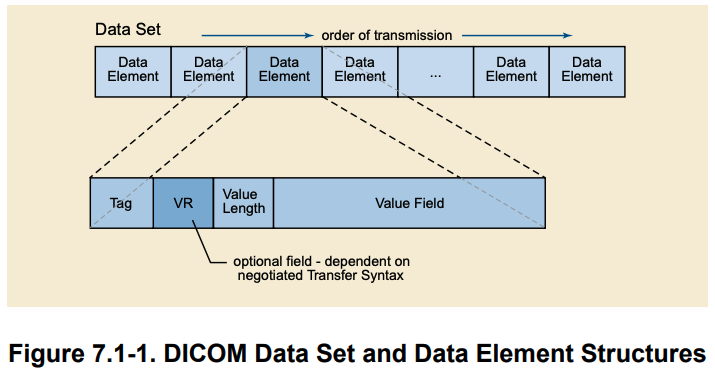
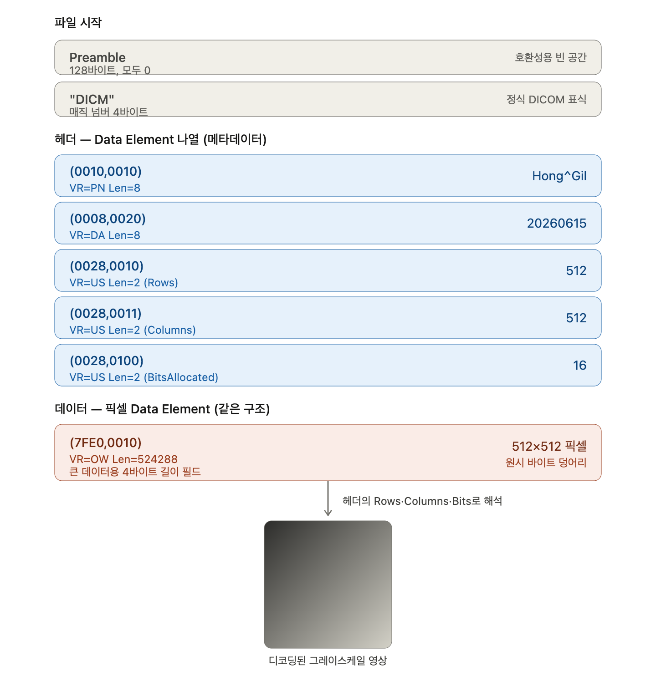
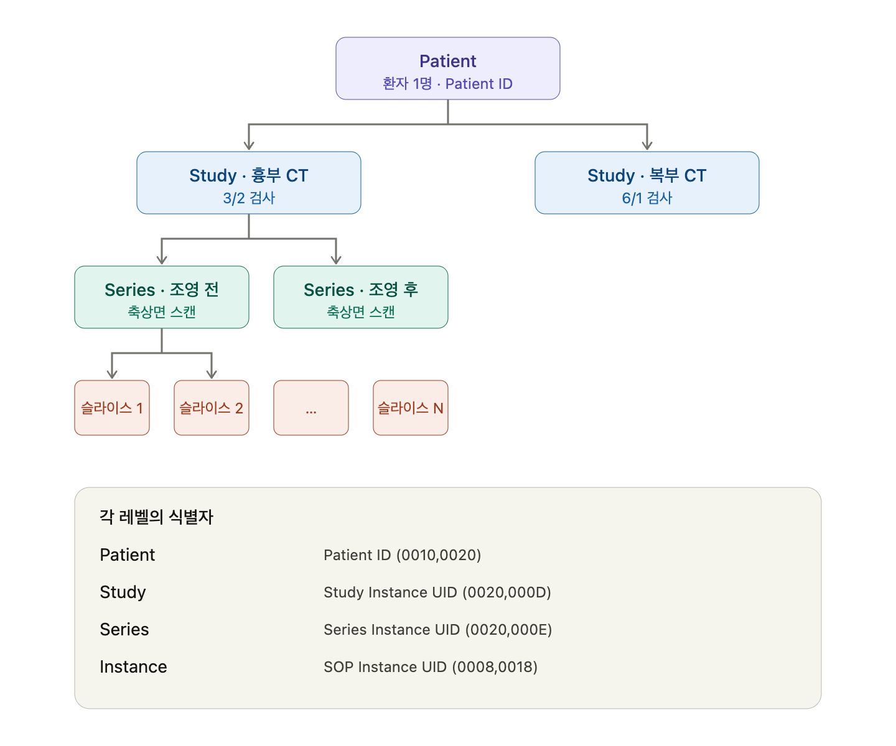
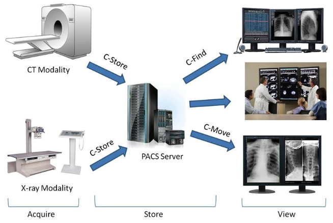
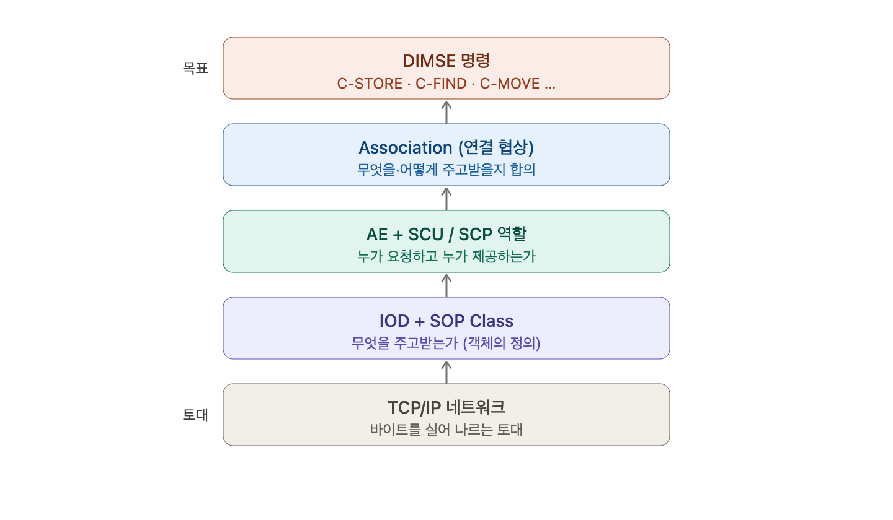
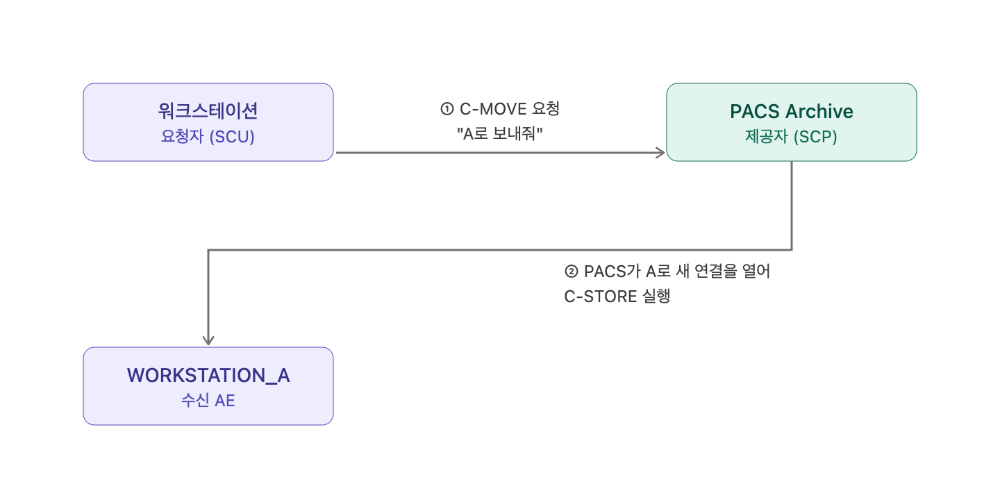
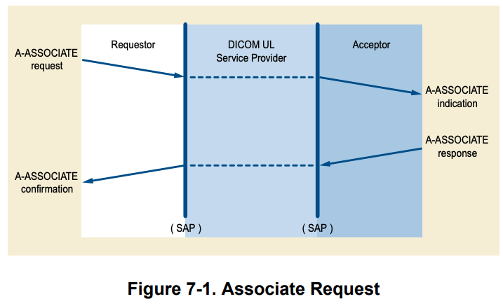

### Intro
`DICOM`(Digital Imaging and Communications in Medicine)은 의료 영상의 저장, 전송, 출력, 처리를 위한 국제 표준이다.
1993년에 처음 출간되었고, X-ray 필름을 디지털로 전환하는 데 결정적인 역할을 했다.
지금은 방사선과, 심장내과를 비롯해 거의 모든 의료 영상 장비에서 사실상 유일한 표준으로 자리잡고 있다.
#
`DICOM`이 다른 이미지 포맷과 구별되는 가장 큰 특징은 영상 데이터와 메타데이터를 하나의 파일에 함께 담는다는 점이다.
환자 이름, 검사 날짜, 장비 정보 같은 임상 정보가 픽셀 데이터와 함께 `.dcm` 확장자 파일 안에 공존한다.
영상만 있으면 누구 영상인지 알 수 없으니, 이 둘을 묶어서 관리하는 방식이 의료 현장에서는 필수다.

### 파일 구조

*출처: https://89douner.tistory.com/293*
#
`DICOM` 파일은 크게 두 부분으로 나뉜다. 하나는 헤더(메타데이터)이고, 다른 하나는 실제 픽셀 데이터다.
헤더 안의 모든 데이터는 `Data Element`라는 단위로 구성된다.
`Data Element`는 `Tag`, `VR`, `Length`, `Value` 네 가지 필드로 이루어져 있다.
#
`Tag`는 `(group, element)` 형태의 16진수 쌍으로 각 속성을 식별한다.
예를 들어 `(0010,0010)`은 환자 이름, `(0010,0020)`은 환자 ID, `(0008,0020)`은 검사 날짜를 의미한다.
`(0028,0010)`은 영상의 행 수(Rows)를, 그리고 `(7FE0,0010)`이 바로 픽셀 데이터 자체를 가리킨다.
이처럼 Tag 번호만 보면 그 필드가 무엇을 담고 있는지 바로 알 수 있는 구조다.
#
`VR`(Value Representation)은 해당 Value의 데이터 타입을 나타낸다.
`VR`이 파일에 직접 적혀 있으면 `Explicit VR`, 파일에 없으면 `Implicit VR`이라고 한다.
`Implicit VR` 방식에서는 Tag를 보고 표준 사전을 조회해서 VR을 알아내야 한다.
`Length`는 Value가 몇 바이트인지를 나타내고, `Value`는 실제 데이터를 담는다.
#

*출처: https://89douner.tistory.com/293*

### 계층 구조

*출처: https://89douner.tistory.com/293*
#
`DICOM`은 단순히 파일 포맷에 그치지 않는다.
하나의 영상 파일이 전체 검사 맥락 속 어디에 위치하는지를 네 단계 계층 구조로 표현한다.
#
계층의 최상위는 **환자**다. 환자 이름, 생년월일, 성별처럼 개인을 식별하는 정보가 이 레벨에 속한다.
#
그 아래에 **Study**가 있다. Study는 검사 단위로, 환자가 어느 날 병원을 방문해서 받은 한 번의 검사를 묶는 단위다.
그날 촬영한 모든 영상 시리즈가 하나의 Study 아래에 묶인다.
#
Study 아래에는 **Series**가 있다. 한 번의 검사 안에서도 촬영 방식이나 조건이 다른 영상 묶음이 여러 개 나올 수 있는데,
그 각각이 하나의 Series다. 복부 CT 검사 하나만 놓고 봐도 조영제를 넣기 전 스캔, 조영제 투입 후 스캔,
같은 데이터를 관상면(coronal)으로 재구성한 영상이 각각 별도의 Series로 분리된다.
#
계층의 맨 아래가 **Instance**다. `.dcm` 파일 하나하나가 바로 Instance에 해당한다.
CT나 MRI에서 촬영되는 단면 이미지 한 장이 Instance 하나다.

### PACS

*출처: https://89douner.tistory.com/293*
#
`PACS`(Picture Archiving and Communication System)는 의료 영상을 디지털로 저장, 조회, 전송, 표시하는 병원 시스템이다.
`DICOM` 표준 위에서 동작하며, 영상 장비(`Modality`), 저장 서버(`Archive`), 판독용 워크스테이션이
`DICOM` 네트워크를 구성해 서로 통신한다.
#
CT 장비가 영상을 찍으면 `PACS` 서버로 자동 전송되고, 의사는 워크스테이션에서 이를 조회하고 판독한다.
이 모든 흐름이 `DICOM` 프로토콜로 이루어진다.

### DIMSE 서비스

*출처: https://89douner.tistory.com/293*
#
`DIMSE`(DICOM Message Service Element)는 `DICOM` 네트워크에서 장비들 사이에 메시지를 주고받는 전통적인 프로토콜이다.
이 프로토콜을 이해하려면 먼저 `IOD`와 `SOP Class` 개념을 알아야 한다.
#
`IOD`(Information Object Definition)는 정보 객체의 청사진이다.
환자 정보, 검사 정보, 픽셀 데이터 같은 속성들이 어떻게 구성되는지를 정의하며,
앞서 살펴본 `Data Element`(태그)가 바로 IOD를 구성하는 요소다.
#
`SOP Class`(Service-Object Pair Class)는 동작과 데이터 객체를 결합한 개념이다.
서비스(동작)와 IOD(객체)를 묶어서 표현한다.
"CT 영상 IOD" + "저장 동작"을 합치면 `CT Image Storage SOP Class`가 되고,
"Study 정보" + "조회 동작"을 합치면 `Study Root Query/Retrieve SOP Class`가 된다.

### 통신 주체와 Association
`DICOM` 네트워크를 구성하는 장비, 서버, 워크스테이션을 `AE`(Application Entity)라고 부른다.
각 AE는 고유한 `AE Title`을 가지며, 통신은 항상 두 AE 사이에서 이루어진다.
서비스를 요청하는 쪽을 `SCU`(Service Class User), 서비스를 제공하는 쪽을 `SCP`(Service Class Provider)라고 한다.
#

*출처: https://89douner.tistory.com/293*
#
두 AE가 통신을 시작하기 전에는 먼저 `Association`(연결 협상) 단계를 거쳐야 한다.
이 협상에서 어떤 SOP Class를 주고받을지(`Presentation Context`),
어떤 `Transfer Syntax`(인코딩/압축 방식)를 사용할지, SCU와 SCP 역할을 누가 맡을지를 합의한다.
#

*출처: https://89douner.tistory.com/293*
#
`DICOM`은 OSI 7계층 모델의 서비스 개념을 그대로 차용한다.
`A-` 접두사는 Application 계층의 연결 제어 서비스를 뜻한다.
`A-ASSOCIATE`로 연결을 맺고, `A-RELEASE`로 양쪽이 합의하며 우아하게 연결을 끊는다.
문제가 생기면 `A-ABORT`로 일방적으로 중단하거나 `A-P-ABORT`로 하위 계층 문제를 처리한다.
`P-` 접두사는 Presentation 계층의 데이터 전송 서비스로, `P-DATA`를 통해 실제 메시지 데이터를 주고받는다.

### DIMSE 프로토콜 명령
`DIMSE` 명령어는 이름 앞 글자에 따라 두 종류로 나뉜다.
`C-`(Composite) 계열은 영상처럼 여러 정보가 합쳐진 복합 객체를 다루고,
`N-`(Normalized) 계열은 검사 진행 상태처럼 단일 속성을 가진 정규화된 객체를 다룬다.
#
자주 쓰이는 `C-` 계열 명령어를 정리하면 다음과 같다.
`C-STORE`는 영상 객체를 상대 AE에 전송·저장하는 명령으로, CT 장비가 PACS로 영상을 보낼 때 사용한다.
`C-FIND`는 환자명, 검사일 같은 조건으로 검사·시리즈·영상 목록을 조회한다.
`C-MOVE`는 조회된 객체를 지정한 AE로 보내달라고 요청하는 명령인데,
실제 전송은 SCP가 별도의 `C-STORE` 연결을 열어서 수행하는 간접 방식이다.
`C-GET`은 `C-MOVE`와 비슷하지만 같은 연결 안에서 직접 객체를 받아오기 때문에 방화벽 환경에서 유리하다.
그리고 `C-ECHO`는 연결 확인용 핑으로, 흔히 "DICOM ping"이라 부른다.

### DICOMweb
`DIMSE`는 전통적인 TCP 소켓 기반 프로토콜이라 웹 환경이나 클라우드에서 다루기 까다롭다.
이 문제를 해결하기 위해 HTTP 기반으로 재정의한 표준이 `DICOMweb`이다.
#
`STOW-RS`(Store Over the Web)는 `C-STORE`에 대응하며, HTTP POST로 영상을 업로드한다.
`QIDO-RS`(Query based on ID for DICOM Objects)는 `C-FIND`에 대응하며, HTTP GET으로 검색하고 JSON/XML 형태로 응답을 받는다.
`WADO-RS`(Web Access to DICOM Objects)는 `C-GET`에 대응하며, 영상 픽셀 데이터나 메타데이터를 HTTP로 가져온다.
#
클라우드 기반 의료 플랫폼을 구축할 때는 전통적인 `DIMSE` 대신 `DICOMweb`을 채택하는 경우가 많아지고 있다.
REST API로 표준화되어 있어 기존 웹 개발 스택과 자연스럽게 통합되기 때문이다.

### Reference
- DICOM Standard: https://www.dicomstandard.org/current
- https://89douner.tistory.com/293
